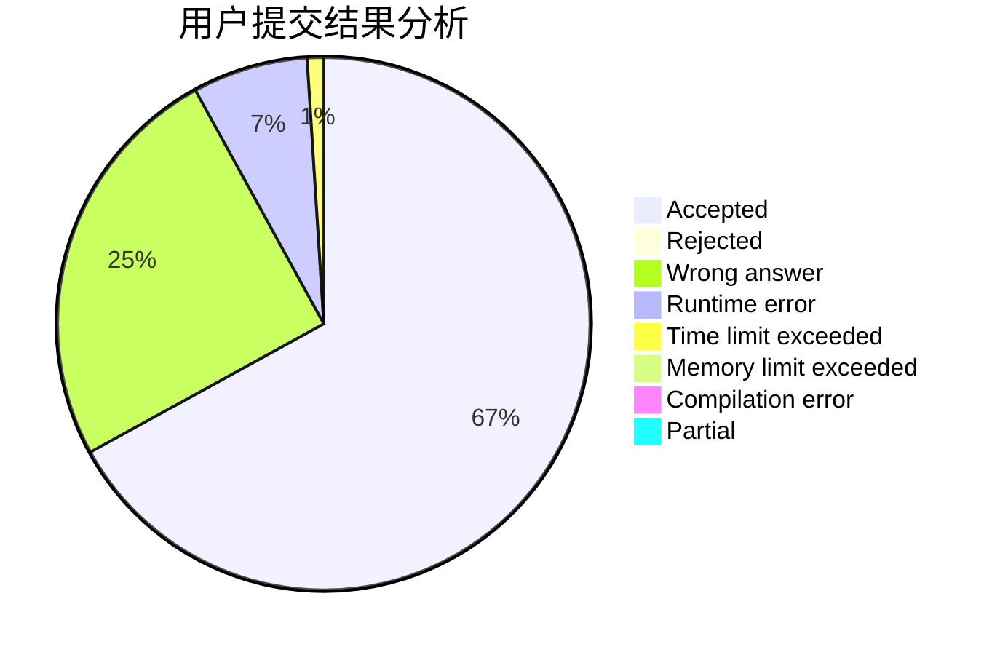
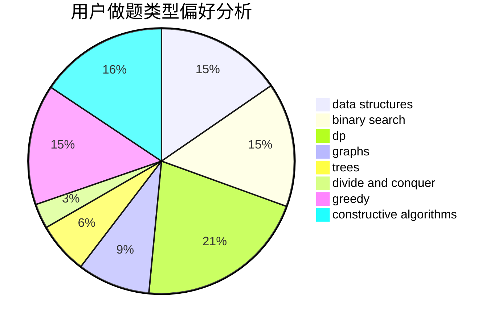
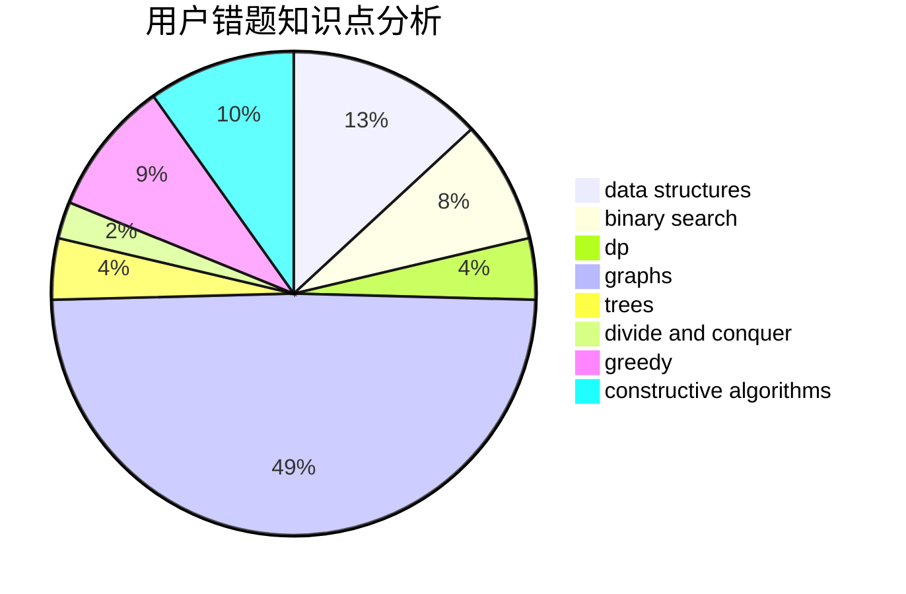

# LiuYu_penguin

<!-- tabs:start -->

#### **用户提交结果分析**

#### **用户做题类型偏好分析**

#### **用户错题知识点分析**

<!-- tabs:end -->
# 推荐题目
[1470D](https://codeforces.com/contest/1470/problem/D)		constructive algorithms,
                        dfs and similar,
                        graph matchings,
                        graphs,
                        greedy		  
[1307B](https://codeforces.com/contest/1307/problem/B)		geometry,
                        greedy,
                        math		  
[1013B](https://codeforces.com/contest/1013/problem/B)		greedy		  
[1141G](https://codeforces.com/contest/1141/problem/G)		binary search,
                        constructive algorithms,
                        dfs and similar,
                        graphs,
                        greedy,
                        trees		  
[191C](https://codeforces.com/contest/191/problem/C)		data structures,
                        dfs and similar,
                        trees		  
[863A](https://codeforces.com/contest/863/problem/A)		brute force,
                        implementation		  
[1368H2](https://codeforces.com/contest/1368H/problem/2)		nan		  
[816B](https://codeforces.com/contest/816/problem/B)		binary search,
                        data structures,
                        implementation		  
[727A](https://codeforces.com/contest/727/problem/A)		brute force,
                        dfs and similar,
                        math		  
[193B](https://codeforces.com/contest/193/problem/B)		brute force		  
