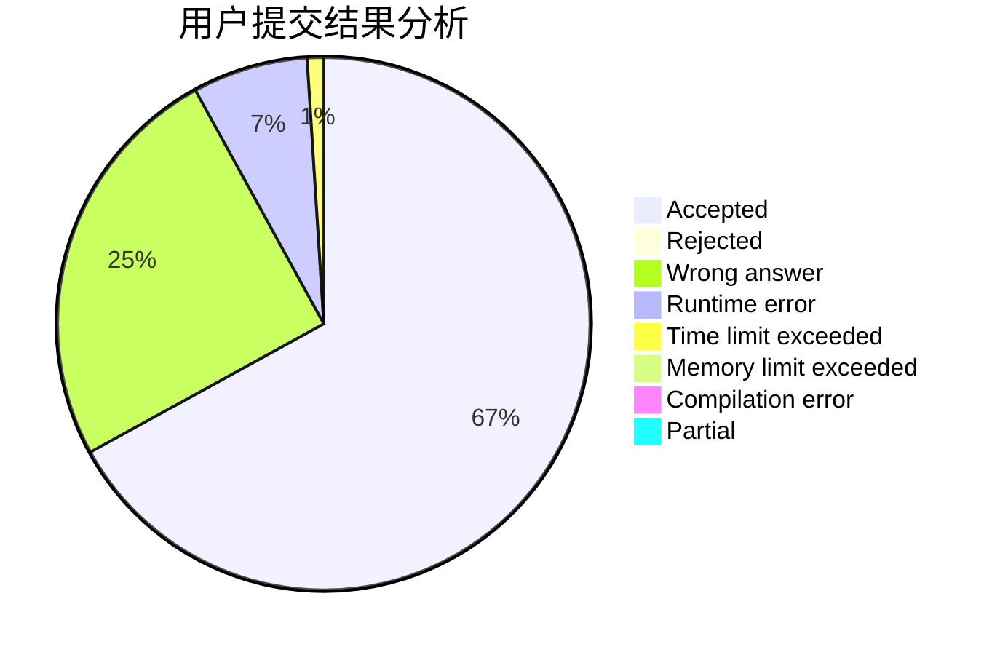
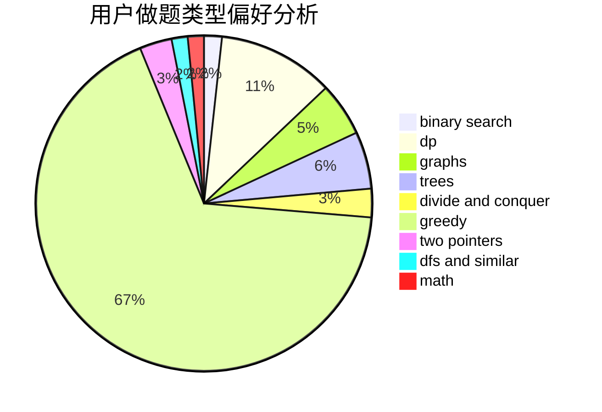

# LiuYu_penguin

<!-- tabs:start -->

#### **用户提交结果分析**

#### **用户做题类型偏好分析**

<!-- tabs:end -->
# 推荐题目
[14791](https://codeforces.com/contest/1479/problem/1)
[1315C](https://codeforces.com/contest/1315/problem/C)
[1013E](https://codeforces.com/contest/1013/problem/E)
[1144B](https://codeforces.com/contest/1144/problem/B)
[216A](https://codeforces.com/contest/216/problem/A)
[883C](https://codeforces.com/contest/883/problem/C)
[1375H](https://codeforces.com/contest/1375/problem/H)
[835C](https://codeforces.com/contest/835/problem/C)
[744C](https://codeforces.com/contest/744/problem/C)
[216C](https://codeforces.com/contest/216/problem/C)
