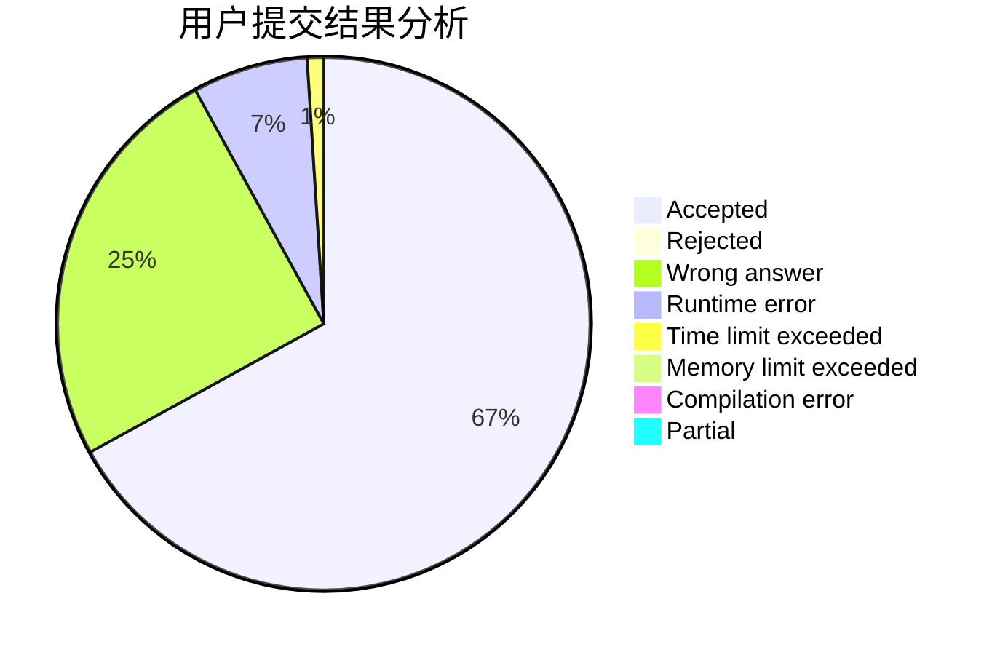
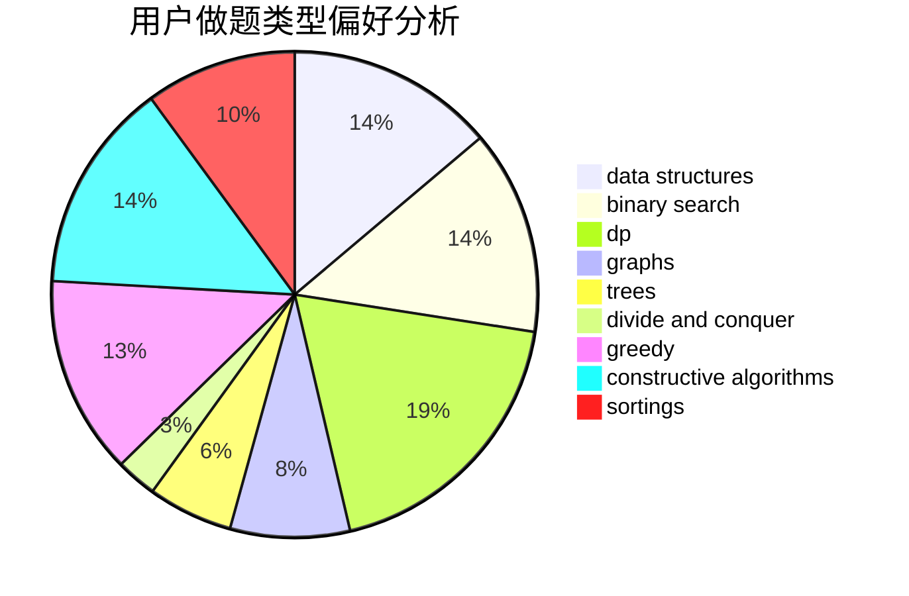
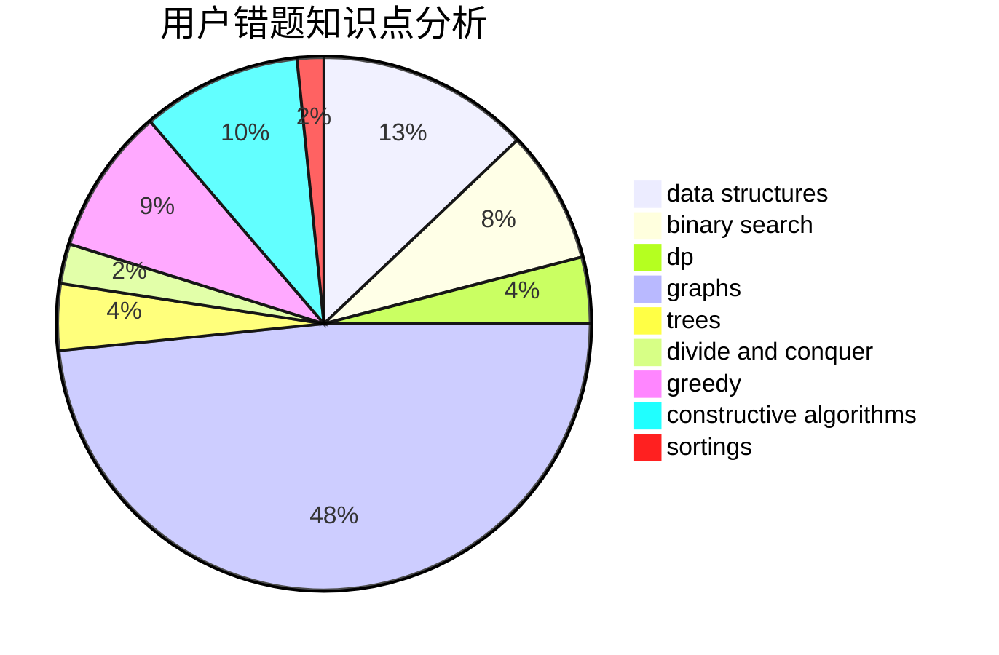

# LiuYu_penguin
<!-- tabs:start -->
#### **用户提交结果分析**

#### **用户做题类型偏好分析**

#### **用户错题知识点分析**

<!-- tabs:end -->
# 推荐题目
[1013B](http://codeforces.com/problemset/problem/1013/B)		greedy		  
[191C](http://codeforces.com/problemset/problem/191/C)		data structures,
                        dfs and similar,
                        trees		  
[863A](http://codeforces.com/problemset/problem/863/A)		brute force,
                        implementation		  
[1141G](http://codeforces.com/problemset/problem/1141/G)		binary search,
                        constructive algorithms,
                        dfs and similar,
                        graphs,
                        greedy,
                        trees		  
[1464C](https://codeforces.com/contest/1464/problem/C)		bitmasks,
                        greedy,
                        math,
                        strings		  
[816B](http://codeforces.com/problemset/problem/816/B)		binary search,
                        data structures,
                        implementation		  
[1423G](http://codeforces.com/problemset/problem/1423/G)		data structures		  
[521B](https://codeforces.com/contest/521/problem/B)		games,
                        greedy,
                        implementation		  
[1154E](http://codeforces.com/problemset/problem/1154/E)		data structures,
                        implementation,
                        sortings		  
[1337E](https://codeforces.com/contest/1337/problem/E)		dp,
                        strings		  
<!-- tabs:start -->
#### **data structures**
[191C](http://codeforces.com/problemset/problem/191/C)		data structures,
                        dfs and similar,
                        trees		  
[816B](http://codeforces.com/problemset/problem/816/B)		binary search,
                        data structures,
                        implementation		  
[1423G](http://codeforces.com/problemset/problem/1423/G)		data structures		  
[1154E](http://codeforces.com/problemset/problem/1154/E)		data structures,
                        implementation,
                        sortings		  
[930D](http://codeforces.com/problemset/problem/930/D)		data structures,
                        games,
                        implementation		  
[1479D](http://codeforces.com/problemset/problem/1479/D)		binary search,
                        bitmasks,
                        brute force,
                        data structures,
                        probabilities,
                        trees		  
[587C](http://codeforces.com/problemset/problem/587/C)		data structures,
                        trees		  
[1163F](http://codeforces.com/problemset/problem/1163/F)		data structures,
                        graphs,
                        shortest paths		  
[115E](http://codeforces.com/problemset/problem/115/E)		data structures,
                        dp		  
[1458D](http://codeforces.com/problemset/problem/1458/D)		data structures,
                        graphs,
                        greedy		  
#### **binary search**
[1141G](http://codeforces.com/problemset/problem/1141/G)		binary search,
                        constructive algorithms,
                        dfs and similar,
                        graphs,
                        greedy,
                        trees		  
[816B](http://codeforces.com/problemset/problem/816/B)		binary search,
                        data structures,
                        implementation		  
[1479D](http://codeforces.com/problemset/problem/1479/D)		binary search,
                        bitmasks,
                        brute force,
                        data structures,
                        probabilities,
                        trees		  
[938C](http://codeforces.com/problemset/problem/938/C)		binary search,
                        brute force,
                        constructive algorithms		  
[919B](http://codeforces.com/problemset/problem/919/B)		binary search,
                        brute force,
                        dp,
                        implementation,
                        number theory		  
[1492C](http://codeforces.com/problemset/problem/1492/C)		binary search,
                        data structures,
                        dp,
                        greedy,
                        two pointers		  
[1463D](http://codeforces.com/problemset/problem/1463/D)		binary search,
                        constructive algorithms,
                        greedy,
                        two pointers		  
[1490G](http://codeforces.com/problemset/problem/1490/G)		binary search,
                        data structures,
                        math		  
[1479D](http://codeforces.com/problemset/problem/1479/D)		binary search,
                        bitmasks,
                        brute force,
                        data structures,
                        probabilities,
                        trees		  
[1436E](http://codeforces.com/problemset/problem/1436/E)		binary search,
                        data structures,
                        two pointers		  
#### **dp**
[1337E](https://codeforces.com/contest/1337/problem/E)		dp,
                        strings		  
[623B](http://codeforces.com/problemset/problem/623/B)		dp,
                        greedy,
                        number theory		  
[919B](http://codeforces.com/problemset/problem/919/B)		binary search,
                        brute force,
                        dp,
                        implementation,
                        number theory		  
[115E](http://codeforces.com/problemset/problem/115/E)		data structures,
                        dp		  
[581F](http://codeforces.com/problemset/problem/581/F)		dp,
                        trees,
                        two pointers		  
[768D](http://codeforces.com/problemset/problem/768/D)		dp,
                        math,
                        probabilities		  
[1492C](http://codeforces.com/problemset/problem/1492/C)		binary search,
                        data structures,
                        dp,
                        greedy,
                        two pointers		  
[1457C](https://codeforces.com/contest/1457/problem/C)		brute force,
                        dp,
                        implementation		  
[1491C](http://codeforces.com/problemset/problem/1491/C)		brute force,
                        data structures,
                        dp,
                        greedy,
                        implementation		  
[1437C](http://codeforces.com/problemset/problem/1437/C)		dp,
                        flows,
                        graph matchings,
                        greedy,
                        math,
                        sortings		  
#### **graph**
[1141G](http://codeforces.com/problemset/problem/1141/G)		binary search,
                        constructive algorithms,
                        dfs and similar,
                        graphs,
                        greedy,
                        trees		  
[1011F](https://codeforces.com/contest/1011/problem/F)		dfs and similar,
                        graphs,
                        implementation,
                        trees		  
[1470D](http://codeforces.com/problemset/problem/1470/D)		constructive algorithms,
                        dfs and similar,
                        graph matchings,
                        graphs,
                        greedy		  
[1163F](http://codeforces.com/problemset/problem/1163/F)		data structures,
                        graphs,
                        shortest paths		  
[862B](http://codeforces.com/problemset/problem/862/B)		dfs and similar,
                        graphs,
                        trees		  
[1458D](http://codeforces.com/problemset/problem/1458/D)		data structures,
                        graphs,
                        greedy		  
[1496E](https://codeforces.com/contest/1496/problem/E)		constructive algorithms,
                        graphs		  
[1176D](http://codeforces.com/problemset/problem/1176/D)		dfs and similar,
                        graphs,
                        greedy,
                        number theory,
                        sortings		  
[1277E](https://codeforces.com/contest/1277/problem/E)		combinatorics,
                        dfs and similar,
                        dsu,
                        graphs		  
[1487C](http://codeforces.com/problemset/problem/1487/C)		brute force,
                        constructive algorithms,
                        dfs and similar,
                        graphs,
                        greedy,
                        implementation,
                        math		  
#### **trees**
[191C](http://codeforces.com/problemset/problem/191/C)		data structures,
                        dfs and similar,
                        trees		  
[1141G](http://codeforces.com/problemset/problem/1141/G)		binary search,
                        constructive algorithms,
                        dfs and similar,
                        graphs,
                        greedy,
                        trees		  
[1011F](https://codeforces.com/contest/1011/problem/F)		dfs and similar,
                        graphs,
                        implementation,
                        trees		  
[1479D](http://codeforces.com/problemset/problem/1479/D)		binary search,
                        bitmasks,
                        brute force,
                        data structures,
                        probabilities,
                        trees		  
[587C](http://codeforces.com/problemset/problem/587/C)		data structures,
                        trees		  
[862B](http://codeforces.com/problemset/problem/862/B)		dfs and similar,
                        graphs,
                        trees		  
[581F](http://codeforces.com/problemset/problem/581/F)		dp,
                        trees,
                        two pointers		  
[1479D](http://codeforces.com/problemset/problem/1479/D)		binary search,
                        bitmasks,
                        brute force,
                        data structures,
                        probabilities,
                        trees		  
[1511C](http://codeforces.com/problemset/problem/1511/C)		brute force,
                        data structures,
                        implementation,
                        trees		  
[1499F](http://codeforces.com/problemset/problem/1499/F)		combinatorics,
                        dfs and similar,
                        dp,
                        trees		  
#### **divide and conquer**
[1461D](http://codeforces.com/problemset/problem/1461/D)		binary search,
                        brute force,
                        data structures,
                        divide and conquer,
                        implementation,
                        sortings		  
[1466G](http://codeforces.com/problemset/problem/1466/G)		combinatorics,
                        divide and conquer,
                        hashing,
                        math,
                        string suffix structures,
                        strings		  
[1490D](http://codeforces.com/problemset/problem/1490/D)		dfs and similar,
                        divide and conquer,
                        implementation		  
[1483C](https://codeforces.com/contest/1483/problem/C)		data structures,
                        divide and conquer,
                        dp		  
[1491E](http://codeforces.com/problemset/problem/1491/E)		brute force,
                        dfs and similar,
                        divide and conquer,
                        number theory,
                        trees		  
[1303G](http://codeforces.com/problemset/problem/1303/G)		data structures,
                        divide and conquer,
                        geometry,
                        trees		  
[1494D](http://codeforces.com/problemset/problem/1494/D)		constructive algorithms,
                        data structures,
                        dfs and similar,
                        divide and conquer,
                        dsu,
                        greedy,
                        sortings,
                        trees		  
[1482E](http://codeforces.com/problemset/problem/1482/E)		data structures,
                        divide and conquer,
                        dp		  
[566C](http://codeforces.com/problemset/problem/566/C)		dfs and similar,
                        divide and conquer,
                        trees		  
[1428F](http://codeforces.com/problemset/problem/1428/F)		binary search,
                        data structures,
                        divide and conquer,
                        dp,
                        two pointers		  
#### **greedy**
[1013B](http://codeforces.com/problemset/problem/1013/B)		greedy		  
[1141G](http://codeforces.com/problemset/problem/1141/G)		binary search,
                        constructive algorithms,
                        dfs and similar,
                        graphs,
                        greedy,
                        trees		  
[1464C](https://codeforces.com/contest/1464/problem/C)		bitmasks,
                        greedy,
                        math,
                        strings		  
[521B](https://codeforces.com/contest/521/problem/B)		games,
                        greedy,
                        implementation		  
[1130D1](https://codeforces.com/contest/1130/problem/D1)		brute force,
                        greedy		  
[623B](http://codeforces.com/problemset/problem/623/B)		dp,
                        greedy,
                        number theory		  
[1470D](http://codeforces.com/problemset/problem/1470/D)		constructive algorithms,
                        dfs and similar,
                        graph matchings,
                        graphs,
                        greedy		  
[1307B](http://codeforces.com/problemset/problem/1307/B)		geometry,
                        greedy,
                        math		  
[1458D](http://codeforces.com/problemset/problem/1458/D)		data structures,
                        graphs,
                        greedy		  
[1091F](http://codeforces.com/problemset/problem/1091/F)		constructive algorithms,
                        greedy		  
#### **constructive algorithms**
[1141G](http://codeforces.com/problemset/problem/1141/G)		binary search,
                        constructive algorithms,
                        dfs and similar,
                        graphs,
                        greedy,
                        trees		  
[938C](http://codeforces.com/problemset/problem/938/C)		binary search,
                        brute force,
                        constructive algorithms		  
[1470D](http://codeforces.com/problemset/problem/1470/D)		constructive algorithms,
                        dfs and similar,
                        graph matchings,
                        graphs,
                        greedy		  
[1091F](http://codeforces.com/problemset/problem/1091/F)		constructive algorithms,
                        greedy		  
[1496E](https://codeforces.com/contest/1496/problem/E)		constructive algorithms,
                        graphs		  
[1504F](https://codeforces.com/contest/1504/problem/F)		2-sat,
                        constructive algorithms,
                        data structures,
                        greedy,
                        sortings,
                        two pointers		  
[1493A](http://codeforces.com/problemset/problem/1493/A)		constructive algorithms,
                        greedy		  
[1463D](http://codeforces.com/problemset/problem/1463/D)		binary search,
                        constructive algorithms,
                        greedy,
                        two pointers		  
[1456B](https://codeforces.com/contest/1456/problem/B)		bitmasks,
                        brute force,
                        constructive algorithms		  
[1492D](http://codeforces.com/problemset/problem/1492/D)		bitmasks,
                        constructive algorithms,
                        greedy,
                        math		  
#### **sortings**
[1154E](http://codeforces.com/problemset/problem/1154/E)		data structures,
                        implementation,
                        sortings		  
[1176D](http://codeforces.com/problemset/problem/1176/D)		dfs and similar,
                        graphs,
                        greedy,
                        number theory,
                        sortings		  
[1504F](https://codeforces.com/contest/1504/problem/F)		2-sat,
                        constructive algorithms,
                        data structures,
                        greedy,
                        sortings,
                        two pointers		  
[1496C](https://codeforces.com/contest/1496/problem/C)		geometry,
                        greedy,
                        math,
                        sortings		  
[1495A](http://codeforces.com/problemset/problem/1495/A)		geometry,
                        greedy,
                        math,
                        sortings		  
[1497A](http://codeforces.com/problemset/problem/1497/A)		brute force,
                        data structures,
                        greedy,
                        sortings		  
[1427A](http://codeforces.com/problemset/problem/1427/A)		math,
                        sortings		  
[1461D](http://codeforces.com/problemset/problem/1461/D)		binary search,
                        brute force,
                        data structures,
                        divide and conquer,
                        implementation,
                        sortings		  
[1437C](http://codeforces.com/problemset/problem/1437/C)		dp,
                        flows,
                        graph matchings,
                        greedy,
                        math,
                        sortings		  
[1473A](http://codeforces.com/problemset/problem/1473/A)		greedy,
                        implementation,
                        math,
                        sortings		  
<!-- tabs:end -->
