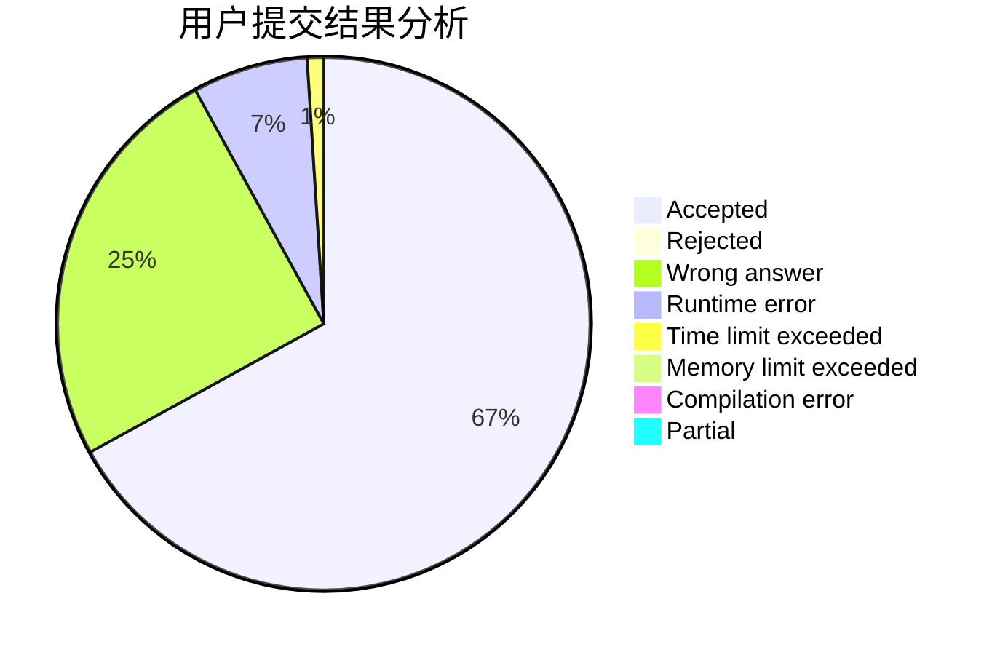
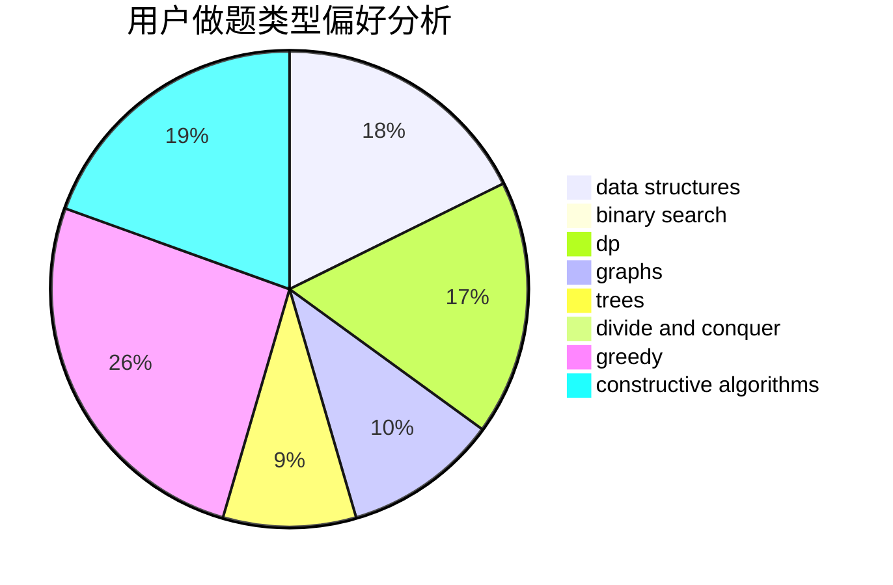
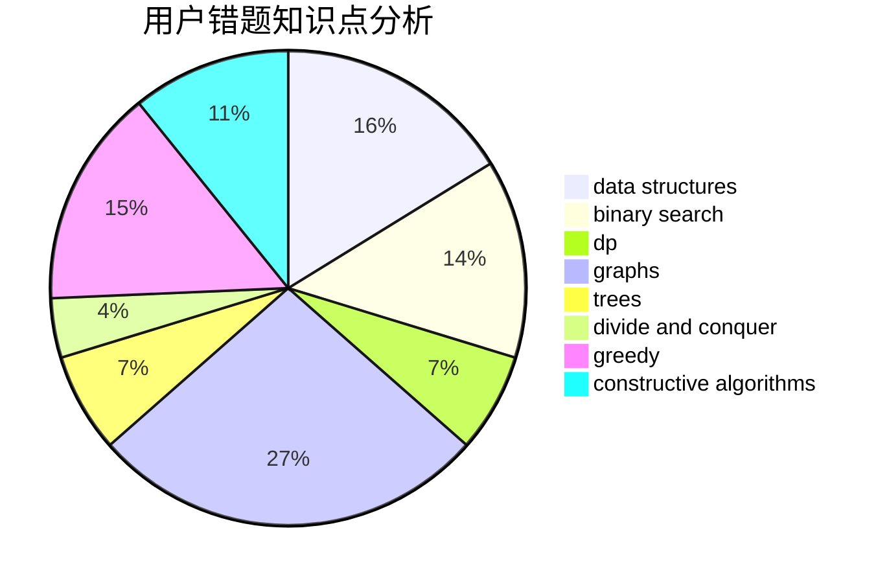

# LiuYu_penguin

<!-- tabs:start -->

#### **用户提交结果分析**

#### **用户做题类型偏好分析**

#### **用户错题知识点分析**

<!-- tabs:end -->
# 推荐题目
[14791](https://codeforces.com/contest/1479/problem/1)		dsu,graphs,sortings,trees		  
[1315C](https://codeforces.com/contest/1315/problem/C)		greedy		  
[1013E](https://codeforces.com/contest/1013/problem/E)		dsu,graphs,sortings,trees		  
[1144B](https://codeforces.com/contest/1144/problem/B)		greedy,
                        implementation,
                        sortings		  
[216A](https://codeforces.com/contest/216/problem/A)		implementation,
                        math		  
[883C](https://codeforces.com/contest/883/problem/C)		binary search,
                        implementation		  
[1375H](https://codeforces.com/contest/1375/problem/H)		constructive algorithms,
                        divide and conquer		  
[835C](https://codeforces.com/contest/835/problem/C)		dp,
                        implementation		  
[744C](https://codeforces.com/contest/744/problem/C)		bitmasks,
                        brute force,
                        dp		  
[216C](https://codeforces.com/contest/216/problem/C)		greedy		  
