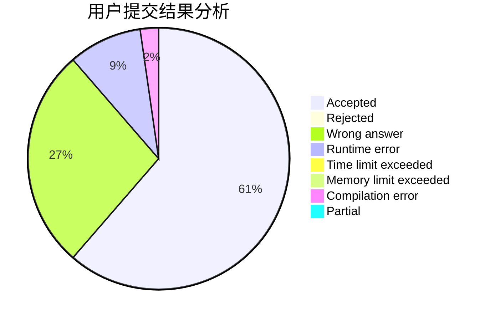
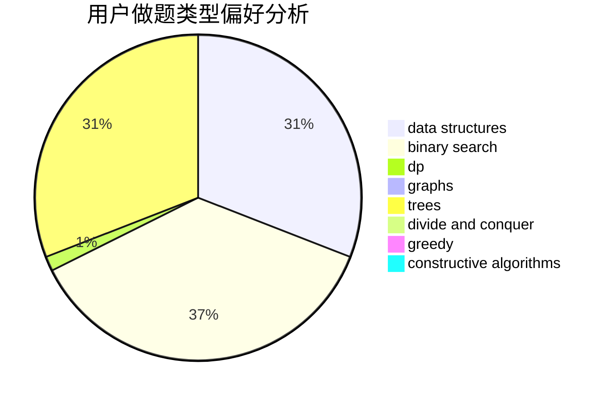
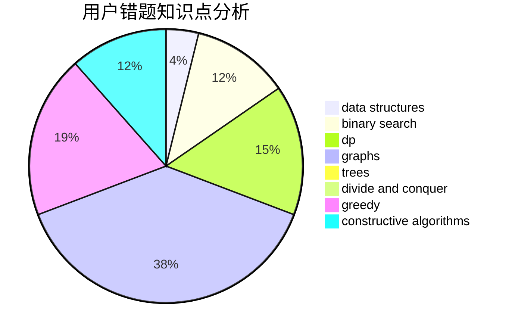

# Liu_AK

<!-- tabs:start -->

#### **用户提交结果分析**

#### **用户做题类型偏好分析**

#### **用户错题知识点分析**

<!-- tabs:end -->
# 推荐题目
[1189D2](https://codeforces.com/contest/1189D/problem/2)		dsu,graphs,sortings,trees		  
[180C](https://codeforces.com/contest/180/problem/C)		dp		  
[628C](https://codeforces.com/contest/628/problem/C)		greedy,
                        strings		  
[1206B](https://codeforces.com/contest/1206/problem/B)		dp,
                        implementation		  
[1184C3](https://codeforces.com/contest/1184C/problem/3)		nan		  
[760B](https://codeforces.com/contest/760/problem/B)		binary search,
                        greedy		  
[819A](https://codeforces.com/contest/819/problem/A)		games,
                        greedy		  
[125E](https://codeforces.com/contest/125/problem/E)		binary search,
                        graphs		  
[1186F](https://codeforces.com/contest/1186/problem/F)		dfs and similar,
                        graphs,
                        greedy,
                        implementation		  
[1482E](https://codeforces.com/contest/1482/problem/E)		data structures,
                        divide and conquer,
                        dp		  
