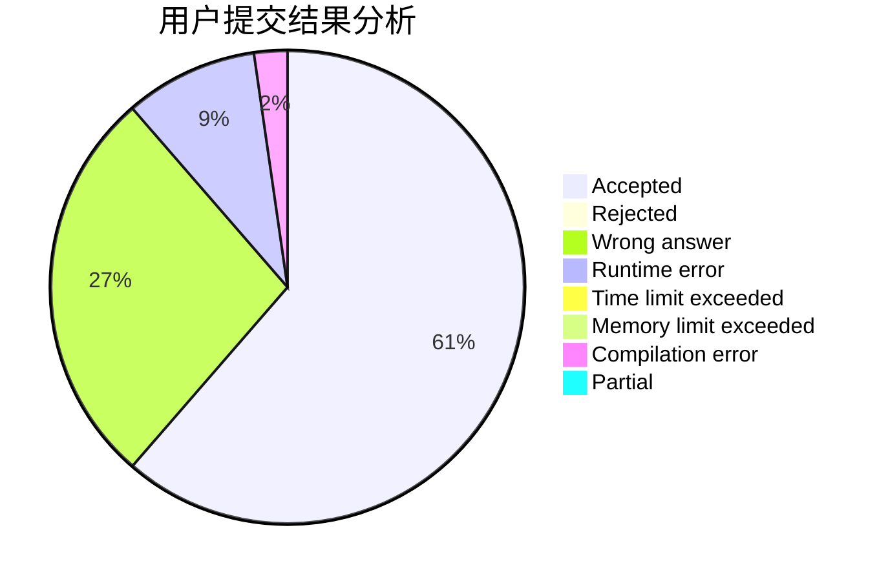
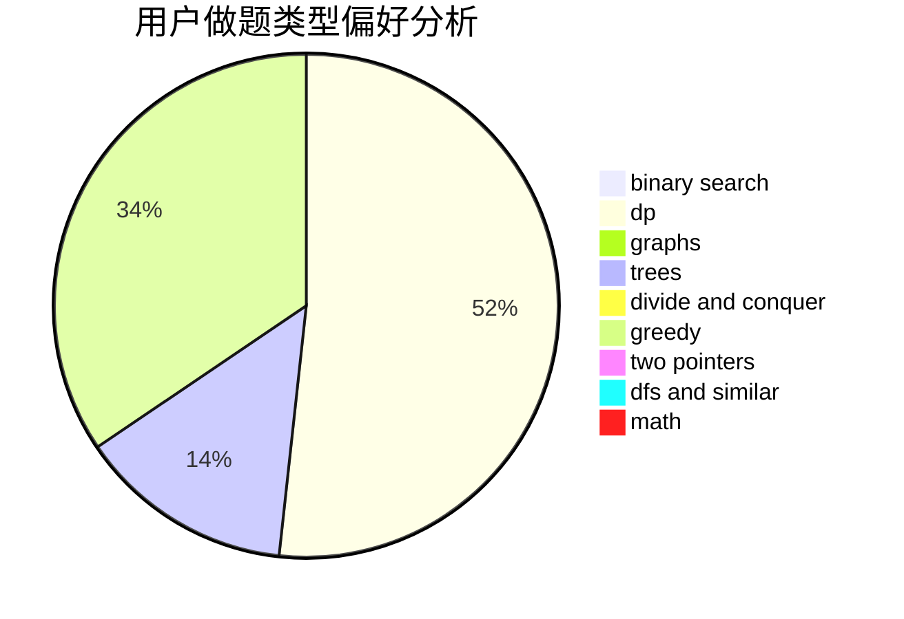

# Liu_AK

<!-- tabs:start -->

#### **用户提交结果分析**

#### **用户做题类型偏好分析**

<!-- tabs:end -->
# 推荐题目
[11951](https://codeforces.com/contest/1195/problem/1)
[205D](https://codeforces.com/contest/205/problem/D)
[656D](https://codeforces.com/contest/656/problem/D)
[1210C](https://codeforces.com/contest/1210/problem/C)
[11882](https://codeforces.com/contest/1188/problem/2)
[780A](https://codeforces.com/contest/780/problem/A)
[839A](https://codeforces.com/contest/839/problem/A)
[1265E](https://codeforces.com/contest/1265/problem/E)
[1190B](https://codeforces.com/contest/1190/problem/B)
[1490C](https://codeforces.com/contest/1490/problem/C)
