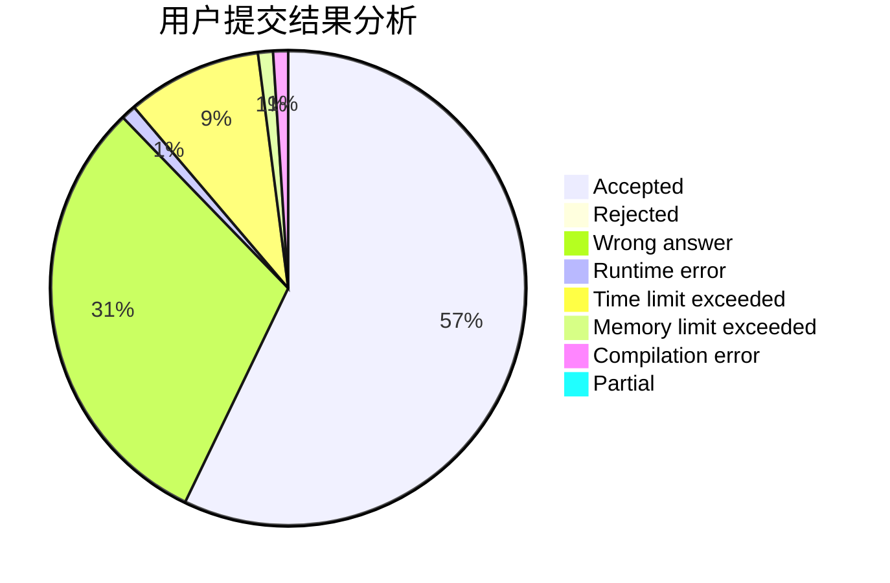
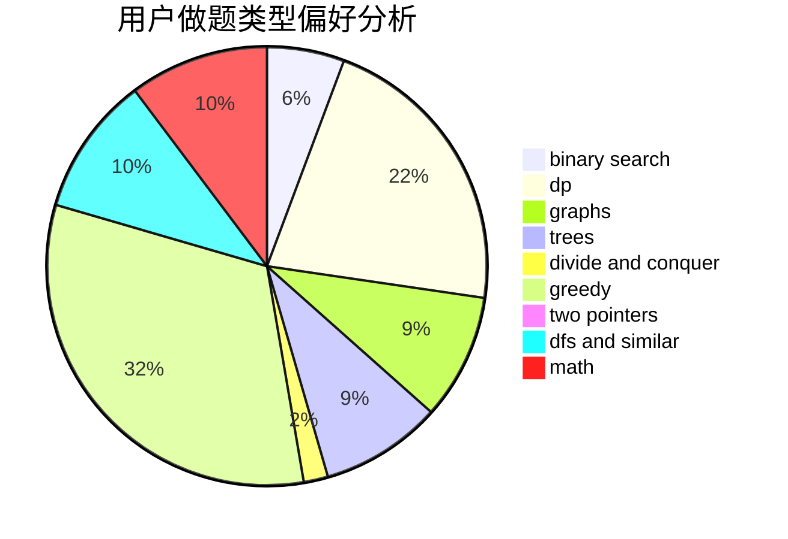

# Liu_QY

<!-- tabs:start -->

#### **用户提交结果分析**

#### **用户做题类型偏好分析**

<!-- tabs:end -->
# 推荐题目
[963C](https://codeforces.com/contest/963/problem/C)
[1446E](https://codeforces.com/contest/1446/problem/E)
[733D](https://codeforces.com/contest/733/problem/D)
[810A](https://codeforces.com/contest/810/problem/A)
[1058A](https://codeforces.com/contest/1058/problem/A)
[1057B](https://codeforces.com/contest/1057/problem/B)
[822A](https://codeforces.com/contest/822/problem/A)
[699C](https://codeforces.com/contest/699/problem/C)
[8D](https://codeforces.com/contest/8/problem/D)
[877B](https://codeforces.com/contest/877/problem/B)
