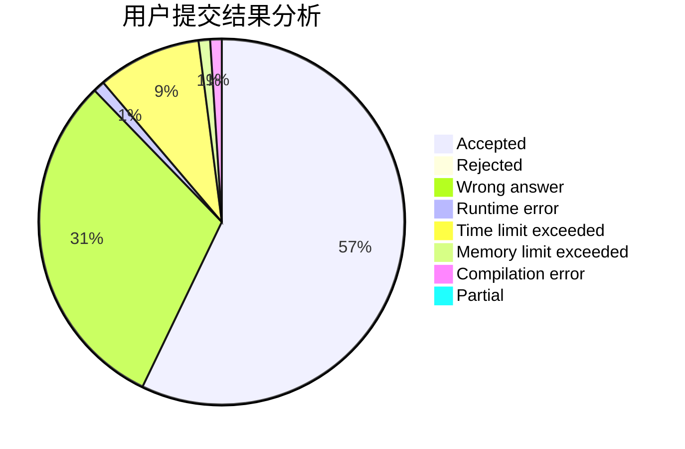
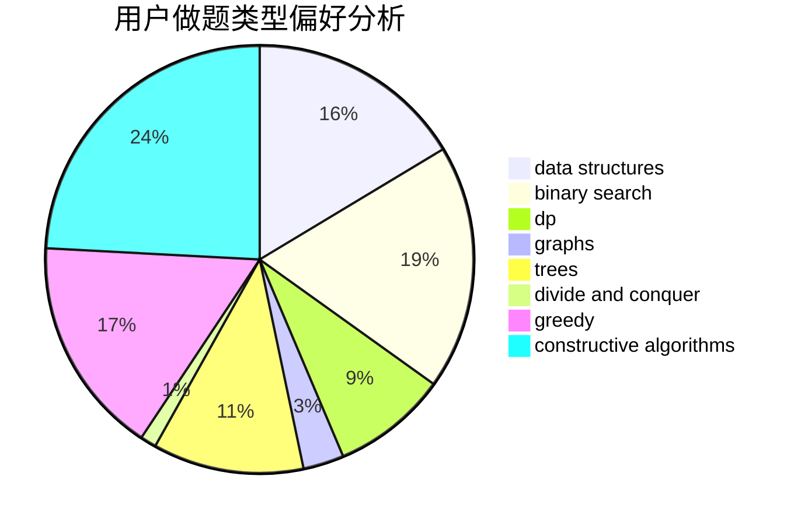
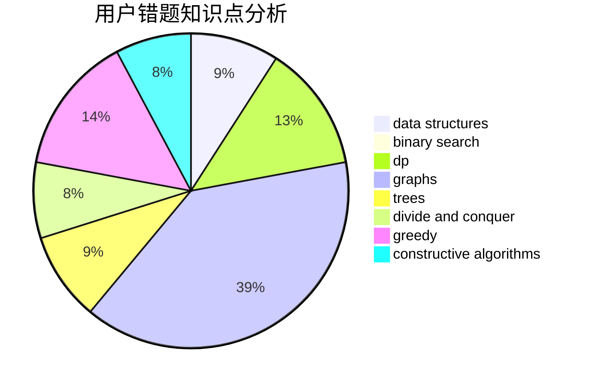

# Liu_QY

<!-- tabs:start -->

#### **用户提交结果分析**

#### **用户做题类型偏好分析**

#### **用户错题知识点分析**

<!-- tabs:end -->
# 推荐题目
[946F](https://codeforces.com/contest/946/problem/F)		combinatorics,
                        dp,
                        matrices		  
[1436F](https://codeforces.com/contest/1436/problem/F)		combinatorics,
                        math,
                        number theory		  
[715B](https://codeforces.com/contest/715/problem/B)		binary search,
                        constructive algorithms,
                        graphs,
                        shortest paths		  
[795K](https://codeforces.com/contest/795/problem/K)		dsu,graphs,sortings,trees		  
[1056G](https://codeforces.com/contest/1056/problem/G)		brute force,
                        data structures,
                        graphs		  
[1056F](https://codeforces.com/contest/1056/problem/F)		binary search,
                        dp,
                        math		  
[805D](https://codeforces.com/contest/805/problem/D)		dsu,graphs,sortings,trees		  
[674F](https://codeforces.com/contest/674/problem/F)		dsu,graphs,sortings,trees		  
[87C](https://codeforces.com/contest/87/problem/C)		dp,
                        games,
                        math		  
[859E](https://codeforces.com/contest/859/problem/E)		combinatorics,
                        dfs and similar,
                        dsu,
                        graphs,
                        trees		  
