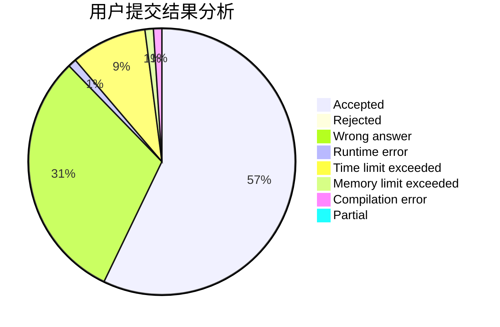
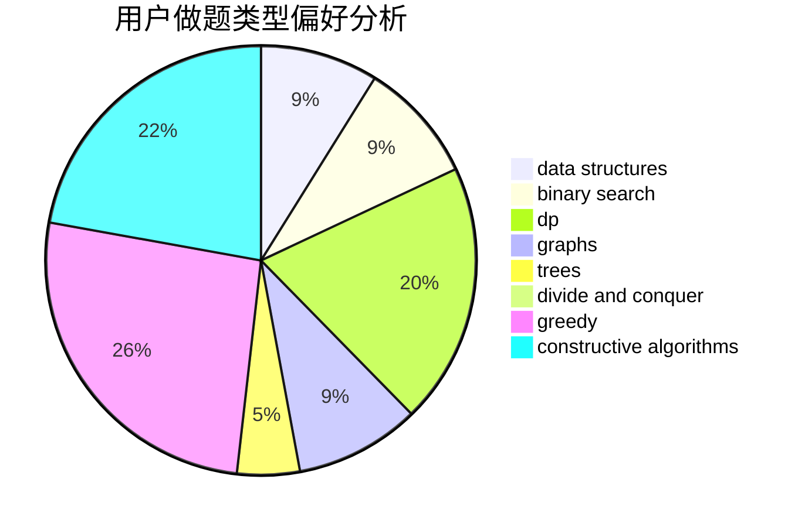
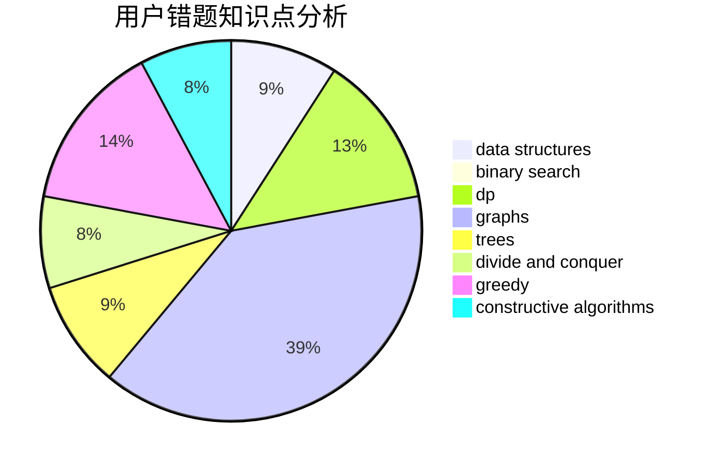

# Liu_QY

<!-- tabs:start -->

#### **用户提交结果分析**

#### **用户做题类型偏好分析**

#### **用户错题知识点分析**

<!-- tabs:end -->
# 推荐题目
[963C](https://codeforces.com/contest/963/problem/C)		brute force,
                        math,
                        number theory		  
[1446E](https://codeforces.com/contest/1446/problem/E)		constructive algorithms,
                        dfs and similar		  
[733D](https://codeforces.com/contest/733/problem/D)		data structures,
                        hashing		  
[810A](https://codeforces.com/contest/810/problem/A)		implementation,
                        math		  
[1058A](https://codeforces.com/contest/1058/problem/A)		dsu,graphs,sortings,trees		  
[1057B](https://codeforces.com/contest/1057/problem/B)		*special problem,
                        brute force		  
[822A](https://codeforces.com/contest/822/problem/A)		implementation,
                        math,
                        number theory		  
[699C](https://codeforces.com/contest/699/problem/C)		dsu,graphs,sortings,trees		  
[8D](https://codeforces.com/contest/8/problem/D)		binary search,
                        geometry		  
[877B](https://codeforces.com/contest/877/problem/B)		brute force,
                        dp		  
