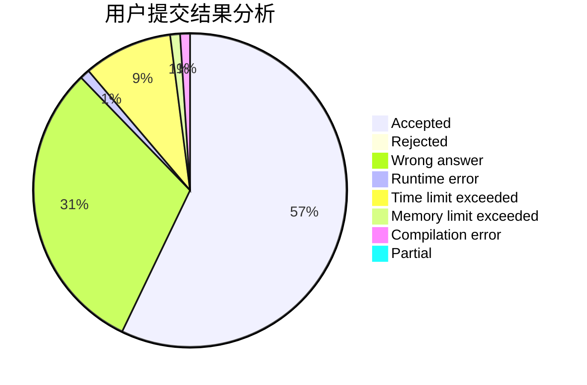
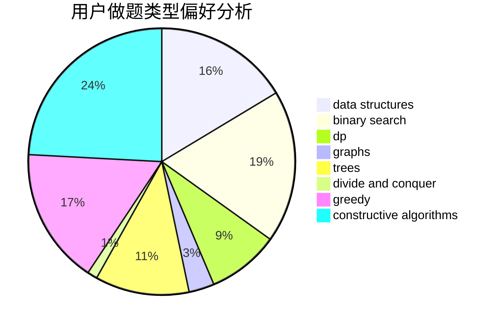
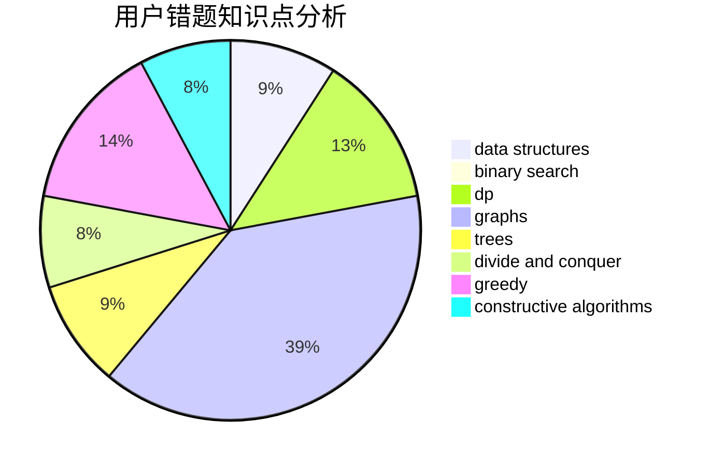

# Liu_QY
<!-- tabs:start -->
#### **用户提交结果分析**

#### **用户做题类型偏好分析**

#### **用户错题知识点分析**

<!-- tabs:end -->
# 推荐题目
[Take Metro](http://codeforces.com/problemset/problem/1056/G)		brute force,
                        data structures,
                        graphs		  
[Fibonacci String Subsequences](http://codeforces.com/problemset/problem/946/F)		combinatorics,
                        dp,
                        matrices		  
[Interesting Game](http://codeforces.com/problemset/problem/87/C)		dp,
                        games,
                        math		  
[Konrad and Company Evaluation](http://codeforces.com/problemset/problem/1210/D)		graphs		  
[Expression](http://codeforces.com/problemset/problem/58/E)		dp		  
[Sum Over Subsets](http://codeforces.com/problemset/problem/1436/F)		combinatorics,
                        math,
                        number theory		  
[Polycarp Training](http://codeforces.com/problemset/problem/1165/B)		data structures,
                        greedy,
                        sortings		  
[Desk Disorder](http://codeforces.com/problemset/problem/859/E)		combinatorics,
                        dfs and similar,
                        dsu,
                        graphs,
                        trees		  
[Road Repairs](http://codeforces.com/problemset/problem/240/E)		dfs and similar,
                        graphs,
                        greedy		  
[Mouse Hunt](http://codeforces.com/problemset/problem/1027/D)		dfs and similar,
                        graphs		  
<!-- tabs:start -->
#### **data structures**
[Take Metro](http://codeforces.com/problemset/problem/1056/G)		brute force,
                        data structures,
                        graphs		  
[Fibonacci String Subsequences](http://codeforces.com/problemset/problem/1165/B)		data structures,
                        greedy,
                        sortings		  
[Interesting Game](http://codeforces.com/problemset/problem/480/E)		data structures,
                        divide and conquer		  
[Konrad and Company Evaluation](http://codeforces.com/problemset/problem/757/G)		data structures,
                        divide and conquer,
                        graphs,
                        trees		  
[Expression](http://codeforces.com/problemset/problem/1310/A)		data structures,
                        greedy,
                        sortings		  
[Sum Over Subsets](http://codeforces.com/problemset/problem/15/D)		data structures,
                        implementation,
                        sortings		  
[Polycarp Training](http://codeforces.com/problemset/problem/1114/F)		bitmasks,
                        data structures,
                        divide and conquer,
                        math,
                        number theory		  
[Desk Disorder](http://codeforces.com/problemset/problem/1492/C)		binary search,
                        data structures,
                        dp,
                        greedy,
                        two pointers		  
[Road Repairs](http://codeforces.com/problemset/problem/1490/G)		binary search,
                        data structures,
                        math		  
[Mouse Hunt](http://codeforces.com/problemset/problem/1479/D)		binary search,
                        bitmasks,
                        brute force,
                        data structures,
                        probabilities,
                        trees		  
#### **binary search**
[Take Metro](http://codeforces.com/problemset/problem/1056/F)		binary search,
                        dp,
                        math		  
[Fibonacci String Subsequences](http://codeforces.com/problemset/problem/837/E)		binary search,
                        implementation,
                        math		  
[Interesting Game](http://codeforces.com/problemset/problem/525/E)		binary search,
                        bitmasks,
                        brute force,
                        dp,
                        math,
                        meet-in-the-middle		  
[Konrad and Company Evaluation](http://codeforces.com/problemset/problem/1279/B)		binary search,
                        brute force,
                        implementation		  
[Expression](http://codeforces.com/problemset/problem/715/B)		binary search,
                        constructive algorithms,
                        graphs,
                        shortest paths		  
[Sum Over Subsets](http://codeforces.com/problemset/problem/1492/C)		binary search,
                        data structures,
                        dp,
                        greedy,
                        two pointers		  
[Polycarp Training](http://codeforces.com/problemset/problem/1463/D)		binary search,
                        constructive algorithms,
                        greedy,
                        two pointers		  
[Desk Disorder](http://codeforces.com/problemset/problem/1490/G)		binary search,
                        data structures,
                        math		  
[Road Repairs](http://codeforces.com/problemset/problem/1479/D)		binary search,
                        bitmasks,
                        brute force,
                        data structures,
                        probabilities,
                        trees		  
[Mouse Hunt](http://codeforces.com/problemset/problem/1436/E)		binary search,
                        data structures,
                        two pointers		  
#### **dp**
[Take Metro](http://codeforces.com/problemset/problem/946/F)		combinatorics,
                        dp,
                        matrices		  
[Fibonacci String Subsequences](http://codeforces.com/problemset/problem/87/C)		dp,
                        games,
                        math		  
[Interesting Game](http://codeforces.com/problemset/problem/58/E)		dp		  
[Konrad and Company Evaluation](http://codeforces.com/problemset/problem/360/C)		combinatorics,
                        dp		  
[Expression](http://codeforces.com/problemset/problem/1056/F)		binary search,
                        dp,
                        math		  
[Sum Over Subsets](https://codeforces.com/contest/1013/problem/E)		dp		  
[Polycarp Training](https://codeforces.com/contest/674/problem/F)		dp,
                        math,
                        meet-in-the-middle		  
[Desk Disorder](http://codeforces.com/problemset/problem/482/D)		combinatorics,
                        dp,
                        trees		  
[Road Repairs](http://codeforces.com/problemset/problem/525/E)		binary search,
                        bitmasks,
                        brute force,
                        dp,
                        math,
                        meet-in-the-middle		  
[Mouse Hunt](http://codeforces.com/problemset/problem/623/E)		combinatorics,
                        dp,
                        fft,
                        math		  
#### **graph**
[Take Metro](http://codeforces.com/problemset/problem/1056/G)		brute force,
                        data structures,
                        graphs		  
[Fibonacci String Subsequences](http://codeforces.com/problemset/problem/1210/D)		graphs		  
[Interesting Game](http://codeforces.com/problemset/problem/859/E)		combinatorics,
                        dfs and similar,
                        dsu,
                        graphs,
                        trees		  
[Konrad and Company Evaluation](http://codeforces.com/problemset/problem/240/E)		dfs and similar,
                        graphs,
                        greedy		  
[Expression](http://codeforces.com/problemset/problem/1027/D)		dfs and similar,
                        graphs		  
[Sum Over Subsets](http://codeforces.com/problemset/problem/757/G)		data structures,
                        divide and conquer,
                        graphs,
                        trees		  
[Polycarp Training](http://codeforces.com/problemset/problem/715/B)		binary search,
                        constructive algorithms,
                        graphs,
                        shortest paths		  
[Desk Disorder](http://codeforces.com/problemset/problem/1487/C)		brute force,
                        constructive algorithms,
                        dfs and similar,
                        graphs,
                        greedy,
                        implementation,
                        math		  
[Road Repairs](http://codeforces.com/problemset/problem/1437/C)		dp,
                        flows,
                        graph matchings,
                        greedy,
                        math,
                        sortings		  
[Mouse Hunt](http://codeforces.com/problemset/problem/1470/D)		constructive algorithms,
                        dfs and similar,
                        graph matchings,
                        graphs,
                        greedy		  
#### **trees**
[Take Metro](http://codeforces.com/problemset/problem/859/E)		combinatorics,
                        dfs and similar,
                        dsu,
                        graphs,
                        trees		  
[Fibonacci String Subsequences](http://codeforces.com/problemset/problem/757/G)		data structures,
                        divide and conquer,
                        graphs,
                        trees		  
[Interesting Game](http://codeforces.com/problemset/problem/482/D)		combinatorics,
                        dp,
                        trees		  
[Konrad and Company Evaluation](http://codeforces.com/problemset/problem/1481/F)		dp,
                        greedy,
                        trees		  
[Expression](http://codeforces.com/problemset/problem/1479/D)		binary search,
                        bitmasks,
                        brute force,
                        data structures,
                        probabilities,
                        trees		  
[Sum Over Subsets](http://codeforces.com/problemset/problem/1511/C)		brute force,
                        data structures,
                        implementation,
                        trees		  
[Polycarp Training](http://codeforces.com/problemset/problem/1499/F)		combinatorics,
                        dfs and similar,
                        dp,
                        trees		  
[Desk Disorder](http://codeforces.com/problemset/problem/1491/E)		brute force,
                        dfs and similar,
                        divide and conquer,
                        number theory,
                        trees		  
[Road Repairs](http://codeforces.com/problemset/problem/1466/D)		data structures,
                        greedy,
                        sortings,
                        trees		  
[Mouse Hunt](http://codeforces.com/problemset/problem/1495/D)		combinatorics,
                        dfs and similar,
                        graphs,
                        math,
                        shortest paths,
                        trees		  
#### **divide and conquer**
[Take Metro](http://codeforces.com/problemset/problem/480/E)		data structures,
                        divide and conquer		  
[Fibonacci String Subsequences](http://codeforces.com/problemset/problem/757/G)		data structures,
                        divide and conquer,
                        graphs,
                        trees		  
[Interesting Game](http://codeforces.com/problemset/problem/1114/F)		bitmasks,
                        data structures,
                        divide and conquer,
                        math,
                        number theory		  
[Konrad and Company Evaluation](http://codeforces.com/problemset/problem/1461/D)		binary search,
                        brute force,
                        data structures,
                        divide and conquer,
                        implementation,
                        sortings		  
[Expression](http://codeforces.com/problemset/problem/1466/G)		combinatorics,
                        divide and conquer,
                        hashing,
                        math,
                        string suffix structures,
                        strings		  
[Sum Over Subsets](http://codeforces.com/problemset/problem/1490/D)		dfs and similar,
                        divide and conquer,
                        implementation		  
[Polycarp Training](https://codeforces.com/contest/1483/problem/C)		data structures,
                        divide and conquer,
                        dp		  
[Desk Disorder](http://codeforces.com/problemset/problem/1491/E)		brute force,
                        dfs and similar,
                        divide and conquer,
                        number theory,
                        trees		  
[Road Repairs](http://codeforces.com/problemset/problem/1303/G)		data structures,
                        divide and conquer,
                        geometry,
                        trees		  
[Mouse Hunt](http://codeforces.com/problemset/problem/1494/D)		constructive algorithms,
                        data structures,
                        dfs and similar,
                        divide and conquer,
                        dsu,
                        greedy,
                        sortings,
                        trees		  
#### **greedy**
[Take Metro](http://codeforces.com/problemset/problem/1165/B)		data structures,
                        greedy,
                        sortings		  
[Fibonacci String Subsequences](http://codeforces.com/problemset/problem/240/E)		dfs and similar,
                        graphs,
                        greedy		  
[Interesting Game](http://codeforces.com/problemset/problem/803/C)		constructive algorithms,
                        greedy,
                        math		  
[Konrad and Company Evaluation](https://codeforces.com/contest/805/problem/D)		combinatorics,
                        greedy,
                        implementation,
                        math		  
[Expression](http://codeforces.com/problemset/problem/1333/F)		greedy,
                        implementation,
                        math,
                        number theory,
                        sortings,
                        two pointers		  
[Sum Over Subsets](http://codeforces.com/problemset/problem/1310/A)		data structures,
                        greedy,
                        sortings		  
[Polycarp Training](http://codeforces.com/problemset/problem/920/C)		dfs and similar,
                        greedy,
                        math,
                        sortings,
                        two pointers		  
[Desk Disorder](http://codeforces.com/problemset/problem/1252/E)		greedy,
                        two pointers		  
[Road Repairs](http://codeforces.com/problemset/problem/1421/D)		brute force,
                        constructive algorithms,
                        greedy,
                        implementation,
                        math,
                        shortest paths		  
[Mouse Hunt](http://codeforces.com/problemset/problem/1492/E)		brute force,
                        constructive algorithms,
                        dfs and similar,
                        greedy,
                        implementation		  
#### **constructive algorithms**
[Take Metro](http://codeforces.com/problemset/problem/803/C)		constructive algorithms,
                        greedy,
                        math		  
[Fibonacci String Subsequences](http://codeforces.com/problemset/problem/854/A)		brute force,
                        constructive algorithms,
                        math		  
[Interesting Game](http://codeforces.com/problemset/problem/715/B)		binary search,
                        constructive algorithms,
                        graphs,
                        shortest paths		  
[Konrad and Company Evaluation](http://codeforces.com/problemset/problem/1166/B)		constructive algorithms,
                        math,
                        number theory		  
[Expression](http://codeforces.com/problemset/problem/1421/D)		brute force,
                        constructive algorithms,
                        greedy,
                        implementation,
                        math,
                        shortest paths		  
[Sum Over Subsets](http://codeforces.com/problemset/problem/1492/E)		brute force,
                        constructive algorithms,
                        dfs and similar,
                        greedy,
                        implementation		  
[Polycarp Training](http://codeforces.com/problemset/problem/1416/B)		constructive algorithms,
                        greedy,
                        math		  
[Desk Disorder](http://codeforces.com/problemset/problem/1493/A)		constructive algorithms,
                        greedy		  
[Road Repairs](http://codeforces.com/problemset/problem/1463/D)		binary search,
                        constructive algorithms,
                        greedy,
                        two pointers		  
[Mouse Hunt](https://codeforces.com/contest/1456/problem/B)		bitmasks,
                        brute force,
                        constructive algorithms		  
#### **sortings**
[Take Metro](http://codeforces.com/problemset/problem/1165/B)		data structures,
                        greedy,
                        sortings		  
[Fibonacci String Subsequences](http://codeforces.com/problemset/problem/1333/F)		greedy,
                        implementation,
                        math,
                        number theory,
                        sortings,
                        two pointers		  
[Interesting Game](http://codeforces.com/problemset/problem/1310/A)		data structures,
                        greedy,
                        sortings		  
[Konrad and Company Evaluation](http://codeforces.com/problemset/problem/920/C)		dfs and similar,
                        greedy,
                        math,
                        sortings,
                        two pointers		  
[Expression](http://codeforces.com/problemset/problem/15/D)		data structures,
                        implementation,
                        sortings		  
[Sum Over Subsets](https://codeforces.com/contest/1496/problem/C)		geometry,
                        greedy,
                        math,
                        sortings		  
[Polycarp Training](http://codeforces.com/problemset/problem/1495/A)		geometry,
                        greedy,
                        math,
                        sortings		  
[Desk Disorder](http://codeforces.com/problemset/problem/1497/A)		brute force,
                        data structures,
                        greedy,
                        sortings		  
[Road Repairs](http://codeforces.com/problemset/problem/1427/A)		math,
                        sortings		  
[Mouse Hunt](http://codeforces.com/problemset/problem/1461/D)		binary search,
                        brute force,
                        data structures,
                        divide and conquer,
                        implementation,
                        sortings		  
<!-- tabs:end -->
