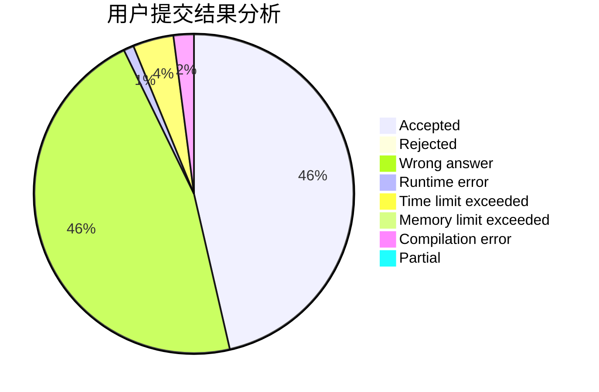
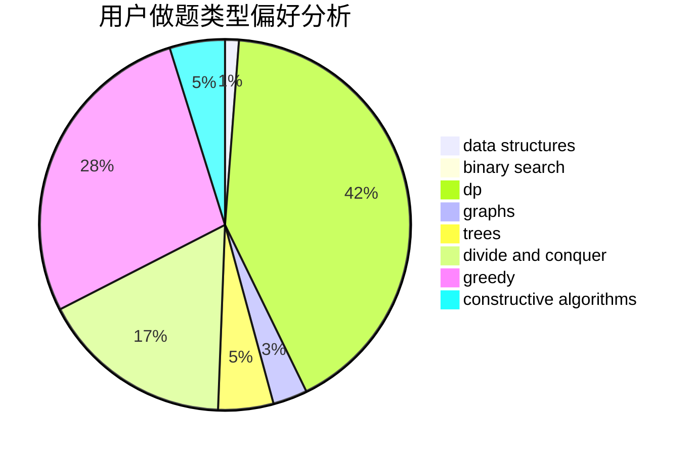
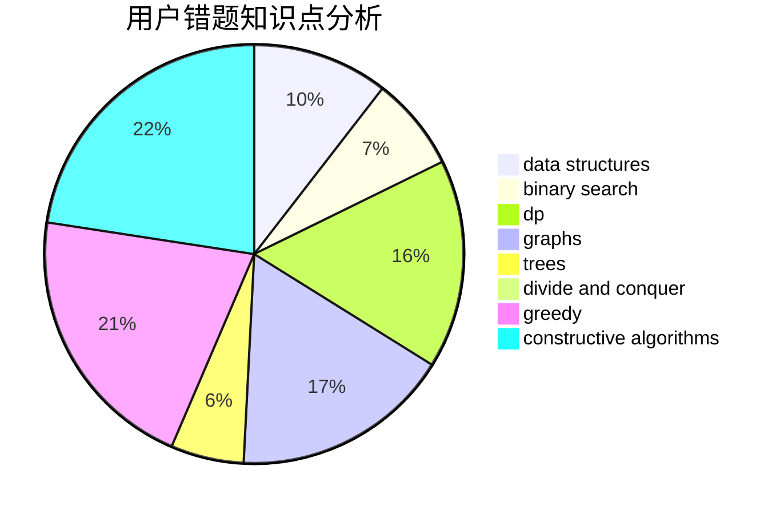

# Logey

<!-- tabs:start -->

#### **用户提交结果分析**

#### **用户做题类型偏好分析**

#### **用户错题知识点分析**

<!-- tabs:end -->
# 推荐题目
[598A](https://codeforces.com/contest/598/problem/A)		math		  
[315C](https://codeforces.com/contest/315/problem/C)		dsu,graphs,sortings,trees		  
[314C](https://codeforces.com/contest/314/problem/C)		data structures,
                        dp		  
[1191D](https://codeforces.com/contest/1191/problem/D)		dsu,graphs,sortings,trees		  
[14B](https://codeforces.com/contest/14/problem/B)		implementation		  
[756A](https://codeforces.com/contest/756/problem/A)		constructive algorithms,
                        dfs and similar		  
[1358B](https://codeforces.com/contest/1358/problem/B)		greedy,
                        sortings		  
[1209D](https://codeforces.com/contest/1209/problem/D)		dfs and similar,
                        dsu,
                        graphs		  
[1439A2](https://codeforces.com/contest/1439A/problem/2)		constructive algorithms,
                        graphs,
                        greedy,
                        implementation		  
[1482E](https://codeforces.com/contest/1482/problem/E)		data structures,
                        divide and conquer,
                        dp		  
