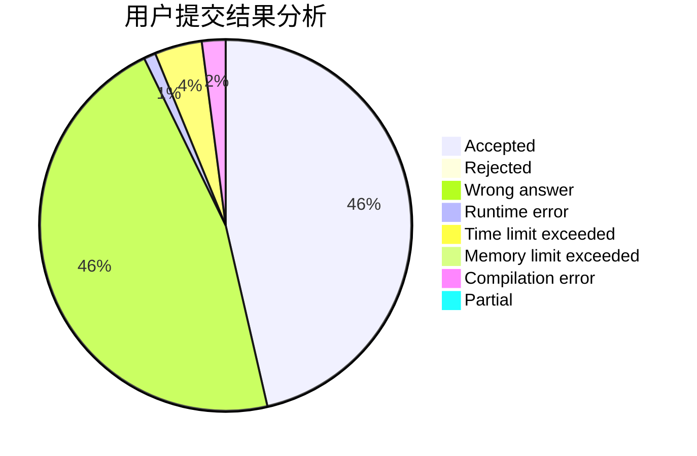
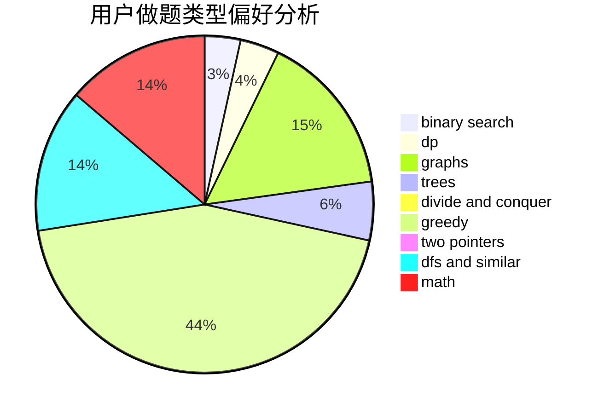

# Logey

<!-- tabs:start -->

#### **用户提交结果分析**

#### **用户做题类型偏好分析**

<!-- tabs:end -->
# 推荐题目
[615D](https://codeforces.com/contest/615/problem/D)
[339D](https://codeforces.com/contest/339/problem/D)
[339B](https://codeforces.com/contest/339/problem/B)
[1197C](https://codeforces.com/contest/1197/problem/C)
[1510C](https://codeforces.com/contest/1510/problem/C)
[776A](https://codeforces.com/contest/776/problem/A)
[1366D](https://codeforces.com/contest/1366/problem/D)
[1214H](https://codeforces.com/contest/1214/problem/H)
[1450B](https://codeforces.com/contest/1450/problem/B)
[1490C](https://codeforces.com/contest/1490/problem/C)
