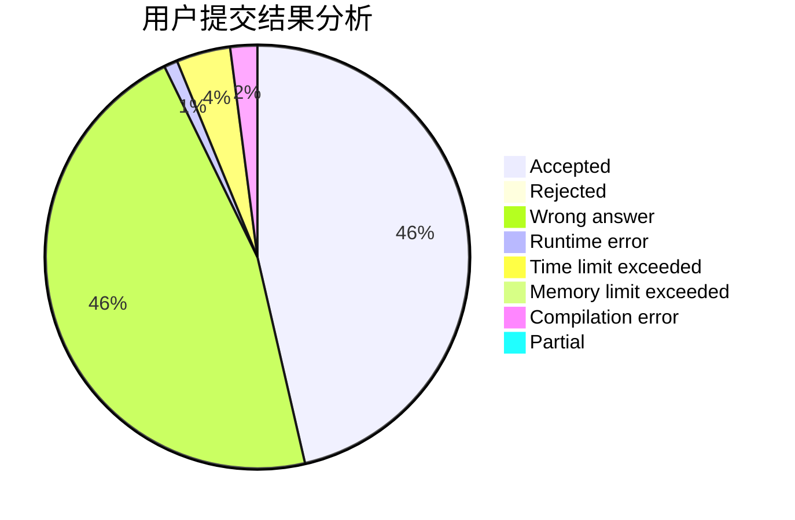
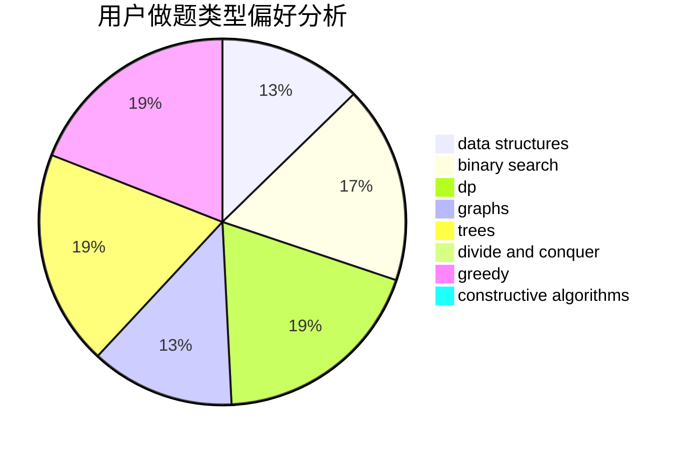
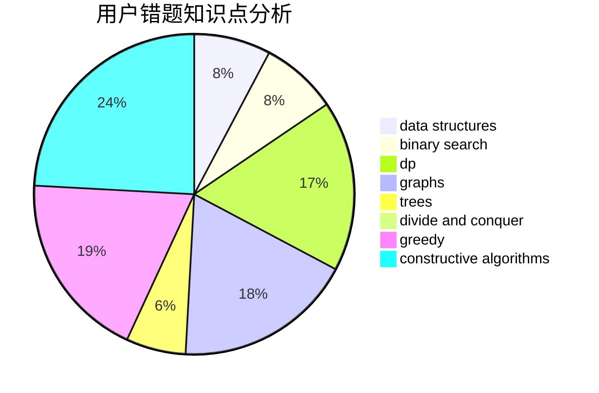

# Logey

<!-- tabs:start -->

#### **用户提交结果分析**

#### **用户做题类型偏好分析**

#### **用户错题知识点分析**

<!-- tabs:end -->
# 推荐题目
[615D](https://codeforces.com/contest/615/problem/D)		math,
                        number theory		  
[339D](https://codeforces.com/contest/339/problem/D)		data structures,
                        trees		  
[339B](https://codeforces.com/contest/339/problem/B)		implementation		  
[1197C](https://codeforces.com/contest/1197/problem/C)		greedy,
                        sortings		  
[1510C](https://codeforces.com/contest/1510/problem/C)		dfs and similar,
                        graph matchings,
                        graphs		  
[776A](https://codeforces.com/contest/776/problem/A)		brute force,
                        implementation,
                        strings		  
[1366D](https://codeforces.com/contest/1366/problem/D)		constructive algorithms,
                        math,
                        number theory		  
[1214H](https://codeforces.com/contest/1214/problem/H)		constructive algorithms,
                        dfs and similar,
                        trees		  
[1450B](https://codeforces.com/contest/1450/problem/B)		brute force,
                        geometry,
                        greedy		  
[1490C](https://codeforces.com/contest/1490/problem/C)		binary search,
                        brute force,
                        brute force,
                        math		  
