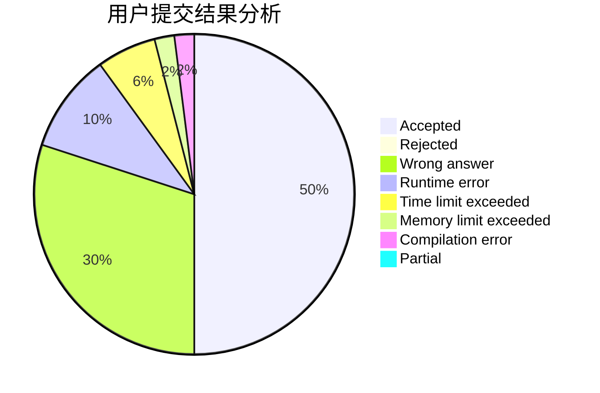
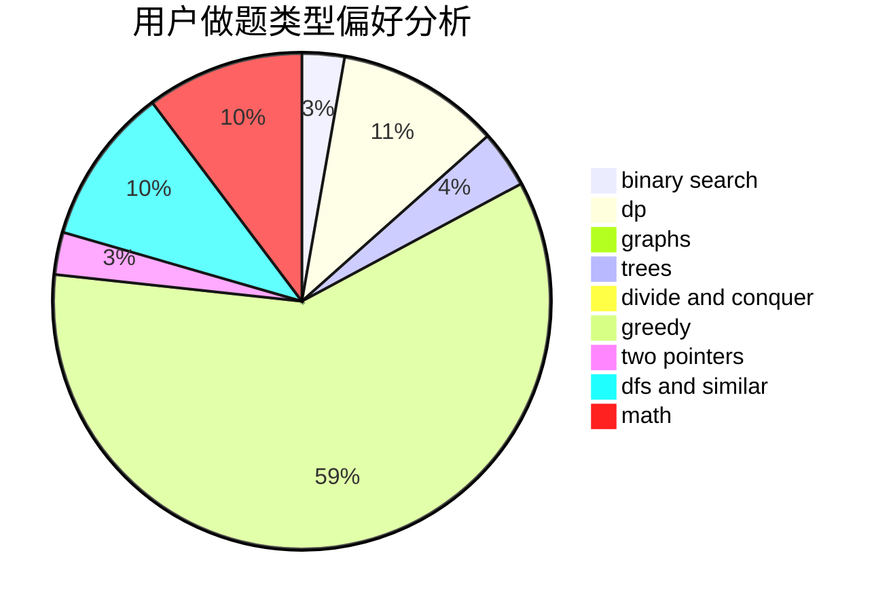

# LoserOfSWUST

<!-- tabs:start -->

#### **用户提交结果分析**

#### **用户做题类型偏好分析**

<!-- tabs:end -->
# 推荐题目
[1107C](https://codeforces.com/contest/1107/problem/C)
[1033G](https://codeforces.com/contest/1033/problem/G)
[516C](https://codeforces.com/contest/516/problem/C)
[581A](https://codeforces.com/contest/581/problem/A)
[1181B](https://codeforces.com/contest/1181/problem/B)
[574B](https://codeforces.com/contest/574/problem/B)
[1054G](https://codeforces.com/contest/1054/problem/G)
[698D](https://codeforces.com/contest/698/problem/D)
[804C](https://codeforces.com/contest/804/problem/C)
[645F](https://codeforces.com/contest/645/problem/F)
