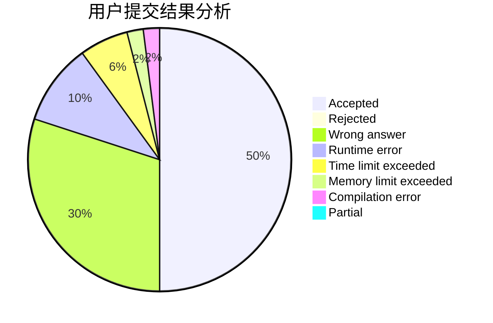
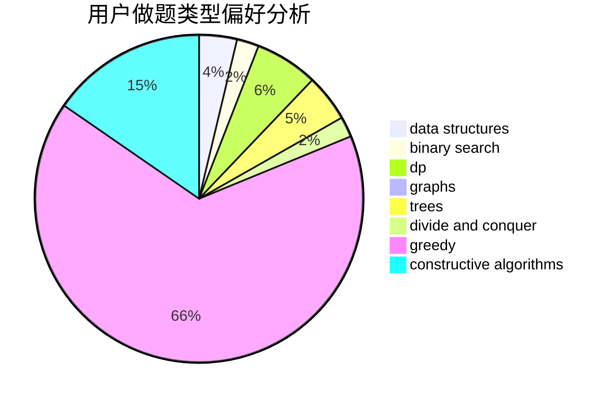
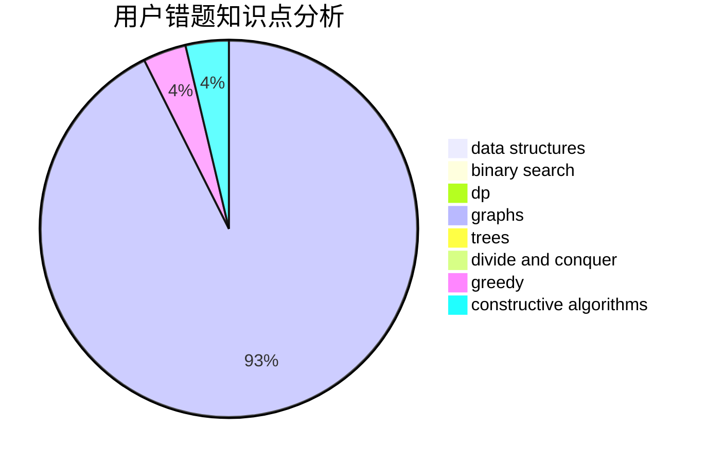

# LoserOfSWUST

<!-- tabs:start -->

#### **用户提交结果分析**

#### **用户做题类型偏好分析**

#### **用户错题知识点分析**

<!-- tabs:end -->
# 推荐题目
[1106F](https://codeforces.com/contest/1106/problem/F)		math,
                        matrices,
                        number theory		  
[1033D](https://codeforces.com/contest/1033/problem/D)		interactive,
                        math,
                        number theory		  
[497B](https://codeforces.com/contest/497/problem/B)		dsu,graphs,sortings,trees		  
[558A](https://codeforces.com/contest/558/problem/A)		brute force,
                        implementation,
                        sortings		  
[1178F2](https://codeforces.com/contest/1178F/problem/2)		dp		  
[549C](https://codeforces.com/contest/549/problem/C)		games		  
[1054C](https://codeforces.com/contest/1054/problem/C)		constructive algorithms,
                        implementation		  
[672C](https://codeforces.com/contest/672/problem/C)		dsu,graphs,sortings,trees		  
[789A](https://codeforces.com/contest/789/problem/A)		implementation,
                        math		  
[621D](https://codeforces.com/contest/621/problem/D)		brute force,
                        constructive algorithms,
                        math		  
