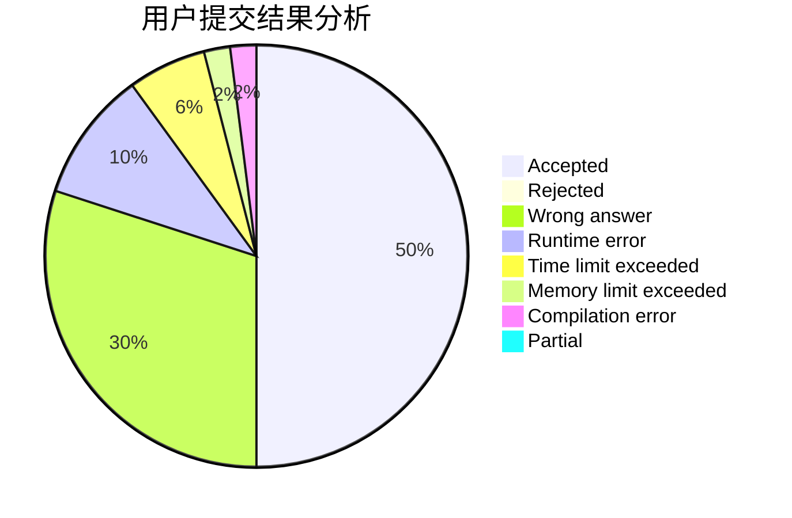
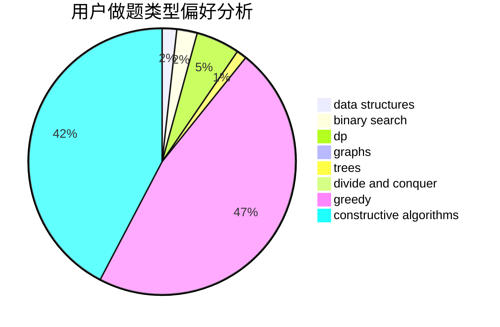
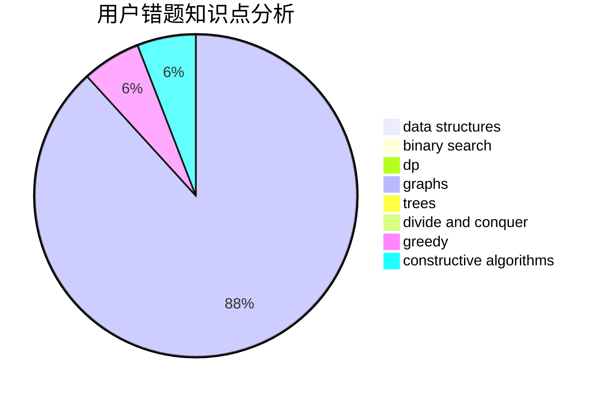

# LoserOfSWUST

<!-- tabs:start -->

#### **用户提交结果分析**

#### **用户做题类型偏好分析**

#### **用户错题知识点分析**

<!-- tabs:end -->
# 推荐题目
[1107C](https://codeforces.com/contest/1107/problem/C)		greedy,
                        sortings,
                        two pointers		  
[1033G](https://codeforces.com/contest/1033/problem/G)		games		  
[516C](https://codeforces.com/contest/516/problem/C)		dsu,graphs,sortings,trees		  
[581A](https://codeforces.com/contest/581/problem/A)		implementation,
                        math		  
[1181B](https://codeforces.com/contest/1181/problem/B)		greedy,
                        implementation,
                        strings		  
[574B](https://codeforces.com/contest/574/problem/B)		brute force,
                        dfs and similar,
                        graphs,
                        hashing		  
[1054G](https://codeforces.com/contest/1054/problem/G)		constructive algorithms,
                        greedy,
                        math		  
[698D](https://codeforces.com/contest/698/problem/D)		brute force,
                        geometry,
                        math		  
[804C](https://codeforces.com/contest/804/problem/C)		constructive algorithms,
                        dfs and similar,
                        greedy		  
[645F](https://codeforces.com/contest/645/problem/F)		combinatorics,
                        math,
                        number theory		  
