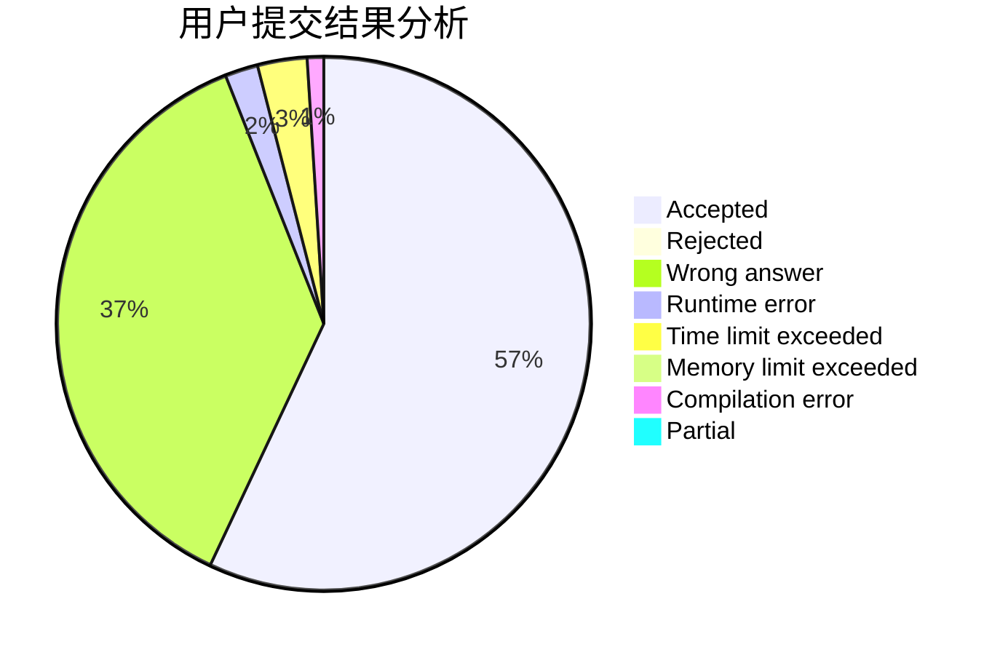
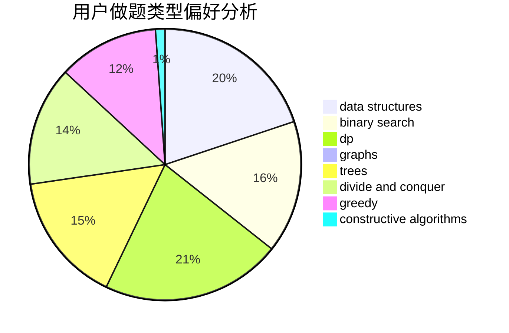
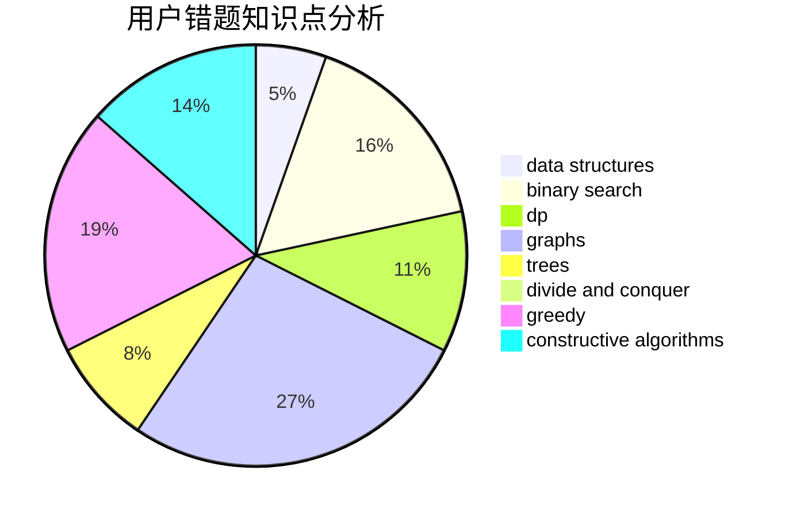

# Lost_Deviation

<!-- tabs:start -->

#### **用户提交结果分析**

#### **用户做题类型偏好分析**

#### **用户错题知识点分析**

<!-- tabs:end -->
# 推荐题目
[659A](https://codeforces.com/contest/659/problem/A)		implementation,
                        math		  
[635E](https://codeforces.com/contest/635/problem/E)		dsu,graphs,sortings,trees		  
[95E](https://codeforces.com/contest/95/problem/E)		dp,
                        dsu,
                        graphs		  
[812A](https://codeforces.com/contest/812/problem/A)		implementation		  
[762B](https://codeforces.com/contest/762/problem/B)		greedy,
                        implementation,
                        sortings,
                        two pointers		  
[1088F](https://codeforces.com/contest/1088/problem/F)		data structures,
                        trees		  
[1364E](https://codeforces.com/contest/1364/problem/E)		bitmasks,
                        constructive algorithms,
                        divide and conquer,
                        interactive,
                        probabilities		  
[731C](https://codeforces.com/contest/731/problem/C)		dfs and similar,
                        dsu,
                        graphs,
                        greedy		  
[796C](https://codeforces.com/contest/796/problem/C)		constructive algorithms,
                        data structures,
                        dp,
                        trees		  
[241B](https://codeforces.com/contest/241/problem/B)		binary search,
                        bitmasks,
                        data structures,
                        math		  
