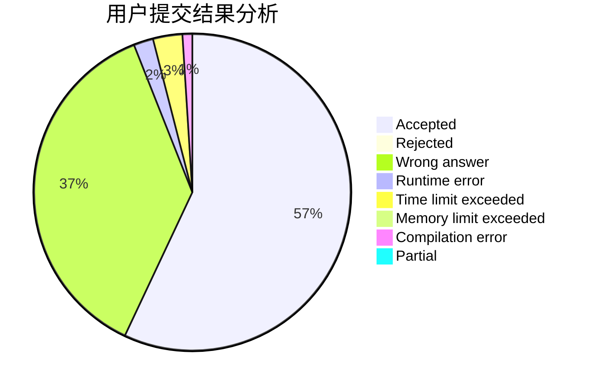
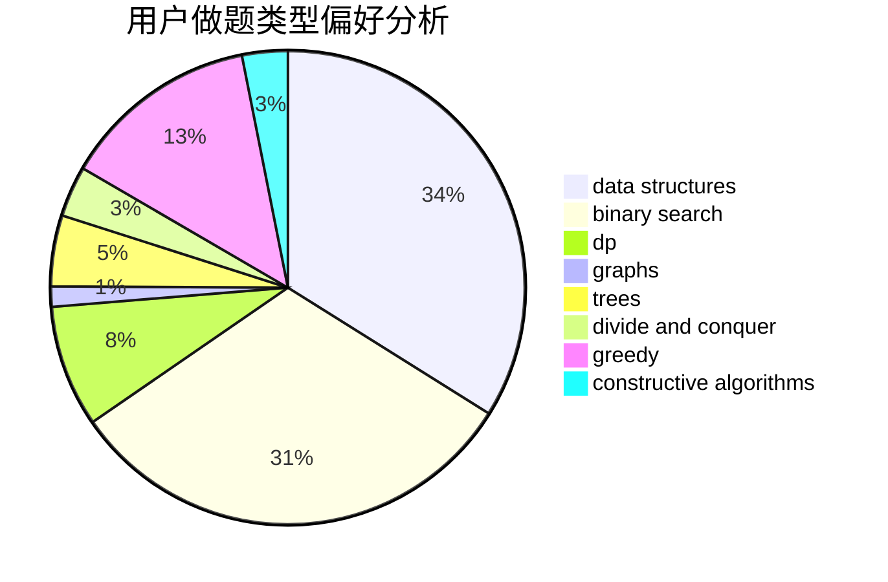
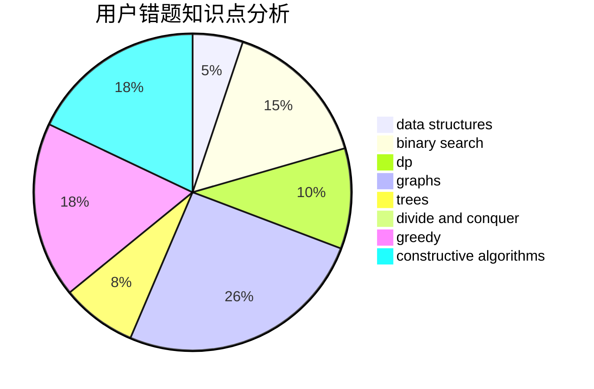

# Lost_Deviation

<!-- tabs:start -->

#### **用户提交结果分析**

#### **用户做题类型偏好分析**

#### **用户错题知识点分析**

<!-- tabs:end -->
# 推荐题目
[629A](https://codeforces.com/contest/629/problem/A)		brute force,
                        combinatorics,
                        constructive algorithms,
                        implementation		  
[617E](https://codeforces.com/contest/617/problem/E)		data structures		  
[938D](https://codeforces.com/contest/938/problem/D)		data structures,
                        graphs,
                        shortest paths		  
[798A](https://codeforces.com/contest/798/problem/A)		brute force,
                        constructive algorithms,
                        strings		  
[741B](https://codeforces.com/contest/741/problem/B)		dfs and similar,
                        dp,
                        dsu		  
[1088C](https://codeforces.com/contest/1088/problem/C)		constructive algorithms,
                        greedy,
                        math		  
[1357B2](https://codeforces.com/contest/1357B/problem/2)		nan		  
[711C](https://codeforces.com/contest/711/problem/C)		dp		  
[778A](https://codeforces.com/contest/778/problem/A)		binary search,
                        greedy,
                        strings		  
[222E](https://codeforces.com/contest/222/problem/E)		dp,
                        matrices		  
