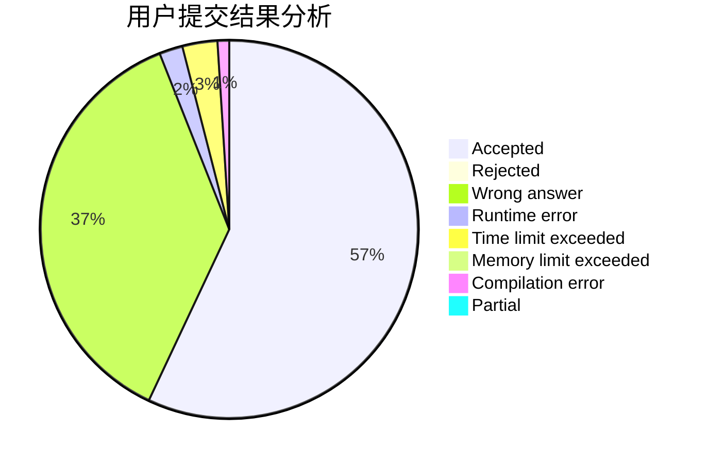
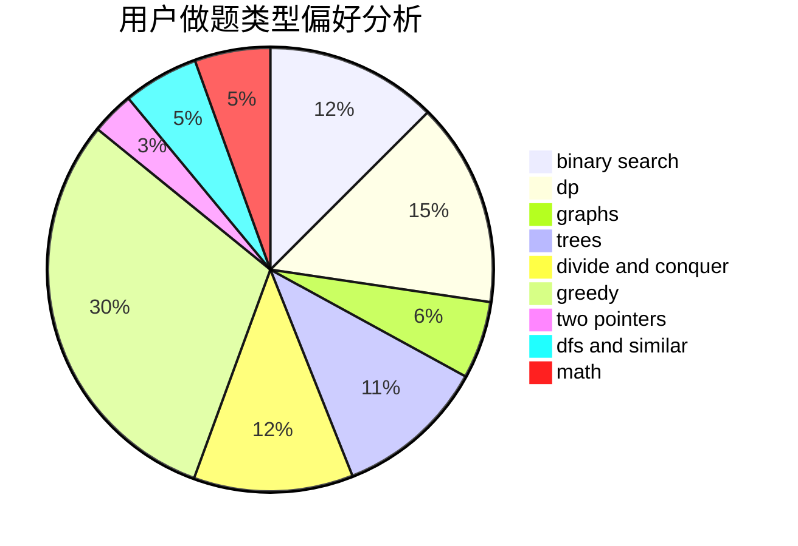

# Lost_Deviation

<!-- tabs:start -->

#### **用户提交结果分析**

#### **用户做题类型偏好分析**

<!-- tabs:end -->
# 推荐题目
[659A](https://codeforces.com/contest/659/problem/A)
[635E](https://codeforces.com/contest/635/problem/E)
[95E](https://codeforces.com/contest/95/problem/E)
[812A](https://codeforces.com/contest/812/problem/A)
[762B](https://codeforces.com/contest/762/problem/B)
[1088F](https://codeforces.com/contest/1088/problem/F)
[1364E](https://codeforces.com/contest/1364/problem/E)
[731C](https://codeforces.com/contest/731/problem/C)
[796C](https://codeforces.com/contest/796/problem/C)
[241B](https://codeforces.com/contest/241/problem/B)
