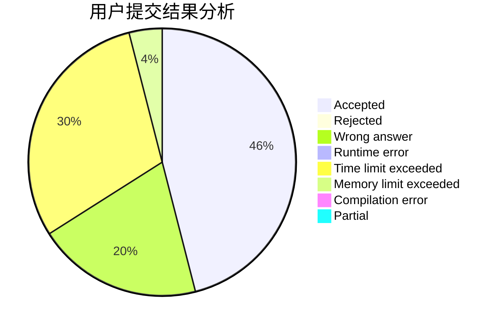
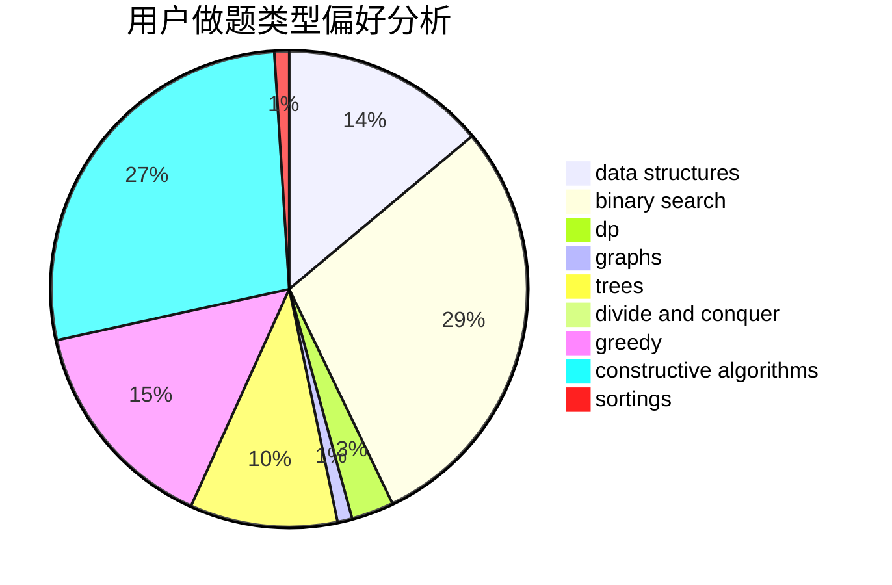
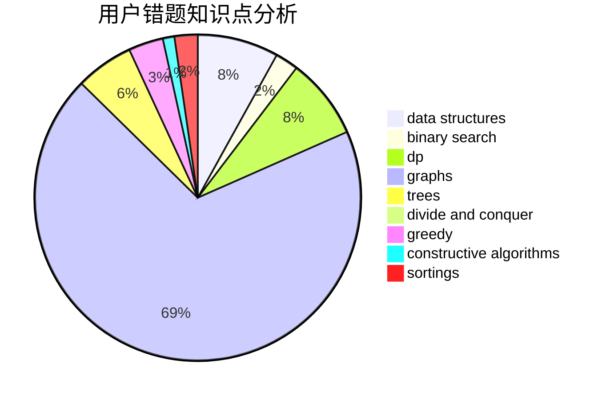

# 718_MiL
<!-- tabs:start -->
#### **用户提交结果分析**

#### **用户做题类型偏好分析**

#### **用户错题知识点分析**

<!-- tabs:end -->
# 推荐题目
[1408G](http://codeforces.com/problemset/problem/1408/G)		combinatorics,
                        dp,
                        dsu,
                        fft,
                        graphs,
                        trees		  
[1407E](http://codeforces.com/problemset/problem/1407/E)		constructive algorithms,
                        dfs and similar,
                        dp,
                        graphs,
                        greedy,
                        shortest paths		  
[1409C](http://codeforces.com/problemset/problem/1409/C)		brute force,
                        math,
                        number theory		  
[1405E](https://codeforces.com/contest/1405/problem/E)		binary search,
                        constructive algorithms,
                        data structures,
                        greedy,
                        two pointers		  
[1408C](http://codeforces.com/problemset/problem/1408/C)		binary search,
                        dp,
                        implementation,
                        math,
                        two pointers		  
[1406C](http://codeforces.com/problemset/problem/1406/C)		constructive algorithms,
                        dfs and similar,
                        graphs,
                        trees		  
[1002B4](http://codeforces.com/problemset/problem/1002/B4)		nan		  
[1407D](http://codeforces.com/problemset/problem/1407/D)		data structures,
                        dp,
                        graphs		  
[1407A](http://codeforces.com/problemset/problem/1407/A)		constructive algorithms,
                        math		  
[1405C](https://codeforces.com/contest/1405/problem/C)		implementation,
                        strings		  
<!-- tabs:start -->
#### **data structures**
[1405E](https://codeforces.com/contest/1405/problem/E)		binary search,
                        constructive algorithms,
                        data structures,
                        greedy,
                        two pointers		  
[1407D](http://codeforces.com/problemset/problem/1407/D)		data structures,
                        dp,
                        graphs		  
[1408H](http://codeforces.com/problemset/problem/1408/H)		binary search,
                        data structures,
                        flows,
                        greedy		  
[1408D](http://codeforces.com/problemset/problem/1408/D)		binary search,
                        brute force,
                        data structures,
                        dp,
                        implementation,
                        sortings,
                        two pointers		  
[1406D](http://codeforces.com/problemset/problem/1406/D)		constructive algorithms,
                        data structures,
                        greedy,
                        math		  
[1257E](http://codeforces.com/problemset/problem/1257/E)		data structures,
                        dp,
                        greedy		  
[1408E](http://codeforces.com/problemset/problem/1408/E)		data structures,
                        dsu,
                        graphs,
                        greedy,
                        sortings,
                        trees		  
[1492C](http://codeforces.com/problemset/problem/1492/C)		binary search,
                        data structures,
                        dp,
                        greedy,
                        two pointers		  
[1490G](http://codeforces.com/problemset/problem/1490/G)		binary search,
                        data structures,
                        math		  
[1479D](http://codeforces.com/problemset/problem/1479/D)		binary search,
                        bitmasks,
                        brute force,
                        data structures,
                        probabilities,
                        trees		  
#### **binary search**
[1405E](https://codeforces.com/contest/1405/problem/E)		binary search,
                        constructive algorithms,
                        data structures,
                        greedy,
                        two pointers		  
[1408C](http://codeforces.com/problemset/problem/1408/C)		binary search,
                        dp,
                        implementation,
                        math,
                        two pointers		  
[1108F](http://codeforces.com/problemset/problem/1108/F)		binary search,
                        dsu,
                        graphs,
                        greedy		  
[1077D](http://codeforces.com/problemset/problem/1077/D)		binary search,
                        sortings		  
[1408H](http://codeforces.com/problemset/problem/1408/H)		binary search,
                        data structures,
                        flows,
                        greedy		  
[1408D](http://codeforces.com/problemset/problem/1408/D)		binary search,
                        brute force,
                        data structures,
                        dp,
                        implementation,
                        sortings,
                        two pointers		  
[1492C](http://codeforces.com/problemset/problem/1492/C)		binary search,
                        data structures,
                        dp,
                        greedy,
                        two pointers		  
[1463D](http://codeforces.com/problemset/problem/1463/D)		binary search,
                        constructive algorithms,
                        greedy,
                        two pointers		  
[1490G](http://codeforces.com/problemset/problem/1490/G)		binary search,
                        data structures,
                        math		  
[1479D](http://codeforces.com/problemset/problem/1479/D)		binary search,
                        bitmasks,
                        brute force,
                        data structures,
                        probabilities,
                        trees		  
#### **dp**
[1408G](http://codeforces.com/problemset/problem/1408/G)		combinatorics,
                        dp,
                        dsu,
                        fft,
                        graphs,
                        trees		  
[1407E](http://codeforces.com/problemset/problem/1407/E)		constructive algorithms,
                        dfs and similar,
                        dp,
                        graphs,
                        greedy,
                        shortest paths		  
[1408C](http://codeforces.com/problemset/problem/1408/C)		binary search,
                        dp,
                        implementation,
                        math,
                        two pointers		  
[1407D](http://codeforces.com/problemset/problem/1407/D)		data structures,
                        dp,
                        graphs		  
[1406B](http://codeforces.com/problemset/problem/1406/B)		brute force,
                        dp,
                        greedy,
                        implementation,
                        sortings		  
[1408D](http://codeforces.com/problemset/problem/1408/D)		binary search,
                        brute force,
                        data structures,
                        dp,
                        implementation,
                        sortings,
                        two pointers		  
[1405D](https://codeforces.com/contest/1405/problem/D)		dfs and similar,
                        dp,
                        games,
                        trees		  
[1389C](http://codeforces.com/problemset/problem/1389/C)		brute force,
                        dp,
                        greedy,
                        two pointers		  
[1257E](http://codeforces.com/problemset/problem/1257/E)		data structures,
                        dp,
                        greedy		  
[1408I](http://codeforces.com/problemset/problem/1408/I)		dp,
                        math		  
#### **graph**
[1408G](http://codeforces.com/problemset/problem/1408/G)		combinatorics,
                        dp,
                        dsu,
                        fft,
                        graphs,
                        trees		  
[1407E](http://codeforces.com/problemset/problem/1407/E)		constructive algorithms,
                        dfs and similar,
                        dp,
                        graphs,
                        greedy,
                        shortest paths		  
[1406C](http://codeforces.com/problemset/problem/1406/C)		constructive algorithms,
                        dfs and similar,
                        graphs,
                        trees		  
[1407D](http://codeforces.com/problemset/problem/1407/D)		data structures,
                        dp,
                        graphs		  
[1108F](http://codeforces.com/problemset/problem/1108/F)		binary search,
                        dsu,
                        graphs,
                        greedy		  
[1408E](http://codeforces.com/problemset/problem/1408/E)		data structures,
                        dsu,
                        graphs,
                        greedy,
                        sortings,
                        trees		  
[1487C](http://codeforces.com/problemset/problem/1487/C)		brute force,
                        constructive algorithms,
                        dfs and similar,
                        graphs,
                        greedy,
                        implementation,
                        math		  
[1437C](http://codeforces.com/problemset/problem/1437/C)		dp,
                        flows,
                        graph matchings,
                        greedy,
                        math,
                        sortings		  
[1470D](http://codeforces.com/problemset/problem/1470/D)		constructive algorithms,
                        dfs and similar,
                        graph matchings,
                        graphs,
                        greedy		  
[1476C](http://codeforces.com/problemset/problem/1476/C)		dp,
                        graphs,
                        greedy		  
#### **trees**
[1408G](http://codeforces.com/problemset/problem/1408/G)		combinatorics,
                        dp,
                        dsu,
                        fft,
                        graphs,
                        trees		  
[1406C](http://codeforces.com/problemset/problem/1406/C)		constructive algorithms,
                        dfs and similar,
                        graphs,
                        trees		  
[1405D](https://codeforces.com/contest/1405/problem/D)		dfs and similar,
                        dp,
                        games,
                        trees		  
[1408E](http://codeforces.com/problemset/problem/1408/E)		data structures,
                        dsu,
                        graphs,
                        greedy,
                        sortings,
                        trees		  
[1479D](http://codeforces.com/problemset/problem/1479/D)		binary search,
                        bitmasks,
                        brute force,
                        data structures,
                        probabilities,
                        trees		  
[1511C](http://codeforces.com/problemset/problem/1511/C)		brute force,
                        data structures,
                        implementation,
                        trees		  
[1499F](http://codeforces.com/problemset/problem/1499/F)		combinatorics,
                        dfs and similar,
                        dp,
                        trees		  
[1491E](http://codeforces.com/problemset/problem/1491/E)		brute force,
                        dfs and similar,
                        divide and conquer,
                        number theory,
                        trees		  
[1466D](http://codeforces.com/problemset/problem/1466/D)		data structures,
                        greedy,
                        sortings,
                        trees		  
[1495D](http://codeforces.com/problemset/problem/1495/D)		combinatorics,
                        dfs and similar,
                        graphs,
                        math,
                        shortest paths,
                        trees		  
#### **divide and conquer**
[1408F](http://codeforces.com/problemset/problem/1408/F)		constructive algorithms,
                        divide and conquer		  
[1461D](http://codeforces.com/problemset/problem/1461/D)		binary search,
                        brute force,
                        data structures,
                        divide and conquer,
                        implementation,
                        sortings		  
[1466G](http://codeforces.com/problemset/problem/1466/G)		combinatorics,
                        divide and conquer,
                        hashing,
                        math,
                        string suffix structures,
                        strings		  
[1490D](http://codeforces.com/problemset/problem/1490/D)		dfs and similar,
                        divide and conquer,
                        implementation		  
[1483C](https://codeforces.com/contest/1483/problem/C)		data structures,
                        divide and conquer,
                        dp		  
[1491E](http://codeforces.com/problemset/problem/1491/E)		brute force,
                        dfs and similar,
                        divide and conquer,
                        number theory,
                        trees		  
[1303G](http://codeforces.com/problemset/problem/1303/G)		data structures,
                        divide and conquer,
                        geometry,
                        trees		  
[1494D](http://codeforces.com/problemset/problem/1494/D)		constructive algorithms,
                        data structures,
                        dfs and similar,
                        divide and conquer,
                        dsu,
                        greedy,
                        sortings,
                        trees		  
[1482E](http://codeforces.com/problemset/problem/1482/E)		data structures,
                        divide and conquer,
                        dp		  
[566C](http://codeforces.com/problemset/problem/566/C)		dfs and similar,
                        divide and conquer,
                        trees		  
#### **greedy**
[1407E](http://codeforces.com/problemset/problem/1407/E)		constructive algorithms,
                        dfs and similar,
                        dp,
                        graphs,
                        greedy,
                        shortest paths		  
[1405E](https://codeforces.com/contest/1405/problem/E)		binary search,
                        constructive algorithms,
                        data structures,
                        greedy,
                        two pointers		  
[1406A](http://codeforces.com/problemset/problem/1406/A)		greedy,
                        implementation,
                        math		  
[1108F](http://codeforces.com/problemset/problem/1108/F)		binary search,
                        dsu,
                        graphs,
                        greedy		  
[1408H](http://codeforces.com/problemset/problem/1408/H)		binary search,
                        data structures,
                        flows,
                        greedy		  
[1358B](http://codeforces.com/problemset/problem/1358/B)		greedy,
                        sortings		  
[1408B](http://codeforces.com/problemset/problem/1408/B)		constructive algorithms,
                        greedy,
                        math		  
[1406B](http://codeforces.com/problemset/problem/1406/B)		brute force,
                        dp,
                        greedy,
                        implementation,
                        sortings		  
[1407B](http://codeforces.com/problemset/problem/1407/B)		brute force,
                        greedy,
                        math,
                        number theory		  
[1409B](http://codeforces.com/problemset/problem/1409/B)		brute force,
                        greedy,
                        math		  
#### **constructive algorithms**
[1407E](http://codeforces.com/problemset/problem/1407/E)		constructive algorithms,
                        dfs and similar,
                        dp,
                        graphs,
                        greedy,
                        shortest paths		  
[1405E](https://codeforces.com/contest/1405/problem/E)		binary search,
                        constructive algorithms,
                        data structures,
                        greedy,
                        two pointers		  
[1406C](http://codeforces.com/problemset/problem/1406/C)		constructive algorithms,
                        dfs and similar,
                        graphs,
                        trees		  
[1407A](http://codeforces.com/problemset/problem/1407/A)		constructive algorithms,
                        math		  
[1339B](http://codeforces.com/problemset/problem/1339/B)		constructive algorithms,
                        sortings		  
[1408A](http://codeforces.com/problemset/problem/1408/A)		constructive algorithms		  
[1408B](http://codeforces.com/problemset/problem/1408/B)		constructive algorithms,
                        greedy,
                        math		  
[1406D](http://codeforces.com/problemset/problem/1406/D)		constructive algorithms,
                        data structures,
                        greedy,
                        math		  
[1407C](http://codeforces.com/problemset/problem/1407/C)		constructive algorithms,
                        interactive,
                        math,
                        two pointers		  
[1408F](http://codeforces.com/problemset/problem/1408/F)		constructive algorithms,
                        divide and conquer		  
#### **sortings**
[1339B](http://codeforces.com/problemset/problem/1339/B)		constructive algorithms,
                        sortings		  
[1077D](http://codeforces.com/problemset/problem/1077/D)		binary search,
                        sortings		  
[1358B](http://codeforces.com/problemset/problem/1358/B)		greedy,
                        sortings		  
[1406B](http://codeforces.com/problemset/problem/1406/B)		brute force,
                        dp,
                        greedy,
                        implementation,
                        sortings		  
[1408D](http://codeforces.com/problemset/problem/1408/D)		binary search,
                        brute force,
                        data structures,
                        dp,
                        implementation,
                        sortings,
                        two pointers		  
[1408E](http://codeforces.com/problemset/problem/1408/E)		data structures,
                        dsu,
                        graphs,
                        greedy,
                        sortings,
                        trees		  
[1496C](https://codeforces.com/contest/1496/problem/C)		geometry,
                        greedy,
                        math,
                        sortings		  
[1495A](http://codeforces.com/problemset/problem/1495/A)		geometry,
                        greedy,
                        math,
                        sortings		  
[1497A](http://codeforces.com/problemset/problem/1497/A)		brute force,
                        data structures,
                        greedy,
                        sortings		  
[1427A](http://codeforces.com/problemset/problem/1427/A)		math,
                        sortings		  
<!-- tabs:end -->
