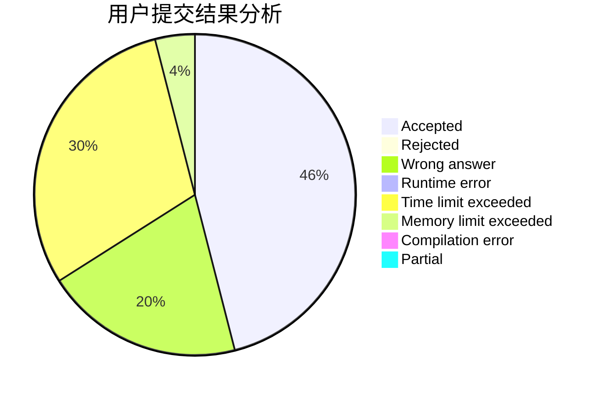
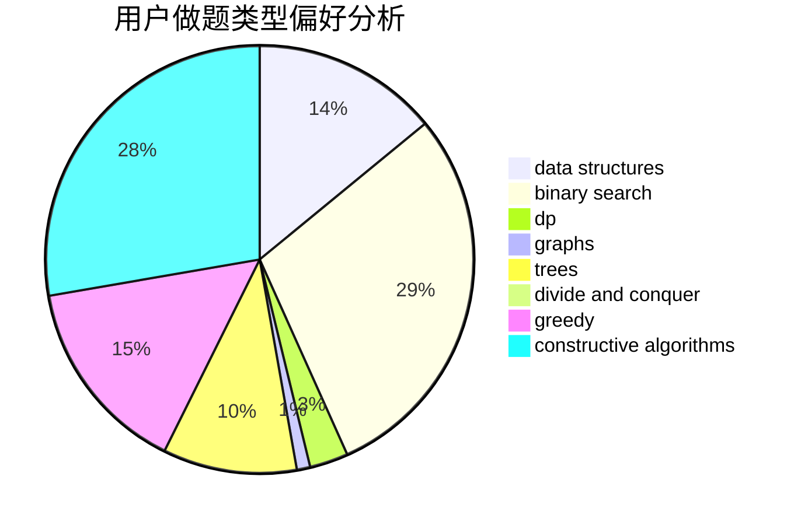
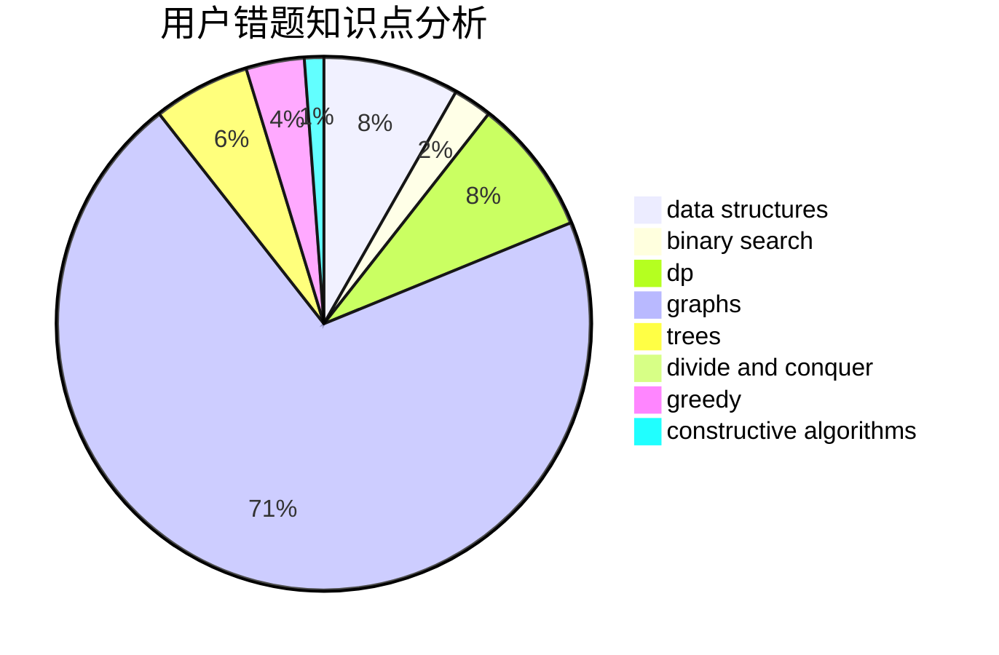

# 718_MiL
<!-- tabs:start -->
#### **用户提交结果分析**

#### **用户做题类型偏好分析**

#### **用户错题知识点分析**

<!-- tabs:end -->
# 推荐题目
[Clusterization Counting](http://codeforces.com/problemset/problem/1408/G)		combinatorics,
                        dp,
                        dsu,
                        fft,
                        graphs,
                        trees		  
[Egor in the Republic of Dagestan](http://codeforces.com/problemset/problem/1407/E)		constructive algorithms,
                        dfs and similar,
                        dp,
                        graphs,
                        greedy,
                        shortest paths		  
[Yet Another Array Restoration](http://codeforces.com/problemset/problem/1409/C)		brute force,
                        math,
                        number theory		  
[Fixed Point Removal](https://codeforces.com/contest/1405/problem/E)		binary search,
                        constructive algorithms,
                        data structures,
                        greedy,
                        two pointers		  
[Discrete Acceleration](http://codeforces.com/problemset/problem/1408/C)		binary search,
                        dp,
                        implementation,
                        math,
                        two pointers		  
[Link Cut Centroids](http://codeforces.com/problemset/problem/1406/C)		constructive algorithms,
                        dfs and similar,
                        graphs,
                        trees		  
[Distinguish four 2-qubit states - 2](http://codeforces.com/problemset/problem/1002/B4)		nan		  
[Discrete Centrifugal Jumps](http://codeforces.com/problemset/problem/1407/D)		data structures,
                        dp,
                        graphs		  
[Ahahahahahahahaha](http://codeforces.com/problemset/problem/1407/A)		constructive algorithms,
                        math		  
[Balanced Bitstring](https://codeforces.com/contest/1405/problem/C)		implementation,
                        strings		  
<!-- tabs:start -->
#### **data structures**
[Clusterization Counting](https://codeforces.com/contest/1405/problem/E)		binary search,
                        constructive algorithms,
                        data structures,
                        greedy,
                        two pointers		  
[Egor in the Republic of Dagestan](http://codeforces.com/problemset/problem/1407/D)		data structures,
                        dp,
                        graphs		  
[Yet Another Array Restoration](http://codeforces.com/problemset/problem/1408/H)		binary search,
                        data structures,
                        flows,
                        greedy		  
[Fixed Point Removal](http://codeforces.com/problemset/problem/1408/D)		binary search,
                        brute force,
                        data structures,
                        dp,
                        implementation,
                        sortings,
                        two pointers		  
[Discrete Acceleration](http://codeforces.com/problemset/problem/1406/D)		constructive algorithms,
                        data structures,
                        greedy,
                        math		  
[Link Cut Centroids](http://codeforces.com/problemset/problem/1257/E)		data structures,
                        dp,
                        greedy		  
[Distinguish four 2-qubit states - 2](http://codeforces.com/problemset/problem/1408/E)		data structures,
                        dsu,
                        graphs,
                        greedy,
                        sortings,
                        trees		  
[Discrete Centrifugal Jumps](http://codeforces.com/problemset/problem/1492/C)		binary search,
                        data structures,
                        dp,
                        greedy,
                        two pointers		  
[Ahahahahahahahaha](http://codeforces.com/problemset/problem/1490/G)		binary search,
                        data structures,
                        math		  
[Balanced Bitstring](http://codeforces.com/problemset/problem/1479/D)		binary search,
                        bitmasks,
                        brute force,
                        data structures,
                        probabilities,
                        trees		  
#### **binary search**
[Clusterization Counting](https://codeforces.com/contest/1405/problem/E)		binary search,
                        constructive algorithms,
                        data structures,
                        greedy,
                        two pointers		  
[Egor in the Republic of Dagestan](http://codeforces.com/problemset/problem/1408/C)		binary search,
                        dp,
                        implementation,
                        math,
                        two pointers		  
[Yet Another Array Restoration](http://codeforces.com/problemset/problem/1108/F)		binary search,
                        dsu,
                        graphs,
                        greedy		  
[Fixed Point Removal](http://codeforces.com/problemset/problem/1077/D)		binary search,
                        sortings		  
[Discrete Acceleration](http://codeforces.com/problemset/problem/1408/H)		binary search,
                        data structures,
                        flows,
                        greedy		  
[Link Cut Centroids](http://codeforces.com/problemset/problem/1408/D)		binary search,
                        brute force,
                        data structures,
                        dp,
                        implementation,
                        sortings,
                        two pointers		  
[Distinguish four 2-qubit states - 2](http://codeforces.com/problemset/problem/1492/C)		binary search,
                        data structures,
                        dp,
                        greedy,
                        two pointers		  
[Discrete Centrifugal Jumps](http://codeforces.com/problemset/problem/1463/D)		binary search,
                        constructive algorithms,
                        greedy,
                        two pointers		  
[Ahahahahahahahaha](http://codeforces.com/problemset/problem/1490/G)		binary search,
                        data structures,
                        math		  
[Balanced Bitstring](http://codeforces.com/problemset/problem/1479/D)		binary search,
                        bitmasks,
                        brute force,
                        data structures,
                        probabilities,
                        trees		  
#### **dp**
[Clusterization Counting](http://codeforces.com/problemset/problem/1408/G)		combinatorics,
                        dp,
                        dsu,
                        fft,
                        graphs,
                        trees		  
[Egor in the Republic of Dagestan](http://codeforces.com/problemset/problem/1407/E)		constructive algorithms,
                        dfs and similar,
                        dp,
                        graphs,
                        greedy,
                        shortest paths		  
[Yet Another Array Restoration](http://codeforces.com/problemset/problem/1408/C)		binary search,
                        dp,
                        implementation,
                        math,
                        two pointers		  
[Fixed Point Removal](http://codeforces.com/problemset/problem/1407/D)		data structures,
                        dp,
                        graphs		  
[Discrete Acceleration](http://codeforces.com/problemset/problem/1406/B)		brute force,
                        dp,
                        greedy,
                        implementation,
                        sortings		  
[Link Cut Centroids](http://codeforces.com/problemset/problem/1408/D)		binary search,
                        brute force,
                        data structures,
                        dp,
                        implementation,
                        sortings,
                        two pointers		  
[Distinguish four 2-qubit states - 2](https://codeforces.com/contest/1405/problem/D)		dfs and similar,
                        dp,
                        games,
                        trees		  
[Discrete Centrifugal Jumps](http://codeforces.com/problemset/problem/1389/C)		brute force,
                        dp,
                        greedy,
                        two pointers		  
[Ahahahahahahahaha](http://codeforces.com/problemset/problem/1257/E)		data structures,
                        dp,
                        greedy		  
[Balanced Bitstring](http://codeforces.com/problemset/problem/1408/I)		dp,
                        math		  
#### **graph**
[Clusterization Counting](http://codeforces.com/problemset/problem/1408/G)		combinatorics,
                        dp,
                        dsu,
                        fft,
                        graphs,
                        trees		  
[Egor in the Republic of Dagestan](http://codeforces.com/problemset/problem/1407/E)		constructive algorithms,
                        dfs and similar,
                        dp,
                        graphs,
                        greedy,
                        shortest paths		  
[Yet Another Array Restoration](http://codeforces.com/problemset/problem/1406/C)		constructive algorithms,
                        dfs and similar,
                        graphs,
                        trees		  
[Fixed Point Removal](http://codeforces.com/problemset/problem/1407/D)		data structures,
                        dp,
                        graphs		  
[Discrete Acceleration](http://codeforces.com/problemset/problem/1108/F)		binary search,
                        dsu,
                        graphs,
                        greedy		  
[Link Cut Centroids](http://codeforces.com/problemset/problem/1408/E)		data structures,
                        dsu,
                        graphs,
                        greedy,
                        sortings,
                        trees		  
[Distinguish four 2-qubit states - 2](http://codeforces.com/problemset/problem/1487/C)		brute force,
                        constructive algorithms,
                        dfs and similar,
                        graphs,
                        greedy,
                        implementation,
                        math		  
[Discrete Centrifugal Jumps](http://codeforces.com/problemset/problem/1437/C)		dp,
                        flows,
                        graph matchings,
                        greedy,
                        math,
                        sortings		  
[Ahahahahahahahaha](http://codeforces.com/problemset/problem/1470/D)		constructive algorithms,
                        dfs and similar,
                        graph matchings,
                        graphs,
                        greedy		  
[Balanced Bitstring](http://codeforces.com/problemset/problem/1476/C)		dp,
                        graphs,
                        greedy		  
#### **trees**
[Clusterization Counting](http://codeforces.com/problemset/problem/1408/G)		combinatorics,
                        dp,
                        dsu,
                        fft,
                        graphs,
                        trees		  
[Egor in the Republic of Dagestan](http://codeforces.com/problemset/problem/1406/C)		constructive algorithms,
                        dfs and similar,
                        graphs,
                        trees		  
[Yet Another Array Restoration](https://codeforces.com/contest/1405/problem/D)		dfs and similar,
                        dp,
                        games,
                        trees		  
[Fixed Point Removal](http://codeforces.com/problemset/problem/1408/E)		data structures,
                        dsu,
                        graphs,
                        greedy,
                        sortings,
                        trees		  
[Discrete Acceleration](http://codeforces.com/problemset/problem/1479/D)		binary search,
                        bitmasks,
                        brute force,
                        data structures,
                        probabilities,
                        trees		  
[Link Cut Centroids](http://codeforces.com/problemset/problem/1511/C)		brute force,
                        data structures,
                        implementation,
                        trees		  
[Distinguish four 2-qubit states - 2](http://codeforces.com/problemset/problem/1499/F)		combinatorics,
                        dfs and similar,
                        dp,
                        trees		  
[Discrete Centrifugal Jumps](http://codeforces.com/problemset/problem/1491/E)		brute force,
                        dfs and similar,
                        divide and conquer,
                        number theory,
                        trees		  
[Ahahahahahahahaha](http://codeforces.com/problemset/problem/1466/D)		data structures,
                        greedy,
                        sortings,
                        trees		  
[Balanced Bitstring](http://codeforces.com/problemset/problem/1495/D)		combinatorics,
                        dfs and similar,
                        graphs,
                        math,
                        shortest paths,
                        trees		  
#### **divide and conquer**
[Clusterization Counting](http://codeforces.com/problemset/problem/1408/F)		constructive algorithms,
                        divide and conquer		  
[Egor in the Republic of Dagestan](http://codeforces.com/problemset/problem/1461/D)		binary search,
                        brute force,
                        data structures,
                        divide and conquer,
                        implementation,
                        sortings		  
[Yet Another Array Restoration](http://codeforces.com/problemset/problem/1466/G)		combinatorics,
                        divide and conquer,
                        hashing,
                        math,
                        string suffix structures,
                        strings		  
[Fixed Point Removal](http://codeforces.com/problemset/problem/1490/D)		dfs and similar,
                        divide and conquer,
                        implementation		  
[Discrete Acceleration](https://codeforces.com/contest/1483/problem/C)		data structures,
                        divide and conquer,
                        dp		  
[Link Cut Centroids](http://codeforces.com/problemset/problem/1491/E)		brute force,
                        dfs and similar,
                        divide and conquer,
                        number theory,
                        trees		  
[Distinguish four 2-qubit states - 2](http://codeforces.com/problemset/problem/1303/G)		data structures,
                        divide and conquer,
                        geometry,
                        trees		  
[Discrete Centrifugal Jumps](http://codeforces.com/problemset/problem/1494/D)		constructive algorithms,
                        data structures,
                        dfs and similar,
                        divide and conquer,
                        dsu,
                        greedy,
                        sortings,
                        trees		  
[Ahahahahahahahaha](http://codeforces.com/problemset/problem/1482/E)		data structures,
                        divide and conquer,
                        dp		  
[Balanced Bitstring](http://codeforces.com/problemset/problem/566/C)		dfs and similar,
                        divide and conquer,
                        trees		  
#### **greedy**
[Clusterization Counting](http://codeforces.com/problemset/problem/1407/E)		constructive algorithms,
                        dfs and similar,
                        dp,
                        graphs,
                        greedy,
                        shortest paths		  
[Egor in the Republic of Dagestan](https://codeforces.com/contest/1405/problem/E)		binary search,
                        constructive algorithms,
                        data structures,
                        greedy,
                        two pointers		  
[Yet Another Array Restoration](http://codeforces.com/problemset/problem/1406/A)		greedy,
                        implementation,
                        math		  
[Fixed Point Removal](http://codeforces.com/problemset/problem/1108/F)		binary search,
                        dsu,
                        graphs,
                        greedy		  
[Discrete Acceleration](http://codeforces.com/problemset/problem/1408/H)		binary search,
                        data structures,
                        flows,
                        greedy		  
[Link Cut Centroids](http://codeforces.com/problemset/problem/1358/B)		greedy,
                        sortings		  
[Distinguish four 2-qubit states - 2](http://codeforces.com/problemset/problem/1408/B)		constructive algorithms,
                        greedy,
                        math		  
[Discrete Centrifugal Jumps](http://codeforces.com/problemset/problem/1406/B)		brute force,
                        dp,
                        greedy,
                        implementation,
                        sortings		  
[Ahahahahahahahaha](http://codeforces.com/problemset/problem/1407/B)		brute force,
                        greedy,
                        math,
                        number theory		  
[Balanced Bitstring](http://codeforces.com/problemset/problem/1409/B)		brute force,
                        greedy,
                        math		  
#### **constructive algorithms**
[Clusterization Counting](http://codeforces.com/problemset/problem/1407/E)		constructive algorithms,
                        dfs and similar,
                        dp,
                        graphs,
                        greedy,
                        shortest paths		  
[Egor in the Republic of Dagestan](https://codeforces.com/contest/1405/problem/E)		binary search,
                        constructive algorithms,
                        data structures,
                        greedy,
                        two pointers		  
[Yet Another Array Restoration](http://codeforces.com/problemset/problem/1406/C)		constructive algorithms,
                        dfs and similar,
                        graphs,
                        trees		  
[Fixed Point Removal](http://codeforces.com/problemset/problem/1407/A)		constructive algorithms,
                        math		  
[Discrete Acceleration](http://codeforces.com/problemset/problem/1339/B)		constructive algorithms,
                        sortings		  
[Link Cut Centroids](http://codeforces.com/problemset/problem/1408/A)		constructive algorithms		  
[Distinguish four 2-qubit states - 2](http://codeforces.com/problemset/problem/1408/B)		constructive algorithms,
                        greedy,
                        math		  
[Discrete Centrifugal Jumps](http://codeforces.com/problemset/problem/1406/D)		constructive algorithms,
                        data structures,
                        greedy,
                        math		  
[Ahahahahahahahaha](http://codeforces.com/problemset/problem/1407/C)		constructive algorithms,
                        interactive,
                        math,
                        two pointers		  
[Balanced Bitstring](http://codeforces.com/problemset/problem/1408/F)		constructive algorithms,
                        divide and conquer		  
#### **sortings**
[Clusterization Counting](http://codeforces.com/problemset/problem/1339/B)		constructive algorithms,
                        sortings		  
[Egor in the Republic of Dagestan](http://codeforces.com/problemset/problem/1077/D)		binary search,
                        sortings		  
[Yet Another Array Restoration](http://codeforces.com/problemset/problem/1358/B)		greedy,
                        sortings		  
[Fixed Point Removal](http://codeforces.com/problemset/problem/1406/B)		brute force,
                        dp,
                        greedy,
                        implementation,
                        sortings		  
[Discrete Acceleration](http://codeforces.com/problemset/problem/1408/D)		binary search,
                        brute force,
                        data structures,
                        dp,
                        implementation,
                        sortings,
                        two pointers		  
[Link Cut Centroids](http://codeforces.com/problemset/problem/1408/E)		data structures,
                        dsu,
                        graphs,
                        greedy,
                        sortings,
                        trees		  
[Distinguish four 2-qubit states - 2](https://codeforces.com/contest/1496/problem/C)		geometry,
                        greedy,
                        math,
                        sortings		  
[Discrete Centrifugal Jumps](http://codeforces.com/problemset/problem/1495/A)		geometry,
                        greedy,
                        math,
                        sortings		  
[Ahahahahahahahaha](http://codeforces.com/problemset/problem/1497/A)		brute force,
                        data structures,
                        greedy,
                        sortings		  
[Balanced Bitstring](http://codeforces.com/problemset/problem/1427/A)		math,
                        sortings		  
<!-- tabs:end -->
