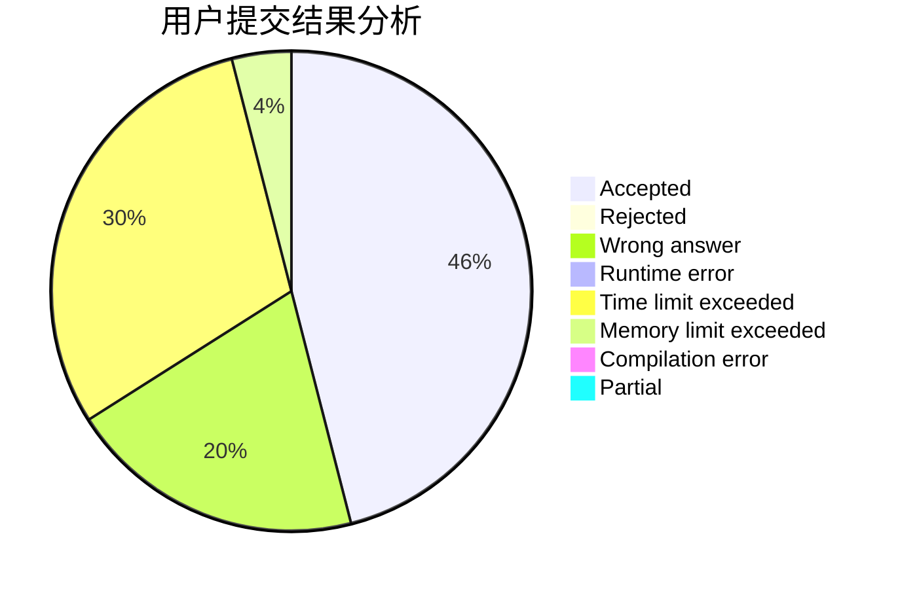
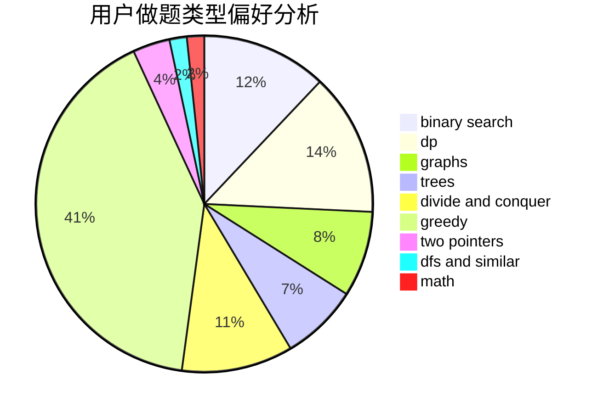

# 718_MiL

<!-- tabs:start -->

#### **用户提交结果分析**

#### **用户做题类型偏好分析**

<!-- tabs:end -->
# 推荐题目
[10023](https://codeforces.com/contest/1002/problem/3)
[1156B](https://codeforces.com/contest/1156/problem/B)
[1416D](https://codeforces.com/contest/1416/problem/D)
[1418G](https://codeforces.com/contest/1418/problem/G)
[1416F](https://codeforces.com/contest/1416/problem/F)
[1417E](https://codeforces.com/contest/1417/problem/E)
[1346B](https://codeforces.com/contest/1346/problem/B)
[1109D](https://codeforces.com/contest/1109/problem/D)
[1417F](https://codeforces.com/contest/1417/problem/F)
[1419F](https://codeforces.com/contest/1419/problem/F)
