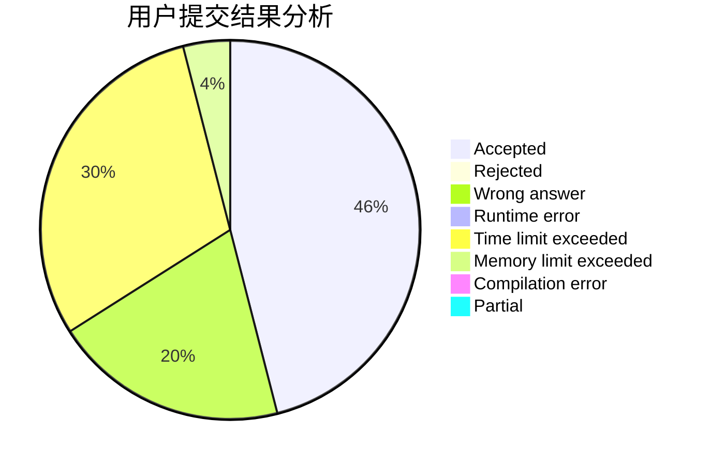
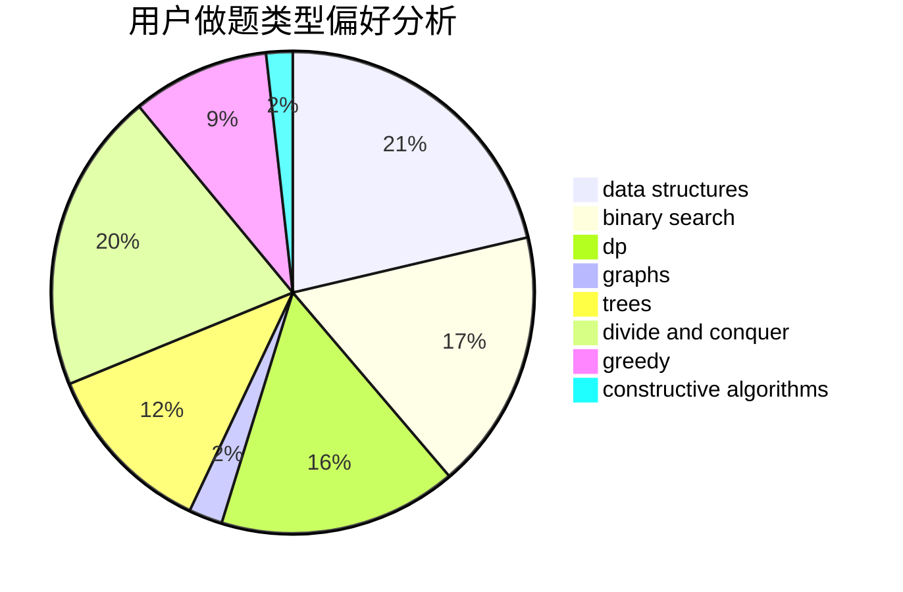
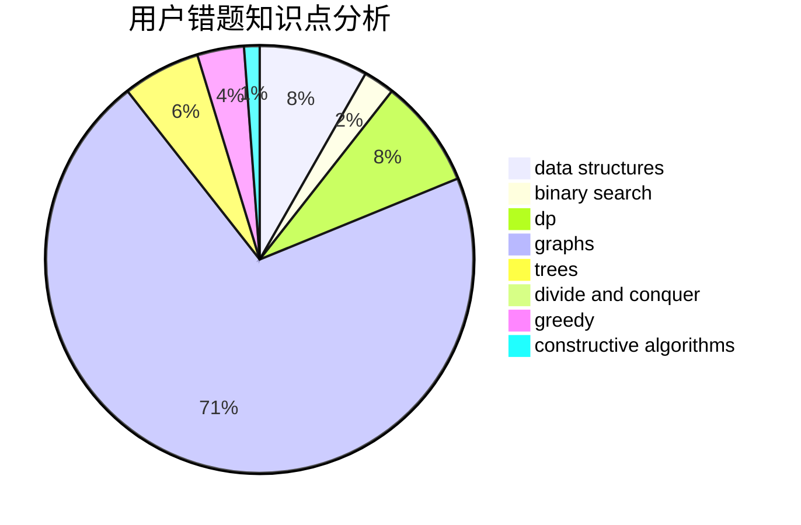

# 718_MiL

<!-- tabs:start -->

#### **用户提交结果分析**

#### **用户做题类型偏好分析**

#### **用户错题知识点分析**

<!-- tabs:end -->
# 推荐题目
[10023](https://codeforces.com/contest/1002/problem/3)		dsu,graphs,sortings,trees		  
[1156B](https://codeforces.com/contest/1156/problem/B)		dfs and similar,
                        greedy,
                        implementation,
                        sortings,
                        strings		  
[1416D](https://codeforces.com/contest/1416/problem/D)		data structures,
                        dsu,
                        graphs,
                        implementation,
                        trees		  
[1418G](https://codeforces.com/contest/1418/problem/G)		data structures,
                        divide and conquer,
                        hashing,
                        two pointers		  
[1416F](https://codeforces.com/contest/1416/problem/F)		flows,
                        graph matchings,
                        greedy,
                        implementation		  
[1417E](https://codeforces.com/contest/1417/problem/E)		dsu,graphs,sortings,trees		  
[1346B](https://codeforces.com/contest/1346/problem/B)		*special problem,
                        greedy		  
[1109D](https://codeforces.com/contest/1109/problem/D)		brute force,
                        combinatorics,
                        dp,
                        math,
                        trees		  
[1417F](https://codeforces.com/contest/1417/problem/F)		dsu,graphs,sortings,trees		  
[1419F](https://codeforces.com/contest/1419/problem/F)		binary search,
                        data structures,
                        dfs and similar,
                        dsu,
                        graphs,
                        implementation		  
