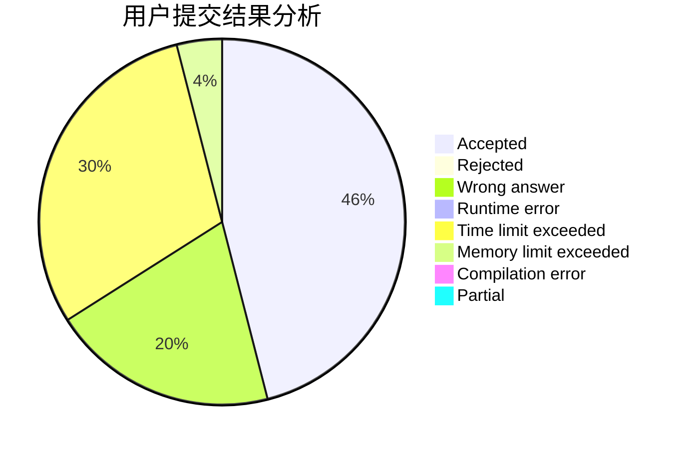
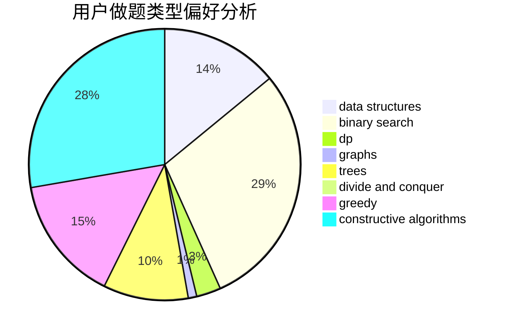
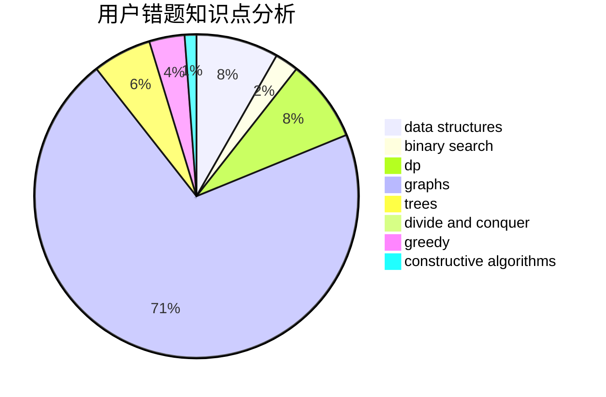

# 718_MiL

<!-- tabs:start -->

#### **用户提交结果分析**

#### **用户做题类型偏好分析**

#### **用户错题知识点分析**

<!-- tabs:end -->
# 推荐题目
[1002B4](https://codeforces.com/contest/1002B/problem/4)		nan		  
[1154B](https://codeforces.com/contest/1154/problem/B)		math		  
[1405C](https://codeforces.com/contest/1405/problem/C)		dsu,graphs,sortings,trees		  
[1408C](https://codeforces.com/contest/1408/problem/C)		binary search,
                        dp,
                        implementation,
                        math,
                        two pointers		  
[1405E](https://codeforces.com/contest/1405/problem/E)		dsu,graphs,sortings,trees		  
[1406E](https://codeforces.com/contest/1406/problem/E)		interactive,
                        math,
                        number theory		  
[1339B](https://codeforces.com/contest/1339/problem/B)		constructive algorithms,
                        sortings		  
[1108F](https://codeforces.com/contest/1108/problem/F)		binary search,
                        dsu,
                        graphs,
                        greedy		  
[1407A](https://codeforces.com/contest/1407/problem/A)		constructive algorithms,
                        math		  
[1409A](https://codeforces.com/contest/1409/problem/A)		greedy,
                        math		  
