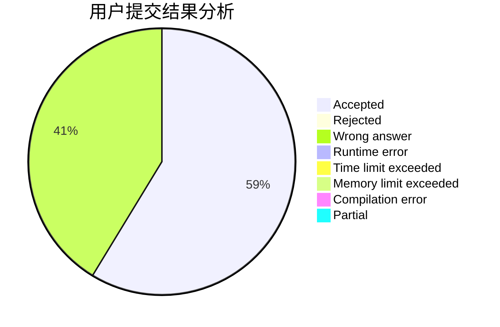
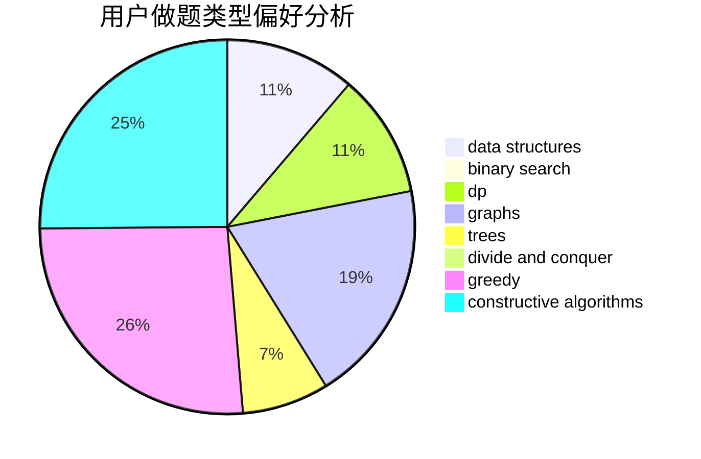

# Louis2803

<!-- tabs:start -->

#### **用户提交结果分析**

#### **用户做题类型偏好分析**

#### **用户错题知识点分析**

<!-- tabs:end -->
# 推荐题目
[1394A](https://codeforces.com/contest/1394/problem/A)		dp,
                        greedy,
                        sortings,
                        two pointers		  
[949E](https://codeforces.com/contest/949/problem/E)		brute force		  
[11082](https://codeforces.com/contest/1108/problem/2)		dsu,graphs,sortings,trees		  
[738D](https://codeforces.com/contest/738/problem/D)		dsu,graphs,sortings,trees		  
[175B](https://codeforces.com/contest/175/problem/B)		implementation		  
[11951](https://codeforces.com/contest/1195/problem/1)		dsu,graphs,sortings,trees		  
[1194E](https://codeforces.com/contest/1194/problem/E)		bitmasks,
                        brute force,
                        data structures,
                        geometry,
                        sortings		  
[1163D](https://codeforces.com/contest/1163/problem/D)		dp,
                        strings		  
[46A](https://codeforces.com/contest/46/problem/A)		brute force,
                        implementation		  
[1217F](https://codeforces.com/contest/1217/problem/F)		data structures,
                        divide and conquer,
                        dsu,
                        graphs,
                        trees		  
