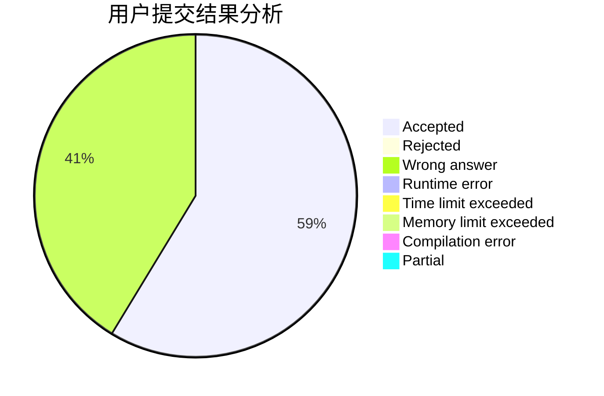
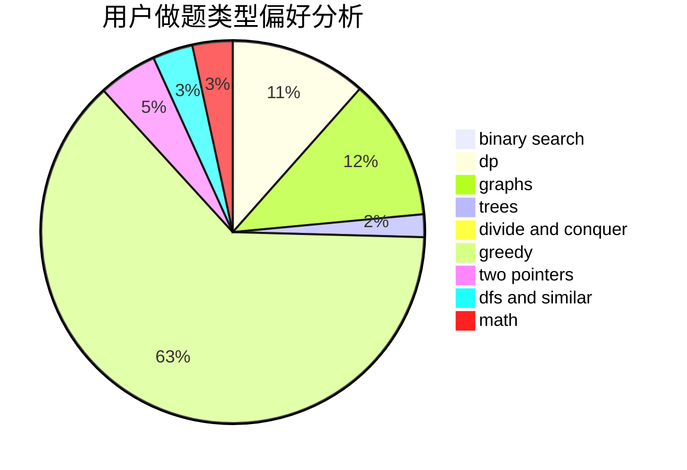

# Louis2803

<!-- tabs:start -->

#### **用户提交结果分析**

#### **用户做题类型偏好分析**

<!-- tabs:end -->
# 推荐题目
[1394A](https://codeforces.com/contest/1394/problem/A)
[949E](https://codeforces.com/contest/949/problem/E)
[11082](https://codeforces.com/contest/1108/problem/2)
[738D](https://codeforces.com/contest/738/problem/D)
[175B](https://codeforces.com/contest/175/problem/B)
[11951](https://codeforces.com/contest/1195/problem/1)
[1194E](https://codeforces.com/contest/1194/problem/E)
[1163D](https://codeforces.com/contest/1163/problem/D)
[46A](https://codeforces.com/contest/46/problem/A)
[1217F](https://codeforces.com/contest/1217/problem/F)
