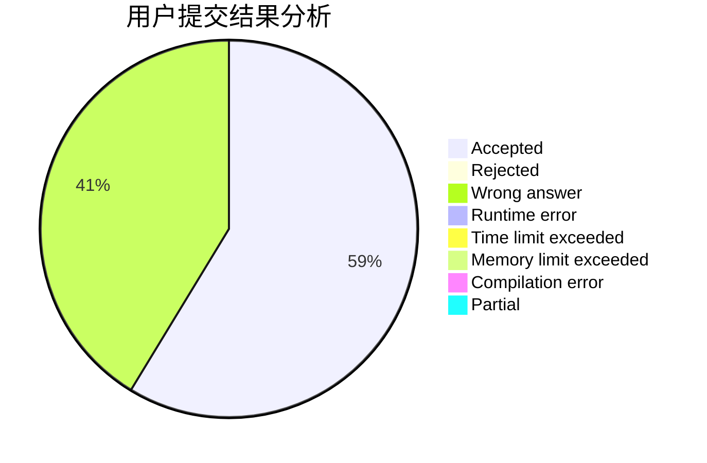
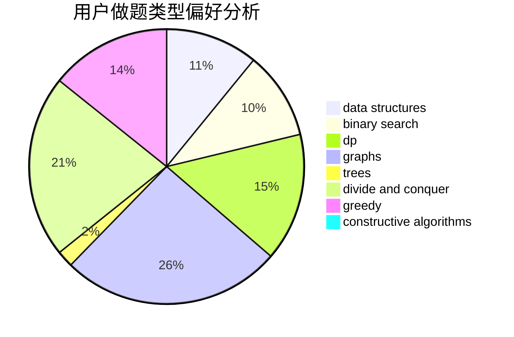

# Louis2803

<!-- tabs:start -->

#### **用户提交结果分析**

#### **用户做题类型偏好分析**

#### **用户错题知识点分析**

<!-- tabs:end -->
# 推荐题目
[1384B1](https://codeforces.com/contest/1384B/problem/1)		brute force,
                        dp,
                        greedy		  
[928B](https://codeforces.com/contest/928/problem/B)		*special problem,
                        dp		  
[1107E](https://codeforces.com/contest/1107/problem/E)		dp		  
[721B](https://codeforces.com/contest/721/problem/B)		implementation,
                        math,
                        sortings,
                        strings		  
[152E](https://codeforces.com/contest/152/problem/E)		bitmasks,
                        dp,
                        graphs,
                        trees		  
[1189D2](https://codeforces.com/contest/1189D/problem/2)		dsu,graphs,sortings,trees		  
[1189C](https://codeforces.com/contest/1189/problem/C)		data structures,
                        dp,
                        implementation,
                        math		  
[1161A](https://codeforces.com/contest/1161/problem/A)		dsu,graphs,sortings,trees		  
[449D](https://codeforces.com/contest/449/problem/D)		bitmasks,
                        combinatorics,
                        dp		  
[1213D1](https://codeforces.com/contest/1213D/problem/1)		brute force,
                        implementation		  
