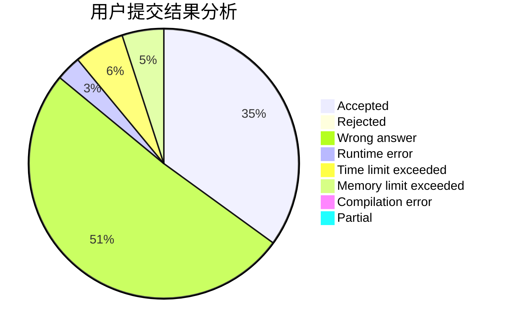
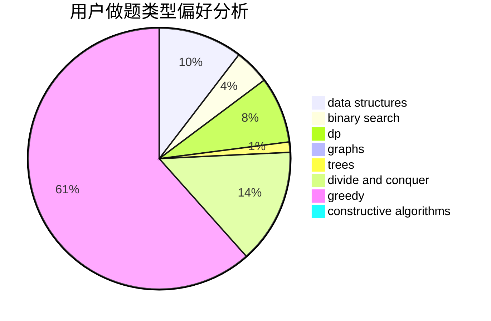
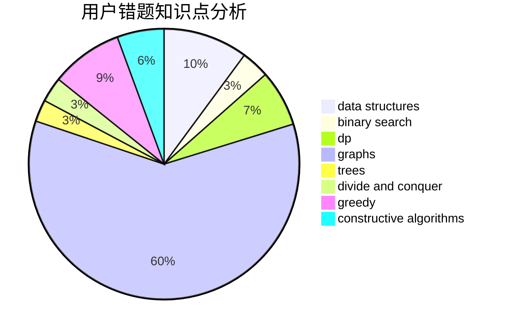

# Love_Jacques

<!-- tabs:start -->

#### **用户提交结果分析**

#### **用户做题类型偏好分析**

#### **用户错题知识点分析**

<!-- tabs:end -->
# 推荐题目
[1447F2](https://codeforces.com/contest/1447F/problem/2)		dsu,graphs,sortings,trees		  
[623E](https://codeforces.com/contest/623/problem/E)		combinatorics,
                        dp,
                        fft,
                        math		  
[33A](https://codeforces.com/contest/33/problem/A)		greedy,
                        implementation		  
[1512A](https://codeforces.com/contest/1512/problem/A)		brute force,
                        implementation		  
[215B](https://codeforces.com/contest/215/problem/B)		greedy,
                        math		  
[446B](https://codeforces.com/contest/446/problem/B)		brute force,
                        data structures,
                        greedy		  
[587F](https://codeforces.com/contest/587/problem/F)		data structures,
                        strings		  
[746B](https://codeforces.com/contest/746/problem/B)		implementation,
                        strings		  
[576C](https://codeforces.com/contest/576/problem/C)		constructive algorithms,
                        divide and conquer,
                        geometry,
                        greedy,
                        sortings		  
[633G](https://codeforces.com/contest/633/problem/G)		bitmasks,
                        data structures,
                        dfs and similar,
                        math,
                        number theory		  
