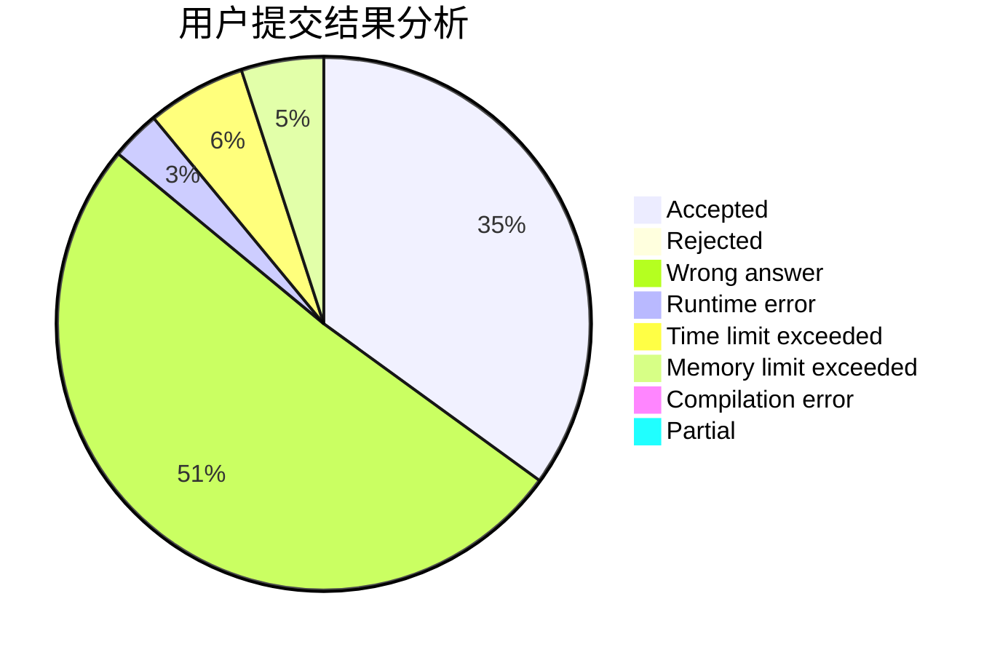
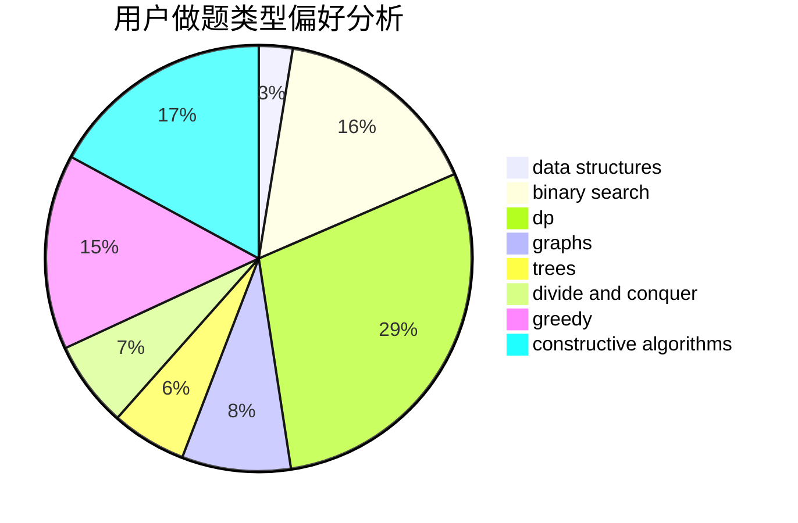

# Love_Jacques

<!-- tabs:start -->

#### **用户提交结果分析**

#### **用户做题类型偏好分析**

#### **用户错题知识点分析**

<!-- tabs:end -->
# 推荐题目
[1457D](https://codeforces.com/contest/1457/problem/D)		dsu,graphs,sortings,trees		  
[652A](https://codeforces.com/contest/652/problem/A)		implementation,
                        math		  
[367B](https://codeforces.com/contest/367/problem/B)		binary search,
                        data structures		  
[171A](https://codeforces.com/contest/171/problem/A)		*special problem,
                        constructive algorithms		  
[234A](https://codeforces.com/contest/234/problem/A)		implementation		  
[466C](https://codeforces.com/contest/466/problem/C)		binary search,
                        brute force,
                        data structures,
                        dp,
                        two pointers		  
[608B](https://codeforces.com/contest/608/problem/B)		combinatorics,
                        strings		  
[765D](https://codeforces.com/contest/765/problem/D)		constructive algorithms,
                        dsu,
                        math		  
[598C](https://codeforces.com/contest/598/problem/C)		geometry,
                        sortings		  
[666B](https://codeforces.com/contest/666/problem/B)		graphs,
                        shortest paths		  
