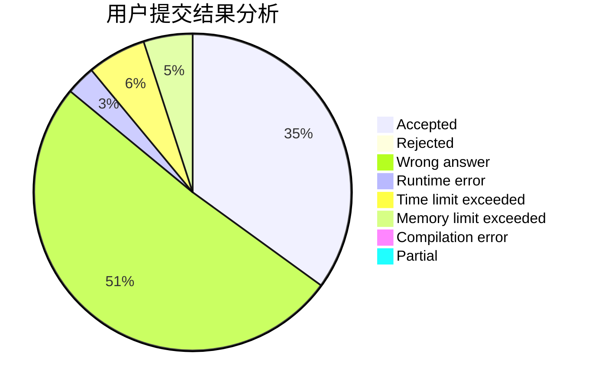
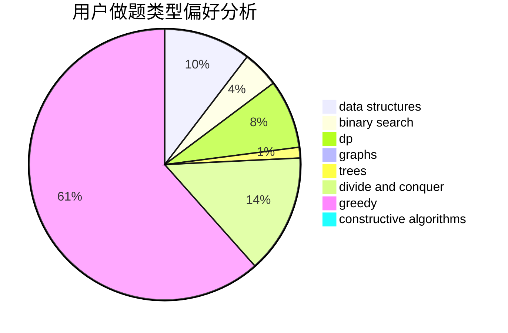
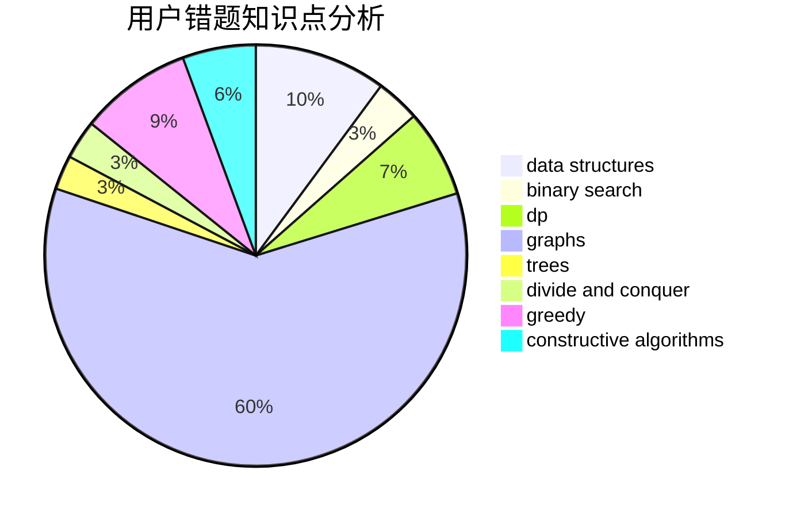

# Love_Jacques
<!-- tabs:start -->
#### **用户提交结果分析**

#### **用户做题类型偏好分析**

#### **用户错题知识点分析**

<!-- tabs:end -->
# 推荐题目
[What is for dinner?](http://codeforces.com/problemset/problem/33/A)		greedy,
                        implementation		  
[Olympic Medal](http://codeforces.com/problemset/problem/215/B)		greedy,
                        math		  
[Downloading B++](http://codeforces.com/problemset/problem/883/C)		binary search,
                        implementation		  
[Flag](http://codeforces.com/problemset/problem/1181/C)		brute force,
                        combinatorics,
                        dp,
                        implementation		  
[Another Problem on Strings](http://codeforces.com/problemset/problem/165/C)		binary search,
                        brute force,
                        dp,
                        math,
                        strings,
                        two pointers		  
[Points on Plane](http://codeforces.com/problemset/problem/576/C)		constructive algorithms,
                        divide and conquer,
                        geometry,
                        greedy,
                        sortings		  
[Coupons and Discounts](http://codeforces.com/problemset/problem/731/B)		constructive algorithms,
                        greedy		  
[Decoding](http://codeforces.com/problemset/problem/746/B)		implementation,
                        strings		  
[Add on a Tree: Revolution](https://codeforces.com/contest/1189/problem/D2)		constructive algorithms,
                        dfs and similar,
                        implementation,
                        trees		  
[Subordinates](https://codeforces.com/contest/737/problem/C)		constructive algorithms,
                        data structures,
                        graphs,
                        greedy,
                        sortings		  
<!-- tabs:start -->
#### **data structures**
[What is for dinner?](https://codeforces.com/contest/737/problem/C)		constructive algorithms,
                        data structures,
                        graphs,
                        greedy,
                        sortings		  
[Olympic Medal](http://codeforces.com/problemset/problem/633/G)		bitmasks,
                        data structures,
                        dfs and similar,
                        math,
                        number theory		  
[Downloading B++](http://codeforces.com/problemset/problem/573/B)		binary search,
                        data structures,
                        dp,
                        math		  
[Flag](http://codeforces.com/problemset/problem/587/F)		data structures,
                        strings		  
[Another Problem on Strings](http://codeforces.com/problemset/problem/1213/B)		data structures,
                        implementation		  
[Points on Plane](http://codeforces.com/problemset/problem/500/E)		data structures,
                        dp,
                        dsu		  
[Coupons and Discounts](http://codeforces.com/problemset/problem/446/B)		brute force,
                        data structures,
                        greedy		  
[Decoding](http://codeforces.com/problemset/problem/242/E)		bitmasks,
                        data structures		  
[Add on a Tree: Revolution](http://codeforces.com/problemset/problem/748/D)		constructive algorithms,
                        data structures,
                        greedy		  
[Subordinates](https://codeforces.com/contest/1447/problem/F2)		data structures,
                        greedy,
                        two pointers		  
#### **binary search**
[What is for dinner?](http://codeforces.com/problemset/problem/883/C)		binary search,
                        implementation		  
[Olympic Medal](http://codeforces.com/problemset/problem/165/C)		binary search,
                        brute force,
                        dp,
                        math,
                        strings,
                        two pointers		  
[Downloading B++](http://codeforces.com/problemset/problem/573/B)		binary search,
                        data structures,
                        dp,
                        math		  
[Flag](https://codeforces.com/contest/1471/problem/E)		binary search,
                        brute force,
                        constructive algorithms,
                        interactive		  
[Another Problem on Strings](http://codeforces.com/problemset/problem/1335/E1)		binary search,
                        brute force,
                        data structures,
                        dp,
                        two pointers		  
[Points on Plane](http://codeforces.com/problemset/problem/1492/C)		binary search,
                        data structures,
                        dp,
                        greedy,
                        two pointers		  
[Coupons and Discounts](http://codeforces.com/problemset/problem/1463/D)		binary search,
                        constructive algorithms,
                        greedy,
                        two pointers		  
[Decoding](http://codeforces.com/problemset/problem/1490/G)		binary search,
                        data structures,
                        math		  
[Add on a Tree: Revolution](http://codeforces.com/problemset/problem/1479/D)		binary search,
                        bitmasks,
                        brute force,
                        data structures,
                        probabilities,
                        trees		  
[Subordinates](http://codeforces.com/problemset/problem/1436/E)		binary search,
                        data structures,
                        two pointers		  
#### **dp**
[What is for dinner?](http://codeforces.com/problemset/problem/1181/C)		brute force,
                        combinatorics,
                        dp,
                        implementation		  
[Olympic Medal](http://codeforces.com/problemset/problem/165/C)		binary search,
                        brute force,
                        dp,
                        math,
                        strings,
                        two pointers		  
[Downloading B++](http://codeforces.com/problemset/problem/573/B)		binary search,
                        data structures,
                        dp,
                        math		  
[Flag](http://codeforces.com/problemset/problem/1282/B2)		dp,
                        greedy,
                        sortings		  
[Another Problem on Strings](http://codeforces.com/problemset/problem/1091/D)		combinatorics,
                        dp,
                        math		  
[Points on Plane](http://codeforces.com/problemset/problem/500/E)		data structures,
                        dp,
                        dsu		  
[Coupons and Discounts](http://codeforces.com/problemset/problem/917/D)		dp,
                        math,
                        matrices,
                        trees		  
[Decoding](http://codeforces.com/problemset/problem/855/C)		dp,
                        trees		  
[Add on a Tree: Revolution](http://codeforces.com/problemset/problem/1466/H)		combinatorics,
                        dp,
                        graphs,
                        greedy,
                        math		  
[Subordinates](http://codeforces.com/problemset/problem/780/F)		bitmasks,
                        dp,
                        graphs,
                        matrices		  
#### **graph**
[What is for dinner?](https://codeforces.com/contest/737/problem/C)		constructive algorithms,
                        data structures,
                        graphs,
                        greedy,
                        sortings		  
[Olympic Medal](http://codeforces.com/problemset/problem/1466/H)		combinatorics,
                        dp,
                        graphs,
                        greedy,
                        math		  
[Downloading B++](http://codeforces.com/problemset/problem/780/F)		bitmasks,
                        dp,
                        graphs,
                        matrices		  
[Flag](http://codeforces.com/problemset/problem/1263/D)		dfs and similar,
                        dsu,
                        graphs		  
[Another Problem on Strings](http://codeforces.com/problemset/problem/1487/C)		brute force,
                        constructive algorithms,
                        dfs and similar,
                        graphs,
                        greedy,
                        implementation,
                        math		  
[Points on Plane](http://codeforces.com/problemset/problem/1437/C)		dp,
                        flows,
                        graph matchings,
                        greedy,
                        math,
                        sortings		  
[Coupons and Discounts](http://codeforces.com/problemset/problem/1470/D)		constructive algorithms,
                        dfs and similar,
                        graph matchings,
                        graphs,
                        greedy		  
[Decoding](http://codeforces.com/problemset/problem/1476/C)		dp,
                        graphs,
                        greedy		  
[Add on a Tree: Revolution](http://codeforces.com/problemset/problem/1304/D)		constructive algorithms,
                        graphs,
                        greedy,
                        two pointers		  
[Subordinates](http://codeforces.com/problemset/problem/1475/C)		combinatorics,
                        graphs,
                        math		  
#### **trees**
[What is for dinner?](https://codeforces.com/contest/1189/problem/D2)		constructive algorithms,
                        dfs and similar,
                        implementation,
                        trees		  
[Olympic Medal](http://codeforces.com/problemset/problem/917/D)		dp,
                        math,
                        matrices,
                        trees		  
[Downloading B++](http://codeforces.com/problemset/problem/855/C)		dp,
                        trees		  
[Flag](http://codeforces.com/problemset/problem/1479/D)		binary search,
                        bitmasks,
                        brute force,
                        data structures,
                        probabilities,
                        trees		  
[Another Problem on Strings](http://codeforces.com/problemset/problem/1511/C)		brute force,
                        data structures,
                        implementation,
                        trees		  
[Points on Plane](http://codeforces.com/problemset/problem/1499/F)		combinatorics,
                        dfs and similar,
                        dp,
                        trees		  
[Coupons and Discounts](http://codeforces.com/problemset/problem/1491/E)		brute force,
                        dfs and similar,
                        divide and conquer,
                        number theory,
                        trees		  
[Decoding](http://codeforces.com/problemset/problem/1466/D)		data structures,
                        greedy,
                        sortings,
                        trees		  
[Add on a Tree: Revolution](http://codeforces.com/problemset/problem/1495/D)		combinatorics,
                        dfs and similar,
                        graphs,
                        math,
                        shortest paths,
                        trees		  
[Subordinates](http://codeforces.com/problemset/problem/1303/G)		data structures,
                        divide and conquer,
                        geometry,
                        trees		  
#### **divide and conquer**
[What is for dinner?](http://codeforces.com/problemset/problem/576/C)		constructive algorithms,
                        divide and conquer,
                        geometry,
                        greedy,
                        sortings		  
[Olympic Medal](http://codeforces.com/problemset/problem/914/G)		bitmasks,
                        divide and conquer,
                        dp,
                        fft,
                        math		  
[Downloading B++](http://codeforces.com/problemset/problem/755/G)		combinatorics,
                        divide and conquer,
                        dp,
                        fft,
                        math,
                        number theory		  
[Flag](http://codeforces.com/problemset/problem/1461/D)		binary search,
                        brute force,
                        data structures,
                        divide and conquer,
                        implementation,
                        sortings		  
[Another Problem on Strings](http://codeforces.com/problemset/problem/1466/G)		combinatorics,
                        divide and conquer,
                        hashing,
                        math,
                        string suffix structures,
                        strings		  
[Points on Plane](http://codeforces.com/problemset/problem/1490/D)		dfs and similar,
                        divide and conquer,
                        implementation		  
[Coupons and Discounts](https://codeforces.com/contest/1483/problem/C)		data structures,
                        divide and conquer,
                        dp		  
[Decoding](http://codeforces.com/problemset/problem/1491/E)		brute force,
                        dfs and similar,
                        divide and conquer,
                        number theory,
                        trees		  
[Add on a Tree: Revolution](http://codeforces.com/problemset/problem/1303/G)		data structures,
                        divide and conquer,
                        geometry,
                        trees		  
[Subordinates](http://codeforces.com/problemset/problem/1494/D)		constructive algorithms,
                        data structures,
                        dfs and similar,
                        divide and conquer,
                        dsu,
                        greedy,
                        sortings,
                        trees		  
#### **greedy**
[What is for dinner?](http://codeforces.com/problemset/problem/33/A)		greedy,
                        implementation		  
[Olympic Medal](http://codeforces.com/problemset/problem/215/B)		greedy,
                        math		  
[Downloading B++](http://codeforces.com/problemset/problem/576/C)		constructive algorithms,
                        divide and conquer,
                        geometry,
                        greedy,
                        sortings		  
[Flag](http://codeforces.com/problemset/problem/731/B)		constructive algorithms,
                        greedy		  
[Another Problem on Strings](https://codeforces.com/contest/737/problem/C)		constructive algorithms,
                        data structures,
                        graphs,
                        greedy,
                        sortings		  
[Points on Plane](http://codeforces.com/problemset/problem/1282/B2)		dp,
                        greedy,
                        sortings		  
[Coupons and Discounts](http://codeforces.com/problemset/problem/1466/H)		combinatorics,
                        dp,
                        graphs,
                        greedy,
                        math		  
[Decoding](http://codeforces.com/problemset/problem/446/B)		brute force,
                        data structures,
                        greedy		  
[Add on a Tree: Revolution](http://codeforces.com/problemset/problem/748/D)		constructive algorithms,
                        data structures,
                        greedy		  
[Subordinates](http://codeforces.com/problemset/problem/1006/B)		greedy,
                        implementation,
                        sortings		  
#### **constructive algorithms**
[What is for dinner?](http://codeforces.com/problemset/problem/576/C)		constructive algorithms,
                        divide and conquer,
                        geometry,
                        greedy,
                        sortings		  
[Olympic Medal](http://codeforces.com/problemset/problem/731/B)		constructive algorithms,
                        greedy		  
[Downloading B++](https://codeforces.com/contest/1189/problem/D2)		constructive algorithms,
                        dfs and similar,
                        implementation,
                        trees		  
[Flag](https://codeforces.com/contest/737/problem/C)		constructive algorithms,
                        data structures,
                        graphs,
                        greedy,
                        sortings		  
[Another Problem on Strings](http://codeforces.com/problemset/problem/1109/B)		constructive algorithms,
                        hashing,
                        strings		  
[Points on Plane](http://codeforces.com/problemset/problem/748/D)		constructive algorithms,
                        data structures,
                        greedy		  
[Coupons and Discounts](https://codeforces.com/contest/1471/problem/E)		binary search,
                        brute force,
                        constructive algorithms,
                        interactive		  
[Decoding](http://codeforces.com/problemset/problem/1400/A)		constructive algorithms,
                        strings		  
[Add on a Tree: Revolution](http://codeforces.com/problemset/problem/1349/B)		constructive algorithms,
                        greedy,
                        math		  
[Subordinates](http://codeforces.com/problemset/problem/1493/A)		constructive algorithms,
                        greedy		  
#### **sortings**
[What is for dinner?](http://codeforces.com/problemset/problem/576/C)		constructive algorithms,
                        divide and conquer,
                        geometry,
                        greedy,
                        sortings		  
[Olympic Medal](https://codeforces.com/contest/737/problem/C)		constructive algorithms,
                        data structures,
                        graphs,
                        greedy,
                        sortings		  
[Downloading B++](http://codeforces.com/problemset/problem/1282/B2)		dp,
                        greedy,
                        sortings		  
[Flag](http://codeforces.com/problemset/problem/1006/B)		greedy,
                        implementation,
                        sortings		  
[Another Problem on Strings](https://codeforces.com/contest/1496/problem/C)		geometry,
                        greedy,
                        math,
                        sortings		  
[Points on Plane](http://codeforces.com/problemset/problem/1495/A)		geometry,
                        greedy,
                        math,
                        sortings		  
[Coupons and Discounts](http://codeforces.com/problemset/problem/1497/A)		brute force,
                        data structures,
                        greedy,
                        sortings		  
[Decoding](http://codeforces.com/problemset/problem/1427/A)		math,
                        sortings		  
[Add on a Tree: Revolution](http://codeforces.com/problemset/problem/1461/D)		binary search,
                        brute force,
                        data structures,
                        divide and conquer,
                        implementation,
                        sortings		  
[Subordinates](http://codeforces.com/problemset/problem/1437/C)		dp,
                        flows,
                        graph matchings,
                        greedy,
                        math,
                        sortings		  
<!-- tabs:end -->
