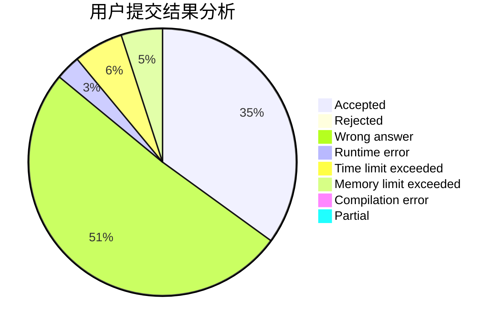
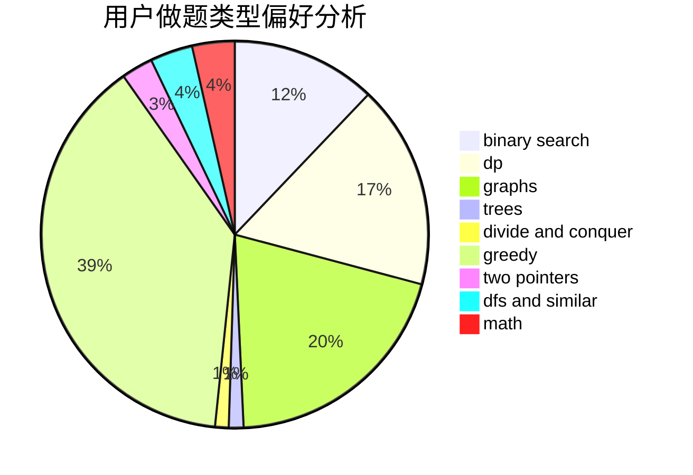

# Love_Jacques

<!-- tabs:start -->

#### **用户提交结果分析**

#### **用户做题类型偏好分析**

<!-- tabs:end -->
# 推荐题目
[1457D](https://codeforces.com/contest/1457/problem/D)
[652A](https://codeforces.com/contest/652/problem/A)
[367B](https://codeforces.com/contest/367/problem/B)
[171A](https://codeforces.com/contest/171/problem/A)
[234A](https://codeforces.com/contest/234/problem/A)
[466C](https://codeforces.com/contest/466/problem/C)
[608B](https://codeforces.com/contest/608/problem/B)
[765D](https://codeforces.com/contest/765/problem/D)
[598C](https://codeforces.com/contest/598/problem/C)
[666B](https://codeforces.com/contest/666/problem/B)
