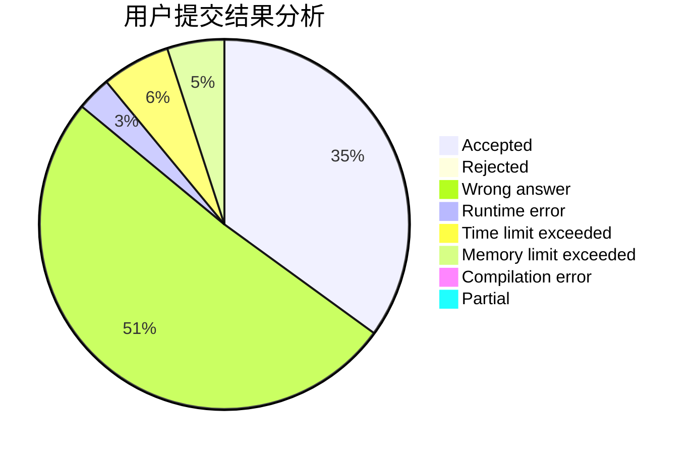
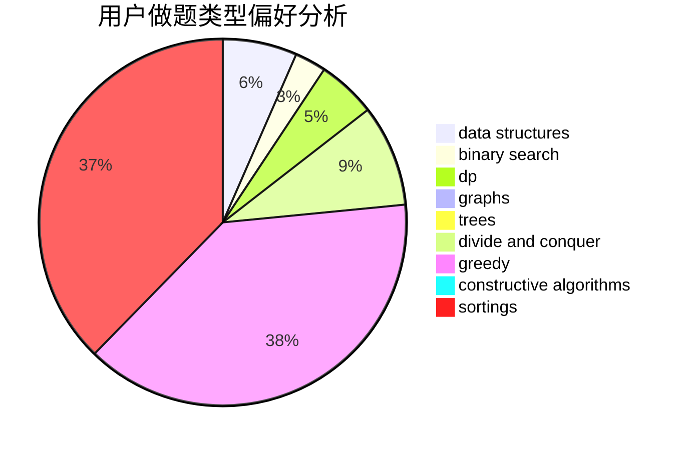
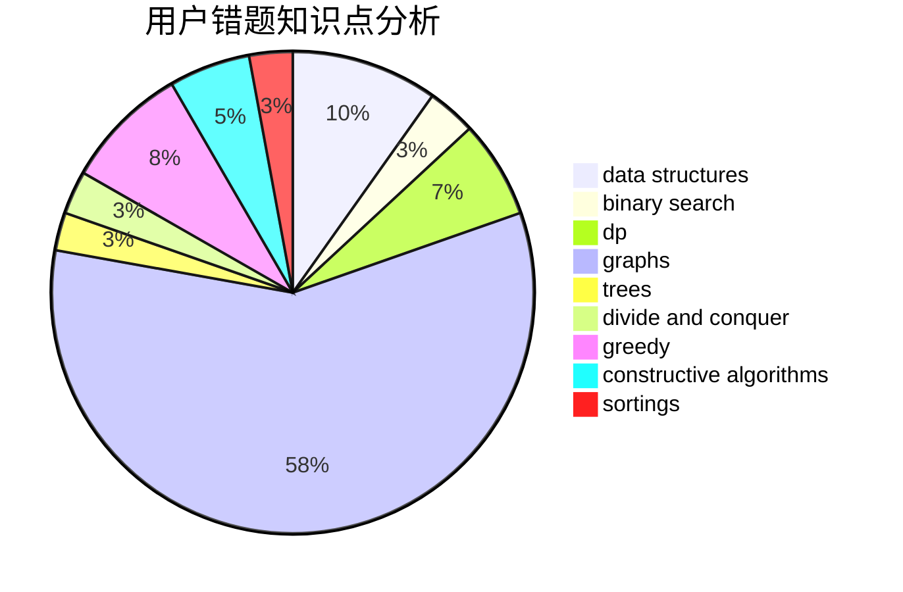

# Love_Jacques
<!-- tabs:start -->
#### **用户提交结果分析**

#### **用户做题类型偏好分析**

#### **用户错题知识点分析**

<!-- tabs:end -->
# 推荐题目
[33A](http://codeforces.com/problemset/problem/33/A)		greedy,
                        implementation		  
[215B](http://codeforces.com/problemset/problem/215/B)		greedy,
                        math		  
[883C](http://codeforces.com/problemset/problem/883/C)		binary search,
                        implementation		  
[1181C](http://codeforces.com/problemset/problem/1181/C)		brute force,
                        combinatorics,
                        dp,
                        implementation		  
[165C](http://codeforces.com/problemset/problem/165/C)		binary search,
                        brute force,
                        dp,
                        math,
                        strings,
                        two pointers		  
[576C](http://codeforces.com/problemset/problem/576/C)		constructive algorithms,
                        divide and conquer,
                        geometry,
                        greedy,
                        sortings		  
[731B](http://codeforces.com/problemset/problem/731/B)		constructive algorithms,
                        greedy		  
[746B](http://codeforces.com/problemset/problem/746/B)		implementation,
                        strings		  
[1189D2](https://codeforces.com/contest/1189/problem/D2)		constructive algorithms,
                        dfs and similar,
                        implementation,
                        trees		  
[737C](https://codeforces.com/contest/737/problem/C)		constructive algorithms,
                        data structures,
                        graphs,
                        greedy,
                        sortings		  
<!-- tabs:start -->
#### **data structures**
[737C](https://codeforces.com/contest/737/problem/C)		constructive algorithms,
                        data structures,
                        graphs,
                        greedy,
                        sortings		  
[633G](http://codeforces.com/problemset/problem/633/G)		bitmasks,
                        data structures,
                        dfs and similar,
                        math,
                        number theory		  
[573B](http://codeforces.com/problemset/problem/573/B)		binary search,
                        data structures,
                        dp,
                        math		  
[587F](http://codeforces.com/problemset/problem/587/F)		data structures,
                        strings		  
[1213B](http://codeforces.com/problemset/problem/1213/B)		data structures,
                        implementation		  
[500E](http://codeforces.com/problemset/problem/500/E)		data structures,
                        dp,
                        dsu		  
[446B](http://codeforces.com/problemset/problem/446/B)		brute force,
                        data structures,
                        greedy		  
[242E](http://codeforces.com/problemset/problem/242/E)		bitmasks,
                        data structures		  
[748D](http://codeforces.com/problemset/problem/748/D)		constructive algorithms,
                        data structures,
                        greedy		  
[1447F2](https://codeforces.com/contest/1447/problem/F2)		data structures,
                        greedy,
                        two pointers		  
#### **binary search**
[883C](http://codeforces.com/problemset/problem/883/C)		binary search,
                        implementation		  
[165C](http://codeforces.com/problemset/problem/165/C)		binary search,
                        brute force,
                        dp,
                        math,
                        strings,
                        two pointers		  
[573B](http://codeforces.com/problemset/problem/573/B)		binary search,
                        data structures,
                        dp,
                        math		  
[1471E](https://codeforces.com/contest/1471/problem/E)		binary search,
                        brute force,
                        constructive algorithms,
                        interactive		  
[1335E1](http://codeforces.com/problemset/problem/1335/E1)		binary search,
                        brute force,
                        data structures,
                        dp,
                        two pointers		  
[1492C](http://codeforces.com/problemset/problem/1492/C)		binary search,
                        data structures,
                        dp,
                        greedy,
                        two pointers		  
[1463D](http://codeforces.com/problemset/problem/1463/D)		binary search,
                        constructive algorithms,
                        greedy,
                        two pointers		  
[1490G](http://codeforces.com/problemset/problem/1490/G)		binary search,
                        data structures,
                        math		  
[1479D](http://codeforces.com/problemset/problem/1479/D)		binary search,
                        bitmasks,
                        brute force,
                        data structures,
                        probabilities,
                        trees		  
[1436E](http://codeforces.com/problemset/problem/1436/E)		binary search,
                        data structures,
                        two pointers		  
#### **dp**
[1181C](http://codeforces.com/problemset/problem/1181/C)		brute force,
                        combinatorics,
                        dp,
                        implementation		  
[165C](http://codeforces.com/problemset/problem/165/C)		binary search,
                        brute force,
                        dp,
                        math,
                        strings,
                        two pointers		  
[573B](http://codeforces.com/problemset/problem/573/B)		binary search,
                        data structures,
                        dp,
                        math		  
[1282B2](http://codeforces.com/problemset/problem/1282/B2)		dp,
                        greedy,
                        sortings		  
[1091D](http://codeforces.com/problemset/problem/1091/D)		combinatorics,
                        dp,
                        math		  
[500E](http://codeforces.com/problemset/problem/500/E)		data structures,
                        dp,
                        dsu		  
[917D](http://codeforces.com/problemset/problem/917/D)		dp,
                        math,
                        matrices,
                        trees		  
[855C](http://codeforces.com/problemset/problem/855/C)		dp,
                        trees		  
[1466H](http://codeforces.com/problemset/problem/1466/H)		combinatorics,
                        dp,
                        graphs,
                        greedy,
                        math		  
[780F](http://codeforces.com/problemset/problem/780/F)		bitmasks,
                        dp,
                        graphs,
                        matrices		  
#### **graph**
[737C](https://codeforces.com/contest/737/problem/C)		constructive algorithms,
                        data structures,
                        graphs,
                        greedy,
                        sortings		  
[1466H](http://codeforces.com/problemset/problem/1466/H)		combinatorics,
                        dp,
                        graphs,
                        greedy,
                        math		  
[780F](http://codeforces.com/problemset/problem/780/F)		bitmasks,
                        dp,
                        graphs,
                        matrices		  
[1263D](http://codeforces.com/problemset/problem/1263/D)		dfs and similar,
                        dsu,
                        graphs		  
[1487C](http://codeforces.com/problemset/problem/1487/C)		brute force,
                        constructive algorithms,
                        dfs and similar,
                        graphs,
                        greedy,
                        implementation,
                        math		  
[1437C](http://codeforces.com/problemset/problem/1437/C)		dp,
                        flows,
                        graph matchings,
                        greedy,
                        math,
                        sortings		  
[1470D](http://codeforces.com/problemset/problem/1470/D)		constructive algorithms,
                        dfs and similar,
                        graph matchings,
                        graphs,
                        greedy		  
[1476C](http://codeforces.com/problemset/problem/1476/C)		dp,
                        graphs,
                        greedy		  
[1304D](http://codeforces.com/problemset/problem/1304/D)		constructive algorithms,
                        graphs,
                        greedy,
                        two pointers		  
[1475C](http://codeforces.com/problemset/problem/1475/C)		combinatorics,
                        graphs,
                        math		  
#### **trees**
[1189D2](https://codeforces.com/contest/1189/problem/D2)		constructive algorithms,
                        dfs and similar,
                        implementation,
                        trees		  
[917D](http://codeforces.com/problemset/problem/917/D)		dp,
                        math,
                        matrices,
                        trees		  
[855C](http://codeforces.com/problemset/problem/855/C)		dp,
                        trees		  
[1479D](http://codeforces.com/problemset/problem/1479/D)		binary search,
                        bitmasks,
                        brute force,
                        data structures,
                        probabilities,
                        trees		  
[1511C](http://codeforces.com/problemset/problem/1511/C)		brute force,
                        data structures,
                        implementation,
                        trees		  
[1499F](http://codeforces.com/problemset/problem/1499/F)		combinatorics,
                        dfs and similar,
                        dp,
                        trees		  
[1491E](http://codeforces.com/problemset/problem/1491/E)		brute force,
                        dfs and similar,
                        divide and conquer,
                        number theory,
                        trees		  
[1466D](http://codeforces.com/problemset/problem/1466/D)		data structures,
                        greedy,
                        sortings,
                        trees		  
[1495D](http://codeforces.com/problemset/problem/1495/D)		combinatorics,
                        dfs and similar,
                        graphs,
                        math,
                        shortest paths,
                        trees		  
[1303G](http://codeforces.com/problemset/problem/1303/G)		data structures,
                        divide and conquer,
                        geometry,
                        trees		  
#### **divide and conquer**
[576C](http://codeforces.com/problemset/problem/576/C)		constructive algorithms,
                        divide and conquer,
                        geometry,
                        greedy,
                        sortings		  
[914G](http://codeforces.com/problemset/problem/914/G)		bitmasks,
                        divide and conquer,
                        dp,
                        fft,
                        math		  
[755G](http://codeforces.com/problemset/problem/755/G)		combinatorics,
                        divide and conquer,
                        dp,
                        fft,
                        math,
                        number theory		  
[1461D](http://codeforces.com/problemset/problem/1461/D)		binary search,
                        brute force,
                        data structures,
                        divide and conquer,
                        implementation,
                        sortings		  
[1466G](http://codeforces.com/problemset/problem/1466/G)		combinatorics,
                        divide and conquer,
                        hashing,
                        math,
                        string suffix structures,
                        strings		  
[1490D](http://codeforces.com/problemset/problem/1490/D)		dfs and similar,
                        divide and conquer,
                        implementation		  
[1483C](https://codeforces.com/contest/1483/problem/C)		data structures,
                        divide and conquer,
                        dp		  
[1491E](http://codeforces.com/problemset/problem/1491/E)		brute force,
                        dfs and similar,
                        divide and conquer,
                        number theory,
                        trees		  
[1303G](http://codeforces.com/problemset/problem/1303/G)		data structures,
                        divide and conquer,
                        geometry,
                        trees		  
[1494D](http://codeforces.com/problemset/problem/1494/D)		constructive algorithms,
                        data structures,
                        dfs and similar,
                        divide and conquer,
                        dsu,
                        greedy,
                        sortings,
                        trees		  
#### **greedy**
[33A](http://codeforces.com/problemset/problem/33/A)		greedy,
                        implementation		  
[215B](http://codeforces.com/problemset/problem/215/B)		greedy,
                        math		  
[576C](http://codeforces.com/problemset/problem/576/C)		constructive algorithms,
                        divide and conquer,
                        geometry,
                        greedy,
                        sortings		  
[731B](http://codeforces.com/problemset/problem/731/B)		constructive algorithms,
                        greedy		  
[737C](https://codeforces.com/contest/737/problem/C)		constructive algorithms,
                        data structures,
                        graphs,
                        greedy,
                        sortings		  
[1282B2](http://codeforces.com/problemset/problem/1282/B2)		dp,
                        greedy,
                        sortings		  
[1466H](http://codeforces.com/problemset/problem/1466/H)		combinatorics,
                        dp,
                        graphs,
                        greedy,
                        math		  
[446B](http://codeforces.com/problemset/problem/446/B)		brute force,
                        data structures,
                        greedy		  
[748D](http://codeforces.com/problemset/problem/748/D)		constructive algorithms,
                        data structures,
                        greedy		  
[1006B](http://codeforces.com/problemset/problem/1006/B)		greedy,
                        implementation,
                        sortings		  
#### **constructive algorithms**
[576C](http://codeforces.com/problemset/problem/576/C)		constructive algorithms,
                        divide and conquer,
                        geometry,
                        greedy,
                        sortings		  
[731B](http://codeforces.com/problemset/problem/731/B)		constructive algorithms,
                        greedy		  
[1189D2](https://codeforces.com/contest/1189/problem/D2)		constructive algorithms,
                        dfs and similar,
                        implementation,
                        trees		  
[737C](https://codeforces.com/contest/737/problem/C)		constructive algorithms,
                        data structures,
                        graphs,
                        greedy,
                        sortings		  
[1109B](http://codeforces.com/problemset/problem/1109/B)		constructive algorithms,
                        hashing,
                        strings		  
[748D](http://codeforces.com/problemset/problem/748/D)		constructive algorithms,
                        data structures,
                        greedy		  
[1471E](https://codeforces.com/contest/1471/problem/E)		binary search,
                        brute force,
                        constructive algorithms,
                        interactive		  
[1400A](http://codeforces.com/problemset/problem/1400/A)		constructive algorithms,
                        strings		  
[1349B](http://codeforces.com/problemset/problem/1349/B)		constructive algorithms,
                        greedy,
                        math		  
[1493A](http://codeforces.com/problemset/problem/1493/A)		constructive algorithms,
                        greedy		  
#### **sortings**
[576C](http://codeforces.com/problemset/problem/576/C)		constructive algorithms,
                        divide and conquer,
                        geometry,
                        greedy,
                        sortings		  
[737C](https://codeforces.com/contest/737/problem/C)		constructive algorithms,
                        data structures,
                        graphs,
                        greedy,
                        sortings		  
[1282B2](http://codeforces.com/problemset/problem/1282/B2)		dp,
                        greedy,
                        sortings		  
[1006B](http://codeforces.com/problemset/problem/1006/B)		greedy,
                        implementation,
                        sortings		  
[1496C](https://codeforces.com/contest/1496/problem/C)		geometry,
                        greedy,
                        math,
                        sortings		  
[1495A](http://codeforces.com/problemset/problem/1495/A)		geometry,
                        greedy,
                        math,
                        sortings		  
[1497A](http://codeforces.com/problemset/problem/1497/A)		brute force,
                        data structures,
                        greedy,
                        sortings		  
[1427A](http://codeforces.com/problemset/problem/1427/A)		math,
                        sortings		  
[1461D](http://codeforces.com/problemset/problem/1461/D)		binary search,
                        brute force,
                        data structures,
                        divide and conquer,
                        implementation,
                        sortings		  
[1437C](http://codeforces.com/problemset/problem/1437/C)		dp,
                        flows,
                        graph matchings,
                        greedy,
                        math,
                        sortings		  
<!-- tabs:end -->
