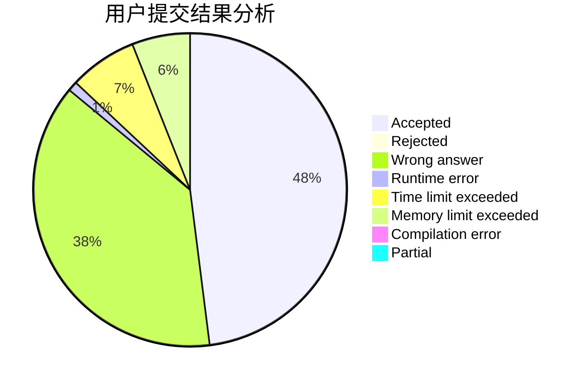
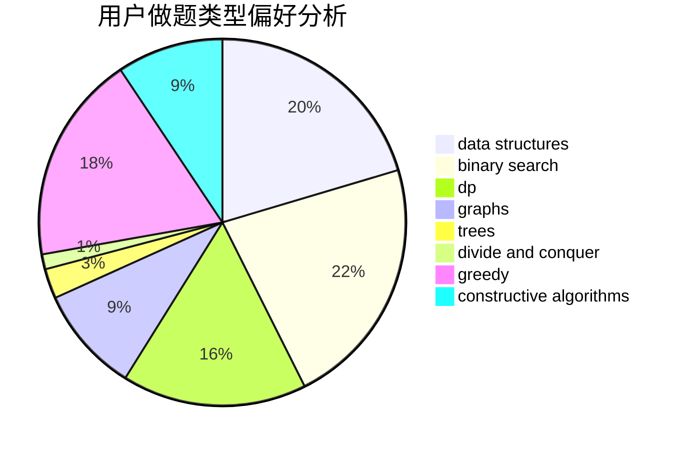
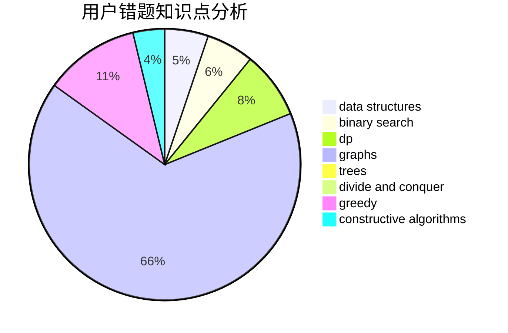

# Love_dkq_Forever

<!-- tabs:start -->

#### **用户提交结果分析**

#### **用户做题类型偏好分析**

#### **用户错题知识点分析**

<!-- tabs:end -->
# 推荐题目
[430B](https://codeforces.com/contest/430/problem/B)		brute force,
                        two pointers		  
[697B](https://codeforces.com/contest/697/problem/B)		brute force,
                        implementation,
                        math,
                        strings		  
[1080B](https://codeforces.com/contest/1080/problem/B)		math		  
[585B](https://codeforces.com/contest/585/problem/B)		dfs and similar,
                        graphs,
                        shortest paths		  
[1136D](https://codeforces.com/contest/1136/problem/D)		greedy		  
[1213D1](https://codeforces.com/contest/1213D/problem/1)		brute force,
                        implementation		  
[922E](https://codeforces.com/contest/922/problem/E)		dp		  
[1234E](https://codeforces.com/contest/1234/problem/E)		math		  
[815E](https://codeforces.com/contest/815/problem/E)		binary search,
                        constructive algorithms,
                        implementation		  
[441D](https://codeforces.com/contest/441/problem/D)		constructive algorithms,
                        dsu,
                        graphs,
                        implementation,
                        math,
                        string suffix structures		  
