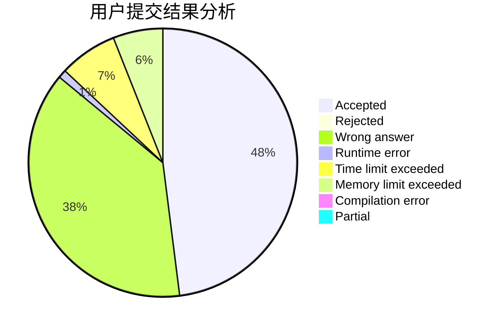
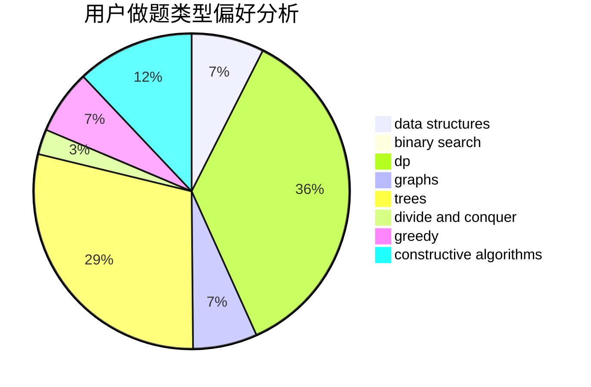
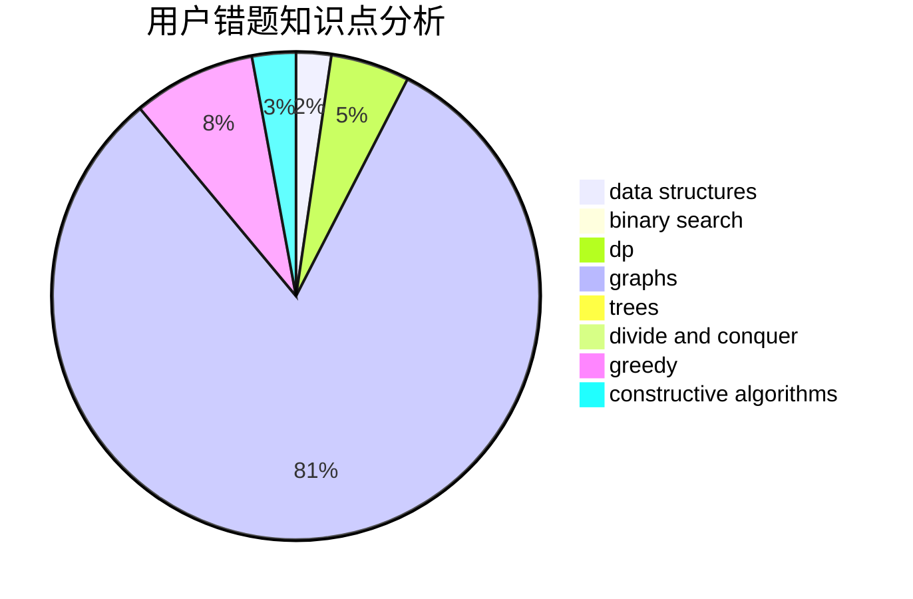

# Love_dkq_Forever

<!-- tabs:start -->

#### **用户提交结果分析**

#### **用户做题类型偏好分析**

#### **用户错题知识点分析**

<!-- tabs:end -->
# 推荐题目
[452C](https://codeforces.com/contest/452/problem/C)		combinatorics,
                        math,
                        probabilities		  
[713E](https://codeforces.com/contest/713/problem/E)		binary search,
                        dp		  
[1080E](https://codeforces.com/contest/1080/problem/E)		strings		  
[605C](https://codeforces.com/contest/605/problem/C)		geometry		  
[1138F](https://codeforces.com/contest/1138/problem/F)		dsu,graphs,sortings,trees		  
[1217F](https://codeforces.com/contest/1217/problem/F)		data structures,
                        divide and conquer,
                        dsu,
                        graphs,
                        trees		  
[946E](https://codeforces.com/contest/946/problem/E)		greedy,
                        implementation		  
[1240B](https://codeforces.com/contest/1240/problem/B)		dsu,graphs,sortings,trees		  
[835A](https://codeforces.com/contest/835/problem/A)		math		  
[462B](https://codeforces.com/contest/462/problem/B)		greedy		  
