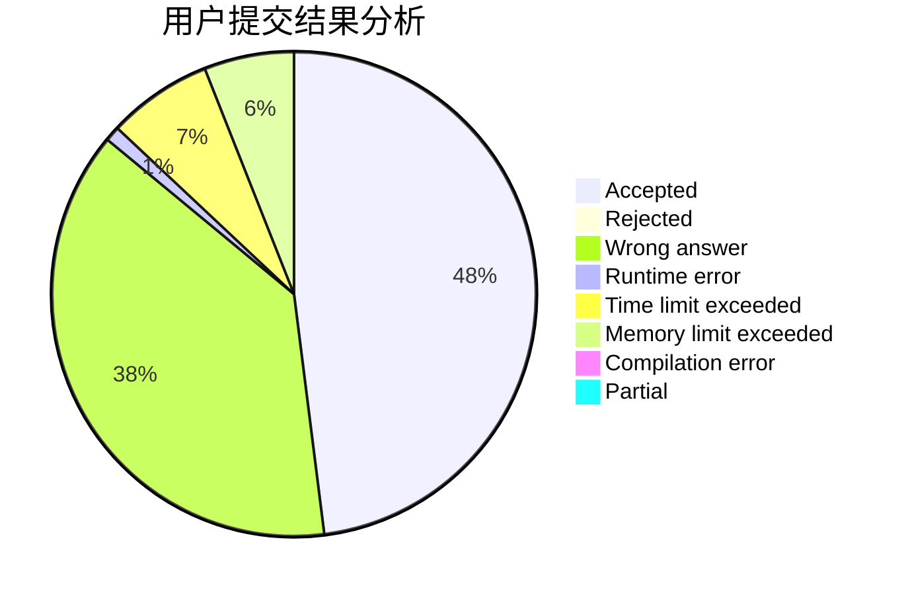
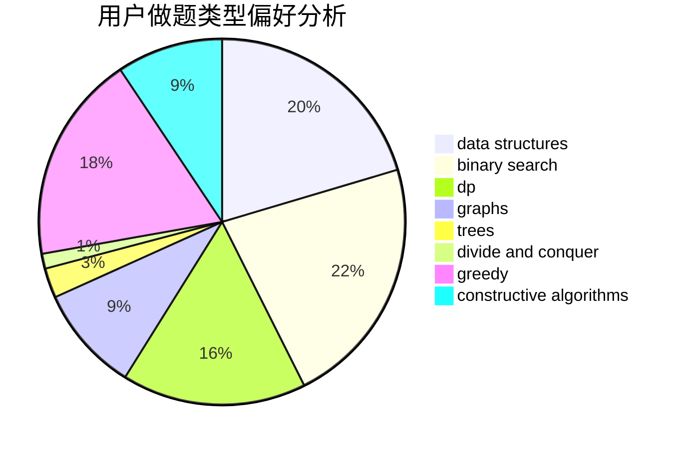
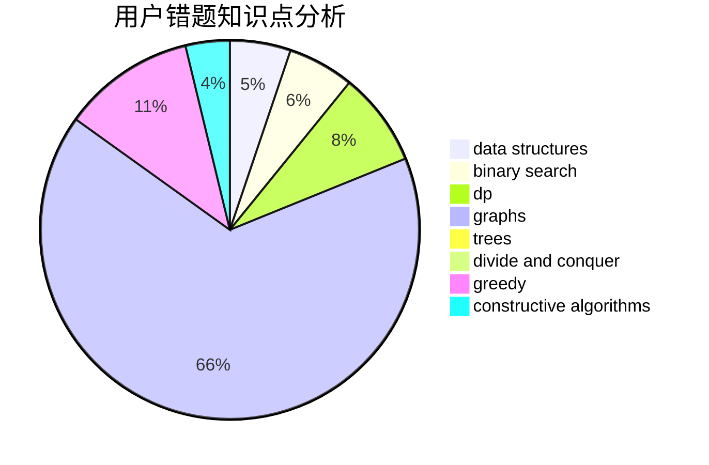

# Love_dkq_Forever
<!-- tabs:start -->
#### **用户提交结果分析**

#### **用户做题类型偏好分析**

#### **用户错题知识点分析**

<!-- tabs:end -->
# 推荐题目
[Margarite and the best present](http://codeforces.com/problemset/problem/1080/B)		math		  
[Did you mean...](https://codeforces.com/contest/860/problem/A)		dp,
                        greedy,
                        implementation		  
[Slime](http://codeforces.com/problemset/problem/1038/D)		dp,
                        greedy,
                        implementation		  
[Special Permutations](http://codeforces.com/problemset/problem/1234/E)		math		  
[Birds](http://codeforces.com/problemset/problem/922/E)		dp		  
[Bark to Unlock](http://codeforces.com/problemset/problem/868/A)		brute force,
                        implementation,
                        strings		  
[Casinos and travel](http://codeforces.com/problemset/problem/852/E)		dp		  
[Karen and Neighborhood](http://codeforces.com/problemset/problem/815/E)		binary search,
                        constructive algorithms,
                        implementation		  
[Nastya Is Buying Lunch](http://codeforces.com/problemset/problem/1136/D)		greedy		  
[Declined Finalists](http://codeforces.com/problemset/problem/859/A)		greedy,
                        implementation		  
<!-- tabs:start -->
#### **data structures**
[Margarite and the best present](http://codeforces.com/problemset/problem/813/F)		data structures,
                        dsu,
                        graphs		  
[Did you mean...](http://codeforces.com/problemset/problem/1354/D)		binary search,
                        data structures		  
[Slime](http://codeforces.com/problemset/problem/1039/D)		data structures,
                        dp,
                        trees		  
[Special Permutations](http://codeforces.com/problemset/problem/566/D)		data structures,
                        dsu		  
[Birds](http://codeforces.com/problemset/problem/1506/G)		brute force,
                        data structures,
                        dp,
                        greedy,
                        strings		  
[Bark to Unlock](http://codeforces.com/problemset/problem/1313/C1)		brute force,
                        data structures,
                        dp,
                        greedy		  
[Casinos and travel](https://codeforces.com/contest/1321/problem/B)		data structures,
                        dp,
                        greedy,
                        math,
                        sortings		  
[Karen and Neighborhood](http://codeforces.com/problemset/problem/1492/C)		binary search,
                        data structures,
                        dp,
                        greedy,
                        two pointers		  
[Nastya Is Buying Lunch](http://codeforces.com/problemset/problem/1490/G)		binary search,
                        data structures,
                        math		  
[Declined Finalists](http://codeforces.com/problemset/problem/1479/D)		binary search,
                        bitmasks,
                        brute force,
                        data structures,
                        probabilities,
                        trees		  
#### **binary search**
[Margarite and the best present](http://codeforces.com/problemset/problem/815/E)		binary search,
                        constructive algorithms,
                        implementation		  
[Did you mean...](http://codeforces.com/problemset/problem/1354/D)		binary search,
                        data structures		  
[Slime](http://codeforces.com/problemset/problem/1114/E)		binary search,
                        interactive,
                        number theory,
                        probabilities		  
[Special Permutations](http://codeforces.com/problemset/problem/1492/C)		binary search,
                        data structures,
                        dp,
                        greedy,
                        two pointers		  
[Birds](http://codeforces.com/problemset/problem/1463/D)		binary search,
                        constructive algorithms,
                        greedy,
                        two pointers		  
[Bark to Unlock](http://codeforces.com/problemset/problem/1490/G)		binary search,
                        data structures,
                        math		  
[Casinos and travel](http://codeforces.com/problemset/problem/1479/D)		binary search,
                        bitmasks,
                        brute force,
                        data structures,
                        probabilities,
                        trees		  
[Karen and Neighborhood](http://codeforces.com/problemset/problem/1436/E)		binary search,
                        data structures,
                        two pointers		  
[Nastya Is Buying Lunch](http://codeforces.com/problemset/problem/1461/D)		binary search,
                        brute force,
                        data structures,
                        divide and conquer,
                        implementation,
                        sortings		  
[Declined Finalists](http://codeforces.com/problemset/problem/1493/C)		binary search,
                        brute force,
                        constructive algorithms,
                        greedy,
                        strings		  
#### **dp**
[Margarite and the best present](https://codeforces.com/contest/860/problem/A)		dp,
                        greedy,
                        implementation		  
[Did you mean...](http://codeforces.com/problemset/problem/1038/D)		dp,
                        greedy,
                        implementation		  
[Slime](http://codeforces.com/problemset/problem/922/E)		dp		  
[Special Permutations](http://codeforces.com/problemset/problem/852/E)		dp		  
[Birds](http://codeforces.com/problemset/problem/650/C)		dfs and similar,
                        dp,
                        dsu,
                        graphs,
                        greedy		  
[Bark to Unlock](http://codeforces.com/problemset/problem/1039/D)		data structures,
                        dp,
                        trees		  
[Casinos and travel](http://codeforces.com/problemset/problem/581/F)		dp,
                        trees,
                        two pointers		  
[Karen and Neighborhood](http://codeforces.com/problemset/problem/1383/B)		bitmasks,
                        constructive algorithms,
                        dp,
                        games,
                        greedy,
                        math		  
[Nastya Is Buying Lunch](http://codeforces.com/problemset/problem/1506/G)		brute force,
                        data structures,
                        dp,
                        greedy,
                        strings		  
[Declined Finalists](http://codeforces.com/problemset/problem/1313/C1)		brute force,
                        data structures,
                        dp,
                        greedy		  
#### **graph**
[Margarite and the best present](http://codeforces.com/problemset/problem/441/D)		constructive algorithms,
                        dsu,
                        graphs,
                        implementation,
                        math,
                        string suffix structures		  
[Did you mean...](http://codeforces.com/problemset/problem/650/C)		dfs and similar,
                        dp,
                        dsu,
                        graphs,
                        greedy		  
[Slime](http://codeforces.com/problemset/problem/120/H)		graph matchings		  
[Special Permutations](http://codeforces.com/problemset/problem/939/A)		graphs		  
[Birds](http://codeforces.com/problemset/problem/813/F)		data structures,
                        dsu,
                        graphs		  
[Bark to Unlock](http://codeforces.com/problemset/problem/585/B)		dfs and similar,
                        graphs,
                        shortest paths		  
[Casinos and travel](http://codeforces.com/problemset/problem/1472/C)		dp,
                        graphs		  
[Karen and Neighborhood](http://codeforces.com/problemset/problem/1487/C)		brute force,
                        constructive algorithms,
                        dfs and similar,
                        graphs,
                        greedy,
                        implementation,
                        math		  
[Nastya Is Buying Lunch](http://codeforces.com/problemset/problem/1437/C)		dp,
                        flows,
                        graph matchings,
                        greedy,
                        math,
                        sortings		  
[Declined Finalists](http://codeforces.com/problemset/problem/1470/D)		constructive algorithms,
                        dfs and similar,
                        graph matchings,
                        graphs,
                        greedy		  
#### **trees**
[Margarite and the best present](http://codeforces.com/problemset/problem/1039/D)		data structures,
                        dp,
                        trees		  
[Did you mean...](http://codeforces.com/problemset/problem/581/F)		dp,
                        trees,
                        two pointers		  
[Slime](http://codeforces.com/problemset/problem/1479/D)		binary search,
                        bitmasks,
                        brute force,
                        data structures,
                        probabilities,
                        trees		  
[Special Permutations](http://codeforces.com/problemset/problem/1511/C)		brute force,
                        data structures,
                        implementation,
                        trees		  
[Birds](http://codeforces.com/problemset/problem/1499/F)		combinatorics,
                        dfs and similar,
                        dp,
                        trees		  
[Bark to Unlock](http://codeforces.com/problemset/problem/1491/E)		brute force,
                        dfs and similar,
                        divide and conquer,
                        number theory,
                        trees		  
[Casinos and travel](http://codeforces.com/problemset/problem/1466/D)		data structures,
                        greedy,
                        sortings,
                        trees		  
[Karen and Neighborhood](http://codeforces.com/problemset/problem/1495/D)		combinatorics,
                        dfs and similar,
                        graphs,
                        math,
                        shortest paths,
                        trees		  
[Nastya Is Buying Lunch](http://codeforces.com/problemset/problem/1303/G)		data structures,
                        divide and conquer,
                        geometry,
                        trees		  
[Declined Finalists](http://codeforces.com/problemset/problem/1454/E)		combinatorics,
                        dfs and similar,
                        graphs,
                        trees		  
#### **divide and conquer**
[Margarite and the best present](http://codeforces.com/problemset/problem/1461/D)		binary search,
                        brute force,
                        data structures,
                        divide and conquer,
                        implementation,
                        sortings		  
[Did you mean...](http://codeforces.com/problemset/problem/1466/G)		combinatorics,
                        divide and conquer,
                        hashing,
                        math,
                        string suffix structures,
                        strings		  
[Slime](http://codeforces.com/problemset/problem/1490/D)		dfs and similar,
                        divide and conquer,
                        implementation		  
[Special Permutations](https://codeforces.com/contest/1483/problem/C)		data structures,
                        divide and conquer,
                        dp		  
[Birds](http://codeforces.com/problemset/problem/1491/E)		brute force,
                        dfs and similar,
                        divide and conquer,
                        number theory,
                        trees		  
[Bark to Unlock](http://codeforces.com/problemset/problem/1303/G)		data structures,
                        divide and conquer,
                        geometry,
                        trees		  
[Casinos and travel](http://codeforces.com/problemset/problem/1494/D)		constructive algorithms,
                        data structures,
                        dfs and similar,
                        divide and conquer,
                        dsu,
                        greedy,
                        sortings,
                        trees		  
[Karen and Neighborhood](http://codeforces.com/problemset/problem/1482/E)		data structures,
                        divide and conquer,
                        dp		  
[Nastya Is Buying Lunch](http://codeforces.com/problemset/problem/566/C)		dfs and similar,
                        divide and conquer,
                        trees		  
[Declined Finalists](http://codeforces.com/problemset/problem/1428/F)		binary search,
                        data structures,
                        divide and conquer,
                        dp,
                        two pointers		  
#### **greedy**
[Margarite and the best present](https://codeforces.com/contest/860/problem/A)		dp,
                        greedy,
                        implementation		  
[Did you mean...](http://codeforces.com/problemset/problem/1038/D)		dp,
                        greedy,
                        implementation		  
[Slime](http://codeforces.com/problemset/problem/1136/D)		greedy		  
[Special Permutations](http://codeforces.com/problemset/problem/859/A)		greedy,
                        implementation		  
[Birds](http://codeforces.com/problemset/problem/650/C)		dfs and similar,
                        dp,
                        dsu,
                        graphs,
                        greedy		  
[Bark to Unlock](http://codeforces.com/problemset/problem/1383/B)		bitmasks,
                        constructive algorithms,
                        dp,
                        games,
                        greedy,
                        math		  
[Casinos and travel](http://codeforces.com/problemset/problem/1367/B)		greedy,
                        math		  
[Karen and Neighborhood](http://codeforces.com/problemset/problem/1430/B)		greedy,
                        implementation,
                        sortings		  
[Nastya Is Buying Lunch](http://codeforces.com/problemset/problem/1433/B)		greedy,
                        implementation		  
[Declined Finalists](http://codeforces.com/problemset/problem/1303/D)		bitmasks,
                        greedy		  
#### **constructive algorithms**
[Margarite and the best present](http://codeforces.com/problemset/problem/815/E)		binary search,
                        constructive algorithms,
                        implementation		  
[Did you mean...](http://codeforces.com/problemset/problem/441/D)		constructive algorithms,
                        dsu,
                        graphs,
                        implementation,
                        math,
                        string suffix structures		  
[Slime](http://codeforces.com/problemset/problem/1475/F)		2-sat,
                        brute force,
                        constructive algorithms		  
[Special Permutations](http://codeforces.com/problemset/problem/1312/B)		constructive algorithms,
                        sortings		  
[Birds](http://codeforces.com/problemset/problem/1383/B)		bitmasks,
                        constructive algorithms,
                        dp,
                        games,
                        greedy,
                        math		  
[Bark to Unlock](http://codeforces.com/problemset/problem/1425/H)		constructive algorithms		  
[Casinos and travel](http://codeforces.com/problemset/problem/1493/A)		constructive algorithms,
                        greedy		  
[Karen and Neighborhood](http://codeforces.com/problemset/problem/1463/D)		binary search,
                        constructive algorithms,
                        greedy,
                        two pointers		  
[Nastya Is Buying Lunch](https://codeforces.com/contest/1456/problem/B)		bitmasks,
                        brute force,
                        constructive algorithms		  
[Declined Finalists](http://codeforces.com/problemset/problem/1492/D)		bitmasks,
                        constructive algorithms,
                        greedy,
                        math		  
#### **sortings**
[Margarite and the best present](http://codeforces.com/problemset/problem/1312/B)		constructive algorithms,
                        sortings		  
[Did you mean...](http://codeforces.com/problemset/problem/1430/B)		greedy,
                        implementation,
                        sortings		  
[Slime](https://codeforces.com/contest/1321/problem/B)		data structures,
                        dp,
                        greedy,
                        math,
                        sortings		  
[Special Permutations](https://codeforces.com/contest/1496/problem/C)		geometry,
                        greedy,
                        math,
                        sortings		  
[Birds](http://codeforces.com/problemset/problem/1495/A)		geometry,
                        greedy,
                        math,
                        sortings		  
[Bark to Unlock](http://codeforces.com/problemset/problem/1497/A)		brute force,
                        data structures,
                        greedy,
                        sortings		  
[Casinos and travel](http://codeforces.com/problemset/problem/1427/A)		math,
                        sortings		  
[Karen and Neighborhood](http://codeforces.com/problemset/problem/1461/D)		binary search,
                        brute force,
                        data structures,
                        divide and conquer,
                        implementation,
                        sortings		  
[Nastya Is Buying Lunch](http://codeforces.com/problemset/problem/1437/C)		dp,
                        flows,
                        graph matchings,
                        greedy,
                        math,
                        sortings		  
[Declined Finalists](http://codeforces.com/problemset/problem/1473/A)		greedy,
                        implementation,
                        math,
                        sortings		  
<!-- tabs:end -->
