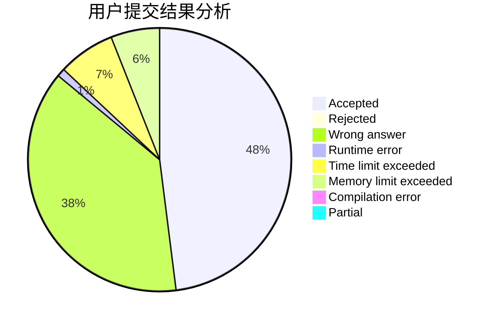
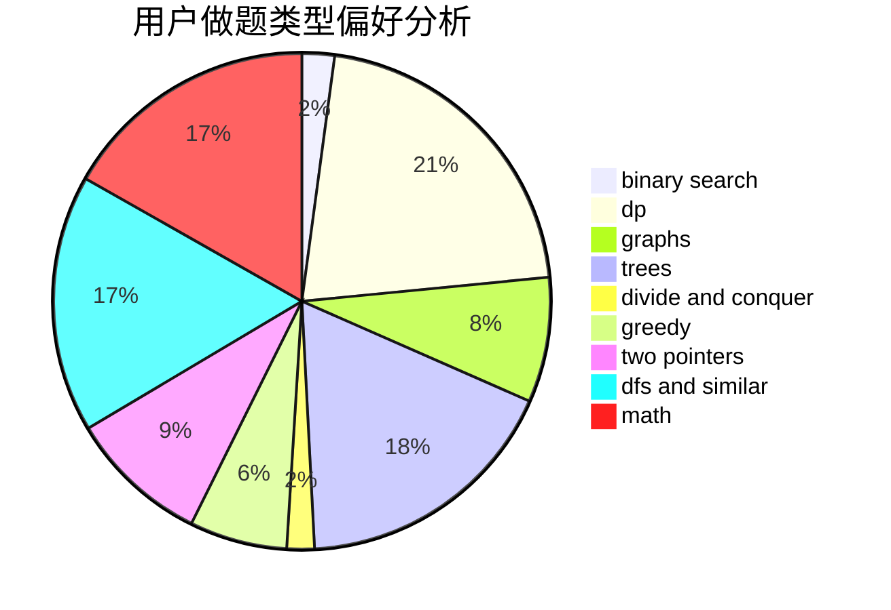

# Love_dkq_Forever

<!-- tabs:start -->

#### **用户提交结果分析**

#### **用户做题类型偏好分析**

<!-- tabs:end -->
# 推荐题目
[452C](https://codeforces.com/contest/452/problem/C)
[713E](https://codeforces.com/contest/713/problem/E)
[1080E](https://codeforces.com/contest/1080/problem/E)
[605C](https://codeforces.com/contest/605/problem/C)
[1138F](https://codeforces.com/contest/1138/problem/F)
[1217F](https://codeforces.com/contest/1217/problem/F)
[946E](https://codeforces.com/contest/946/problem/E)
[1240B](https://codeforces.com/contest/1240/problem/B)
[835A](https://codeforces.com/contest/835/problem/A)
[462B](https://codeforces.com/contest/462/problem/B)
