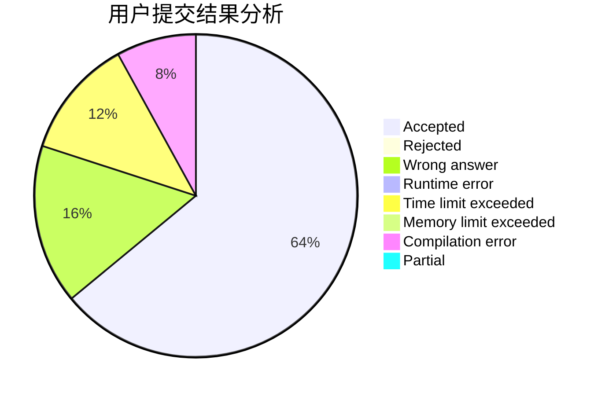
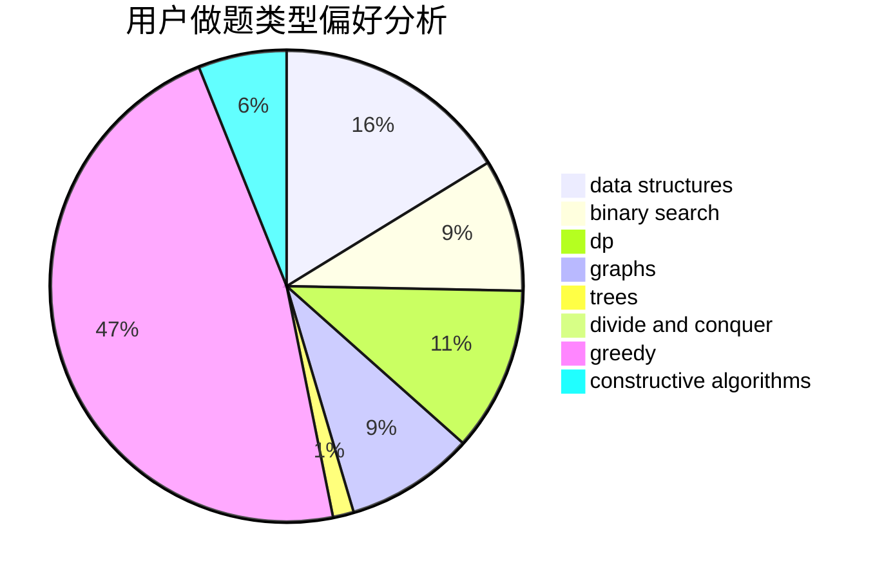
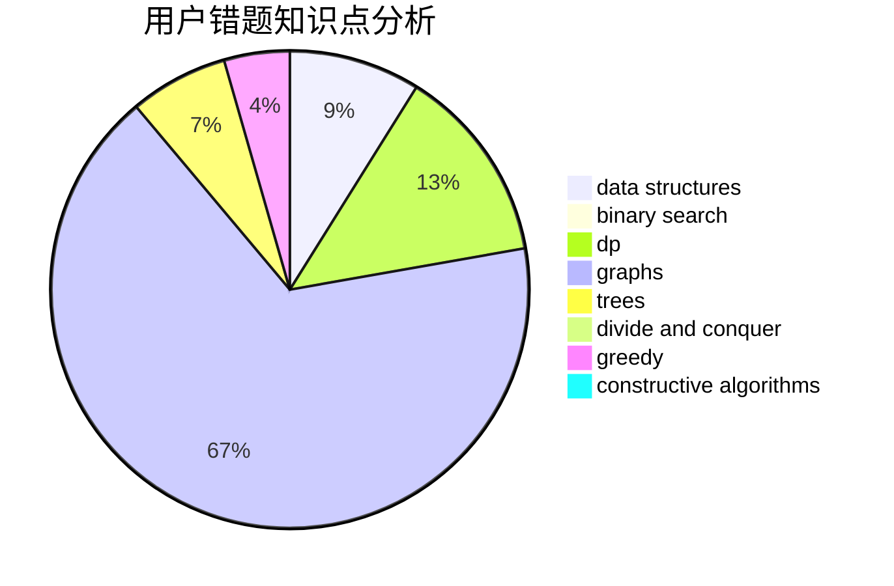

# Lsy2003
<!-- tabs:start -->
#### **用户提交结果分析**

#### **用户做题类型偏好分析**

#### **用户错题知识点分析**

<!-- tabs:end -->
# 推荐题目
[The Values You Can Make](http://codeforces.com/problemset/problem/687/C)		dp		  
[Pluses and Minuses](http://codeforces.com/problemset/problem/1373/C)		math		  
[Boboniu Walks on Graph](https://codeforces.com/contest/1395/problem/E)		brute force,
                        dfs and similar,
                        graphs,
                        hashing		  
[Moving Points](http://codeforces.com/problemset/problem/1311/F)		data structures,
                        divide and conquer,
                        implementation,
                        sortings		  
[Maximum Value](https://codeforces.com/contest/485/problem/D)		binary search,
                        math,
                        sortings,
                        two pointers		  
[Sagheer and Nubian Market](http://codeforces.com/problemset/problem/812/C)		binary search,
                        sortings		  
[Classroom Watch](https://codeforces.com/contest/876/problem/C)		brute force,
                        math		  
[And Reachability](http://codeforces.com/problemset/problem/1168/C)		bitmasks,
                        dp		  
[Three-level Laser](https://codeforces.com/contest/956/problem/B)		binary search,
                        greedy,
                        two pointers		  
[Missile Silos](http://codeforces.com/problemset/problem/144/D)		data structures,
                        dfs and similar,
                        graphs,
                        shortest paths		  
<!-- tabs:start -->
#### **data structures**
[The Values You Can Make](http://codeforces.com/problemset/problem/1311/F)		data structures,
                        divide and conquer,
                        implementation,
                        sortings		  
[Pluses and Minuses](http://codeforces.com/problemset/problem/144/D)		data structures,
                        dfs and similar,
                        graphs,
                        shortest paths		  
[Boboniu Walks on Graph](http://codeforces.com/problemset/problem/681/C)		constructive algorithms,
                        data structures,
                        greedy		  
[Moving Points](http://codeforces.com/problemset/problem/311/D)		data structures,
                        math		  
[Maximum Value](http://codeforces.com/problemset/problem/721/D)		constructive algorithms,
                        data structures,
                        greedy,
                        math		  
[Sagheer and Nubian Market](http://codeforces.com/problemset/problem/292/D)		data structures,
                        dfs and similar,
                        dp,
                        dsu		  
[Classroom Watch](http://codeforces.com/problemset/problem/1253/E)		data structures,
                        dp,
                        greedy,
                        sortings		  
[And Reachability](http://codeforces.com/problemset/problem/47/E)		data structures,
                        geometry,
                        sortings		  
[Three-level Laser](http://codeforces.com/problemset/problem/1263/F)		data structures,
                        dfs and similar,
                        dp,
                        flows,
                        graphs,
                        trees		  
[Missile Silos](http://codeforces.com/problemset/problem/576/E)		binary search,
                        data structures		  
#### **binary search**
[The Values You Can Make](https://codeforces.com/contest/485/problem/D)		binary search,
                        math,
                        sortings,
                        two pointers		  
[Pluses and Minuses](http://codeforces.com/problemset/problem/812/C)		binary search,
                        sortings		  
[Boboniu Walks on Graph](https://codeforces.com/contest/956/problem/B)		binary search,
                        greedy,
                        two pointers		  
[Moving Points](http://codeforces.com/problemset/problem/1156/C)		binary search,
                        greedy,
                        sortings,
                        ternary search,
                        two pointers		  
[Maximum Value](http://codeforces.com/problemset/problem/444/E)		binary search,
                        dsu,
                        trees		  
[Sagheer and Nubian Market](https://codeforces.com/contest/233/problem/C)		binary search,
                        constructive algorithms,
                        graphs,
                        greedy		  
[Classroom Watch](http://codeforces.com/problemset/problem/576/E)		binary search,
                        data structures		  
[And Reachability](http://codeforces.com/problemset/problem/833/B)		binary search,
                        data structures,
                        divide and conquer,
                        dp,
                        two pointers		  
[Three-level Laser](http://codeforces.com/problemset/problem/1443/C)		binary search,
                        greedy,
                        sortings		  
[Missile Silos](http://codeforces.com/problemset/problem/1492/C)		binary search,
                        data structures,
                        dp,
                        greedy,
                        two pointers		  
#### **dp**
[The Values You Can Make](http://codeforces.com/problemset/problem/687/C)		dp		  
[Pluses and Minuses](http://codeforces.com/problemset/problem/1168/C)		bitmasks,
                        dp		  
[Boboniu Walks on Graph](http://codeforces.com/problemset/problem/232/B)		bitmasks,
                        combinatorics,
                        dp,
                        math		  
[Moving Points](http://codeforces.com/problemset/problem/292/D)		data structures,
                        dfs and similar,
                        dp,
                        dsu		  
[Maximum Value](http://codeforces.com/problemset/problem/1253/E)		data structures,
                        dp,
                        greedy,
                        sortings		  
[Sagheer and Nubian Market](http://codeforces.com/problemset/problem/1263/F)		data structures,
                        dfs and similar,
                        dp,
                        flows,
                        graphs,
                        trees		  
[Classroom Watch](http://codeforces.com/problemset/problem/140/E)		combinatorics,
                        dp		  
[And Reachability](http://codeforces.com/problemset/problem/868/C)		bitmasks,
                        brute force,
                        constructive algorithms,
                        dp		  
[Three-level Laser](http://codeforces.com/problemset/problem/1383/E)		combinatorics,
                        data structures,
                        dp		  
[Missile Silos](http://codeforces.com/problemset/problem/868/F)		divide and conquer,
                        dp		  
#### **graph**
[The Values You Can Make](https://codeforces.com/contest/1395/problem/E)		brute force,
                        dfs and similar,
                        graphs,
                        hashing		  
[Pluses and Minuses](http://codeforces.com/problemset/problem/144/D)		data structures,
                        dfs and similar,
                        graphs,
                        shortest paths		  
[Boboniu Walks on Graph](http://codeforces.com/problemset/problem/1176/D)		dfs and similar,
                        graphs,
                        greedy,
                        number theory,
                        sortings		  
[Moving Points](http://codeforces.com/problemset/problem/1263/F)		data structures,
                        dfs and similar,
                        dp,
                        flows,
                        graphs,
                        trees		  
[Maximum Value](https://codeforces.com/contest/233/problem/C)		binary search,
                        constructive algorithms,
                        graphs,
                        greedy		  
[Sagheer and Nubian Market](http://codeforces.com/problemset/problem/464/E)		data structures,
                        graphs,
                        shortest paths		  
[Classroom Watch](http://codeforces.com/problemset/problem/1461/E)		brute force,
                        graphs,
                        greedy,
                        implementation,
                        math		  
[And Reachability](http://codeforces.com/problemset/problem/1487/C)		brute force,
                        constructive algorithms,
                        dfs and similar,
                        graphs,
                        greedy,
                        implementation,
                        math		  
[Three-level Laser](http://codeforces.com/problemset/problem/1437/C)		dp,
                        flows,
                        graph matchings,
                        greedy,
                        math,
                        sortings		  
[Missile Silos](http://codeforces.com/problemset/problem/1470/D)		constructive algorithms,
                        dfs and similar,
                        graph matchings,
                        graphs,
                        greedy		  
#### **trees**
[The Values You Can Make](http://codeforces.com/problemset/problem/1263/F)		data structures,
                        dfs and similar,
                        dp,
                        flows,
                        graphs,
                        trees		  
[Pluses and Minuses](http://codeforces.com/problemset/problem/444/E)		binary search,
                        dsu,
                        trees		  
[Boboniu Walks on Graph](http://codeforces.com/problemset/problem/741/D)		data structures,
                        dfs and similar,
                        trees		  
[Moving Points](http://codeforces.com/problemset/problem/1479/D)		binary search,
                        bitmasks,
                        brute force,
                        data structures,
                        probabilities,
                        trees		  
[Maximum Value](http://codeforces.com/problemset/problem/1511/C)		brute force,
                        data structures,
                        implementation,
                        trees		  
[Sagheer and Nubian Market](http://codeforces.com/problemset/problem/1499/F)		combinatorics,
                        dfs and similar,
                        dp,
                        trees		  
[Classroom Watch](http://codeforces.com/problemset/problem/1491/E)		brute force,
                        dfs and similar,
                        divide and conquer,
                        number theory,
                        trees		  
[And Reachability](http://codeforces.com/problemset/problem/1466/D)		data structures,
                        greedy,
                        sortings,
                        trees		  
[Three-level Laser](http://codeforces.com/problemset/problem/1495/D)		combinatorics,
                        dfs and similar,
                        graphs,
                        math,
                        shortest paths,
                        trees		  
[Missile Silos](http://codeforces.com/problemset/problem/1303/G)		data structures,
                        divide and conquer,
                        geometry,
                        trees		  
#### **divide and conquer**
[The Values You Can Make](http://codeforces.com/problemset/problem/1311/F)		data structures,
                        divide and conquer,
                        implementation,
                        sortings		  
[Pluses and Minuses](http://codeforces.com/problemset/problem/868/F)		divide and conquer,
                        dp		  
[Boboniu Walks on Graph](http://codeforces.com/problemset/problem/833/B)		binary search,
                        data structures,
                        divide and conquer,
                        dp,
                        two pointers		  
[Moving Points](http://codeforces.com/problemset/problem/1461/D)		binary search,
                        brute force,
                        data structures,
                        divide and conquer,
                        implementation,
                        sortings		  
[Maximum Value](http://codeforces.com/problemset/problem/1466/G)		combinatorics,
                        divide and conquer,
                        hashing,
                        math,
                        string suffix structures,
                        strings		  
[Sagheer and Nubian Market](http://codeforces.com/problemset/problem/1490/D)		dfs and similar,
                        divide and conquer,
                        implementation		  
[Classroom Watch](https://codeforces.com/contest/1483/problem/C)		data structures,
                        divide and conquer,
                        dp		  
[And Reachability](http://codeforces.com/problemset/problem/1491/E)		brute force,
                        dfs and similar,
                        divide and conquer,
                        number theory,
                        trees		  
[Three-level Laser](http://codeforces.com/problemset/problem/1303/G)		data structures,
                        divide and conquer,
                        geometry,
                        trees		  
[Missile Silos](http://codeforces.com/problemset/problem/1494/D)		constructive algorithms,
                        data structures,
                        dfs and similar,
                        divide and conquer,
                        dsu,
                        greedy,
                        sortings,
                        trees		  
#### **greedy**
[The Values You Can Make](https://codeforces.com/contest/956/problem/B)		binary search,
                        greedy,
                        two pointers		  
[Pluses and Minuses](http://codeforces.com/problemset/problem/681/C)		constructive algorithms,
                        data structures,
                        greedy		  
[Boboniu Walks on Graph](http://codeforces.com/problemset/problem/721/D)		constructive algorithms,
                        data structures,
                        greedy,
                        math		  
[Moving Points](http://codeforces.com/problemset/problem/1253/E)		data structures,
                        dp,
                        greedy,
                        sortings		  
[Maximum Value](http://codeforces.com/problemset/problem/1176/D)		dfs and similar,
                        graphs,
                        greedy,
                        number theory,
                        sortings		  
[Sagheer and Nubian Market](http://codeforces.com/problemset/problem/1183/D)		greedy,
                        sortings		  
[Classroom Watch](http://codeforces.com/problemset/problem/1156/C)		binary search,
                        greedy,
                        sortings,
                        ternary search,
                        two pointers		  
[And Reachability](https://codeforces.com/contest/233/problem/C)		binary search,
                        constructive algorithms,
                        graphs,
                        greedy		  
[Three-level Laser](http://codeforces.com/problemset/problem/1426/D)		constructive algorithms,
                        data structures,
                        greedy,
                        sortings		  
[Missile Silos](http://codeforces.com/problemset/problem/1433/B)		greedy,
                        implementation		  
#### **constructive algorithms**
[The Values You Can Make](http://codeforces.com/problemset/problem/1335/B)		constructive algorithms		  
[Pluses and Minuses](http://codeforces.com/problemset/problem/681/C)		constructive algorithms,
                        data structures,
                        greedy		  
[Boboniu Walks on Graph](http://codeforces.com/problemset/problem/721/D)		constructive algorithms,
                        data structures,
                        greedy,
                        math		  
[Moving Points](https://codeforces.com/contest/233/problem/C)		binary search,
                        constructive algorithms,
                        graphs,
                        greedy		  
[Maximum Value](http://codeforces.com/problemset/problem/1370/B)		constructive algorithms,
                        math,
                        number theory		  
[Sagheer and Nubian Market](http://codeforces.com/problemset/problem/868/C)		bitmasks,
                        brute force,
                        constructive algorithms,
                        dp		  
[Classroom Watch](http://codeforces.com/problemset/problem/1426/D)		constructive algorithms,
                        data structures,
                        greedy,
                        sortings		  
[And Reachability](http://codeforces.com/problemset/problem/1401/B)		constructive algorithms,
                        greedy,
                        math		  
[Three-level Laser](http://codeforces.com/problemset/problem/1493/A)		constructive algorithms,
                        greedy		  
[Missile Silos](http://codeforces.com/problemset/problem/1463/D)		binary search,
                        constructive algorithms,
                        greedy,
                        two pointers		  
#### **sortings**
[The Values You Can Make](http://codeforces.com/problemset/problem/1311/F)		data structures,
                        divide and conquer,
                        implementation,
                        sortings		  
[Pluses and Minuses](https://codeforces.com/contest/485/problem/D)		binary search,
                        math,
                        sortings,
                        two pointers		  
[Boboniu Walks on Graph](http://codeforces.com/problemset/problem/812/C)		binary search,
                        sortings		  
[Moving Points](http://codeforces.com/problemset/problem/1253/E)		data structures,
                        dp,
                        greedy,
                        sortings		  
[Maximum Value](http://codeforces.com/problemset/problem/47/E)		data structures,
                        geometry,
                        sortings		  
[Sagheer and Nubian Market](http://codeforces.com/problemset/problem/1176/D)		dfs and similar,
                        graphs,
                        greedy,
                        number theory,
                        sortings		  
[Classroom Watch](http://codeforces.com/problemset/problem/1183/D)		greedy,
                        sortings		  
[And Reachability](http://codeforces.com/problemset/problem/1156/C)		binary search,
                        greedy,
                        sortings,
                        ternary search,
                        two pointers		  
[Three-level Laser](http://codeforces.com/problemset/problem/1426/D)		constructive algorithms,
                        data structures,
                        greedy,
                        sortings		  
[Missile Silos](http://codeforces.com/problemset/problem/1443/C)		binary search,
                        greedy,
                        sortings		  
<!-- tabs:end -->
