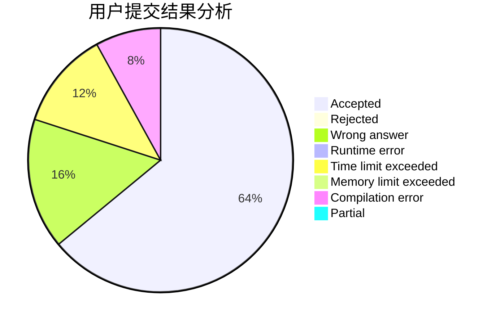
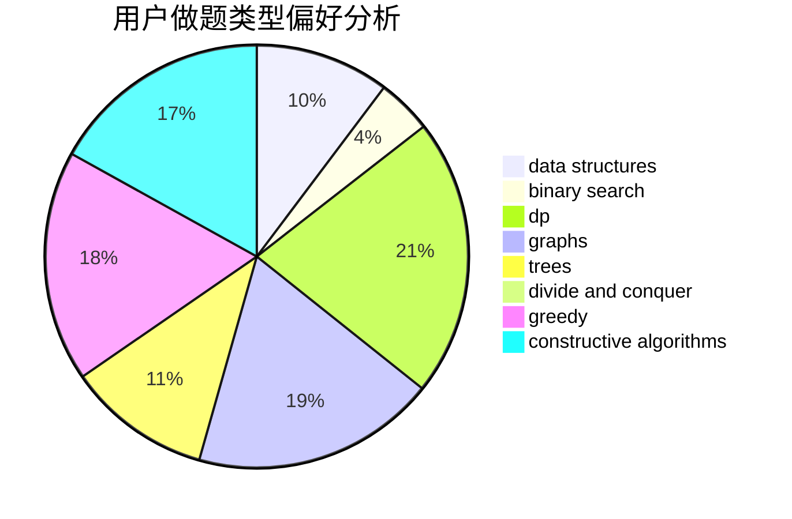
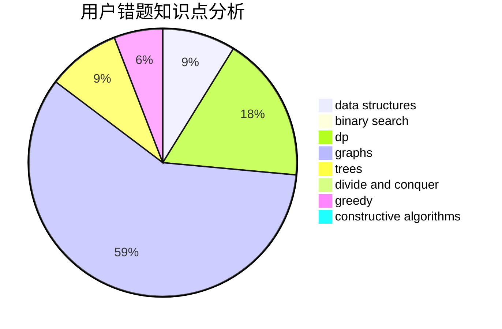

# Lsy2003

<!-- tabs:start -->

#### **用户提交结果分析**

#### **用户做题类型偏好分析**

#### **用户错题知识点分析**

<!-- tabs:end -->
# 推荐题目
[1481E](https://codeforces.com/contest/1481/problem/E)		data structures,
                        dp,
                        greedy		  
[1321B](https://codeforces.com/contest/1321/problem/B)		dsu,graphs,sortings,trees		  
[506C](https://codeforces.com/contest/506/problem/C)		dsu,graphs,sortings,trees		  
[1305C](https://codeforces.com/contest/1305/problem/C)		brute force,
                        combinatorics,
                        math,
                        number theory		  
[254A](https://codeforces.com/contest/254/problem/A)		constructive algorithms,
                        sortings		  
[705B](https://codeforces.com/contest/705/problem/B)		games,
                        math		  
[888B](https://codeforces.com/contest/888/problem/B)		greedy		  
[1154F](https://codeforces.com/contest/1154/problem/F)		dp,
                        greedy,
                        sortings		  
[598E](https://codeforces.com/contest/598/problem/E)		brute force,
                        dp		  
[479C](https://codeforces.com/contest/479/problem/C)		greedy,
                        sortings		  
