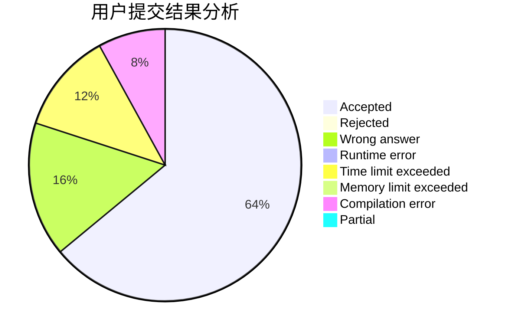
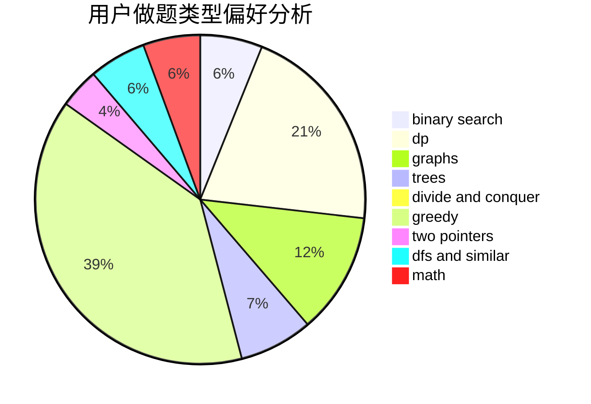

# Lsy2003

<!-- tabs:start -->

#### **用户提交结果分析**

#### **用户做题类型偏好分析**

<!-- tabs:end -->
# 推荐题目
[1481E](https://codeforces.com/contest/1481/problem/E)
[1321B](https://codeforces.com/contest/1321/problem/B)
[506C](https://codeforces.com/contest/506/problem/C)
[1305C](https://codeforces.com/contest/1305/problem/C)
[254A](https://codeforces.com/contest/254/problem/A)
[705B](https://codeforces.com/contest/705/problem/B)
[888B](https://codeforces.com/contest/888/problem/B)
[1154F](https://codeforces.com/contest/1154/problem/F)
[598E](https://codeforces.com/contest/598/problem/E)
[479C](https://codeforces.com/contest/479/problem/C)
