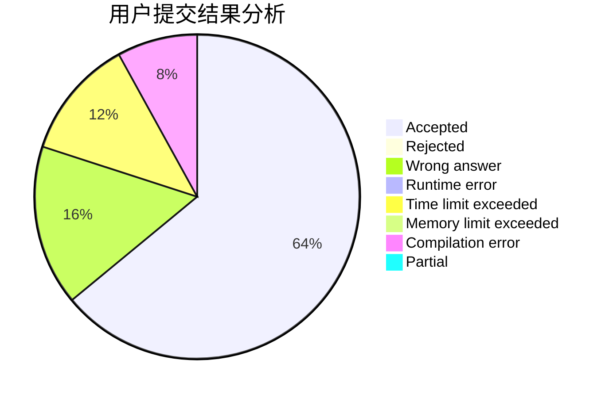
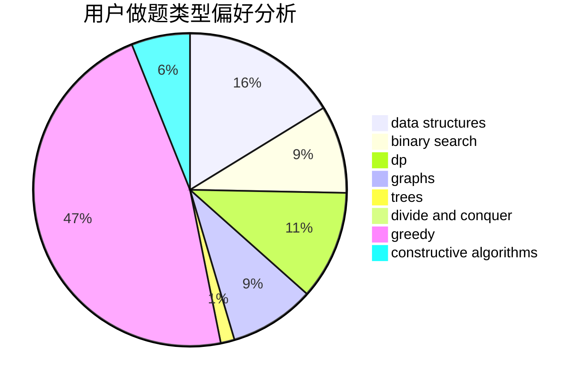
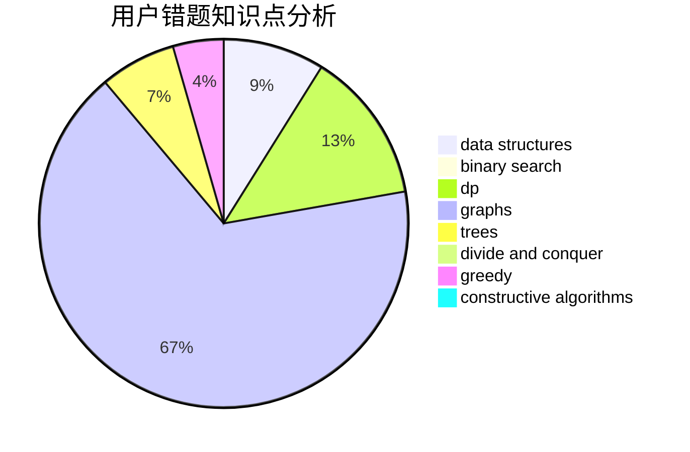

# Lsy2003

<!-- tabs:start -->

#### **用户提交结果分析**

#### **用户做题类型偏好分析**

#### **用户错题知识点分析**

<!-- tabs:end -->
# 推荐题目
[1473B](https://codeforces.com/contest/1473/problem/B)		brute force,
                        math,
                        number theory,
                        strings		  
[1311F](https://codeforces.com/contest/1311/problem/F)		data structures,
                        divide and conquer,
                        implementation,
                        sortings		  
[485D](https://codeforces.com/contest/485/problem/D)		dsu,graphs,sortings,trees		  
[1298D](https://codeforces.com/contest/1298/problem/D)		dsu,graphs,sortings,trees		  
[232B](https://codeforces.com/contest/232/problem/B)		bitmasks,
                        combinatorics,
                        dp,
                        math		  
[681C](https://codeforces.com/contest/681/problem/C)		constructive algorithms,
                        data structures,
                        greedy		  
[868F](https://codeforces.com/contest/868/problem/F)		divide and conquer,
                        dp		  
[1152F1](https://codeforces.com/contest/1152F/problem/1)		bitmasks,
                        dp,
                        matrices		  
[576E](https://codeforces.com/contest/576/problem/E)		binary search,
                        data structures		  
[460A](https://codeforces.com/contest/460/problem/A)		brute force,
                        implementation,
                        math		  
