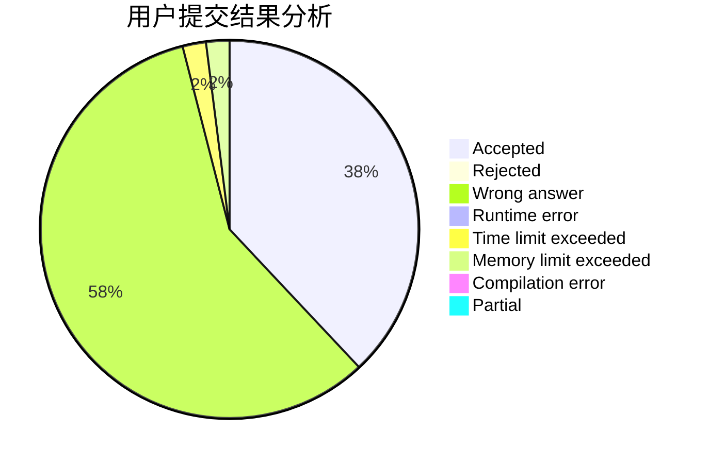
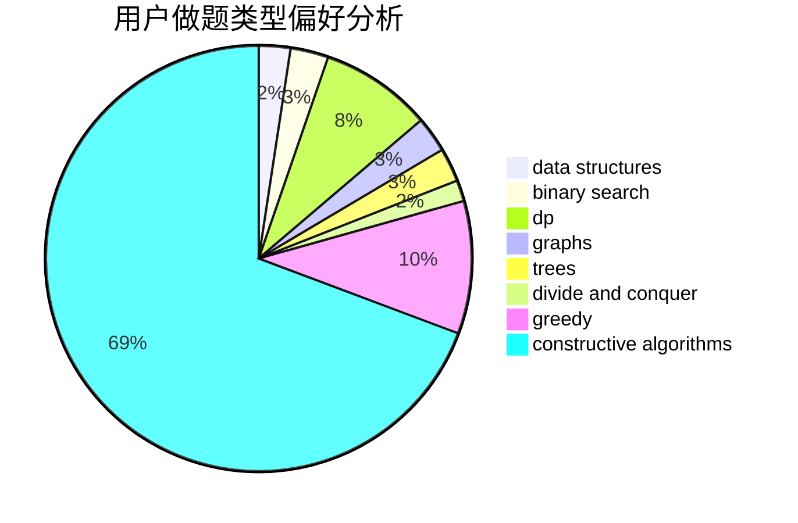
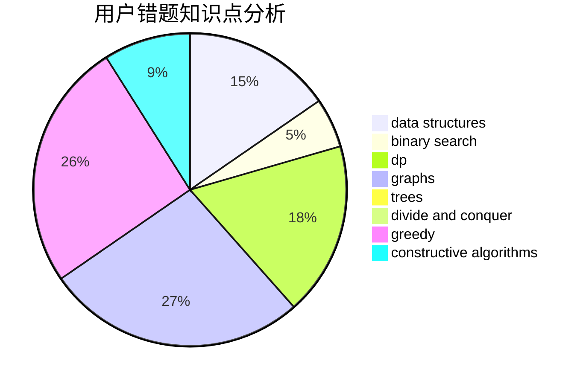

# Ltion

<!-- tabs:start -->

#### **用户提交结果分析**

#### **用户做题类型偏好分析**

#### **用户错题知识点分析**

<!-- tabs:end -->
# 推荐题目
[1329C](https://codeforces.com/contest/1329/problem/C)		constructive algorithms,
                        data structures,
                        greedy,
                        implementation		  
[665C](https://codeforces.com/contest/665/problem/C)		dp,
                        greedy,
                        strings		  
[720C](https://codeforces.com/contest/720/problem/C)		constructive algorithms		  
[453D](https://codeforces.com/contest/453/problem/D)		dp,
                        matrices		  
[1439D](https://codeforces.com/contest/1439/problem/D)		combinatorics,
                        dp,
                        fft		  
[1078D](https://codeforces.com/contest/1078/problem/D)		dsu,graphs,sortings,trees		  
[1140F](https://codeforces.com/contest/1140/problem/F)		data structures,
                        divide and conquer,
                        dsu		  
[645D](https://codeforces.com/contest/645/problem/D)		binary search,
                        dp,
                        graphs		  
[487B](https://codeforces.com/contest/487/problem/B)		binary search,
                        data structures,
                        dp,
                        two pointers		  
[11E](https://codeforces.com/contest/11/problem/E)		binary search,
                        dp,
                        greedy		  
