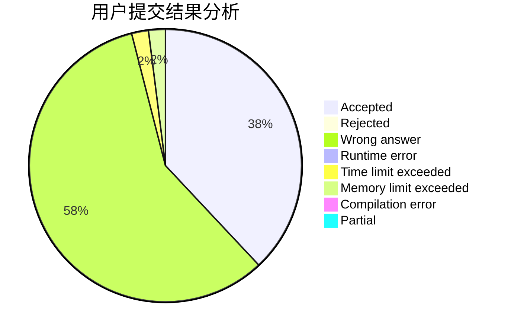
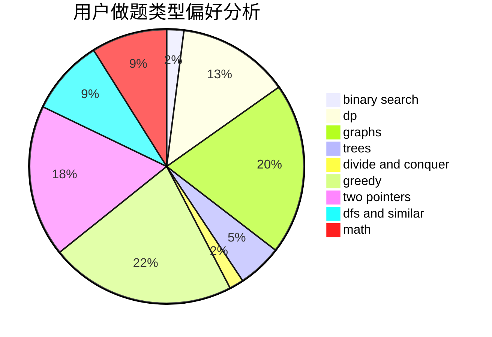

# Ltion

<!-- tabs:start -->

#### **用户提交结果分析**

#### **用户做题类型偏好分析**

<!-- tabs:end -->
# 推荐题目
[1329C](https://codeforces.com/contest/1329/problem/C)
[665C](https://codeforces.com/contest/665/problem/C)
[720C](https://codeforces.com/contest/720/problem/C)
[453D](https://codeforces.com/contest/453/problem/D)
[1439D](https://codeforces.com/contest/1439/problem/D)
[1078D](https://codeforces.com/contest/1078/problem/D)
[1140F](https://codeforces.com/contest/1140/problem/F)
[645D](https://codeforces.com/contest/645/problem/D)
[487B](https://codeforces.com/contest/487/problem/B)
[11E](https://codeforces.com/contest/11/problem/E)
