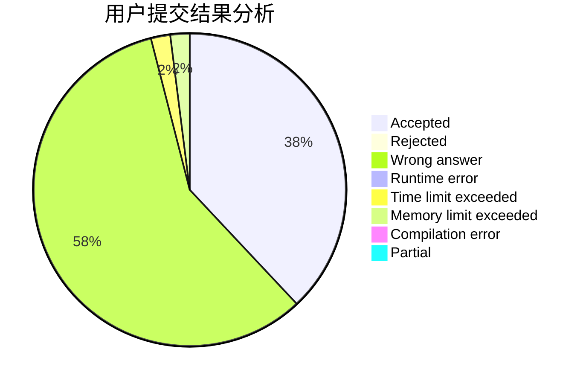
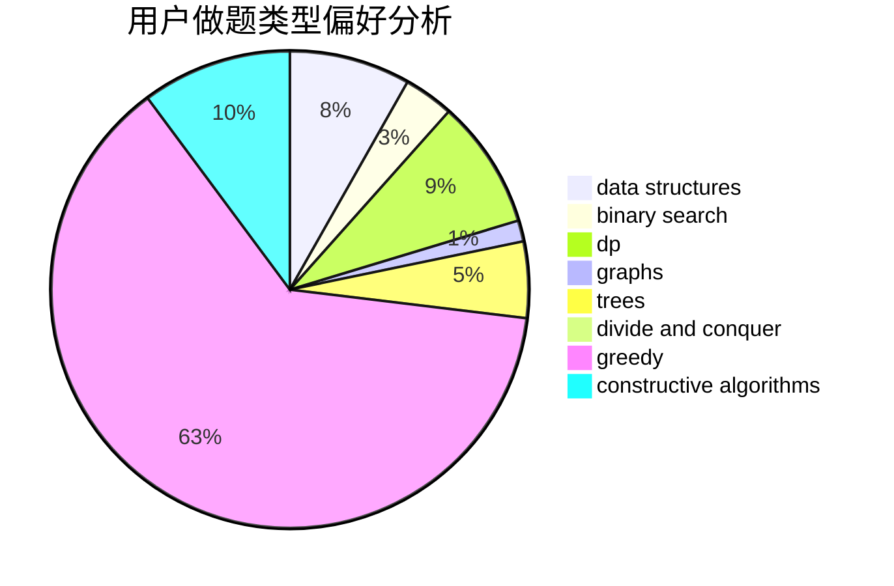
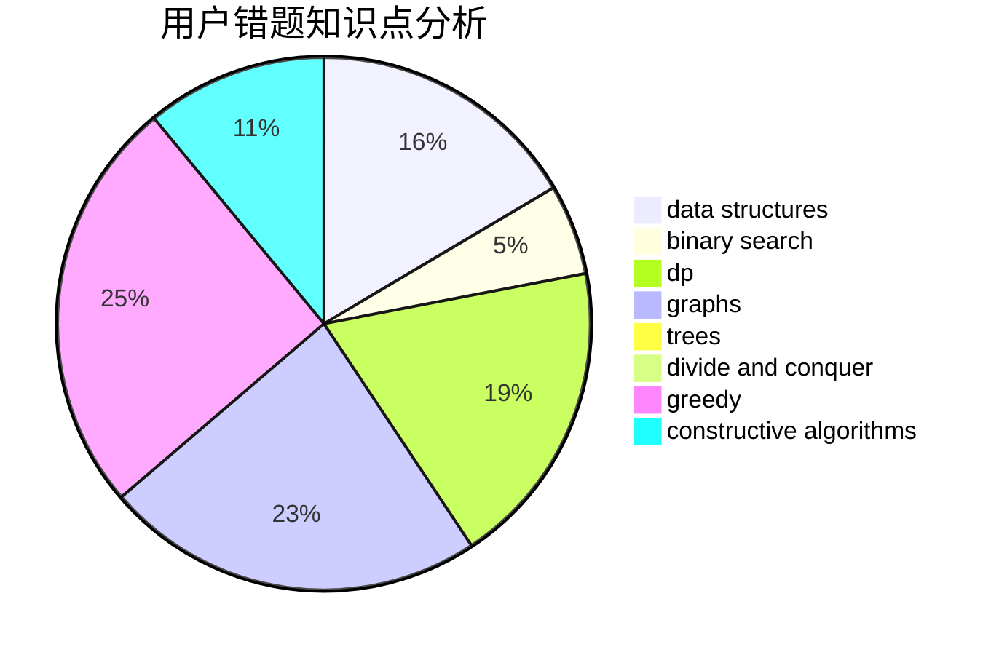

# Ltion

<!-- tabs:start -->

#### **用户提交结果分析**

#### **用户做题类型偏好分析**

#### **用户错题知识点分析**

<!-- tabs:end -->
# 推荐题目
[1322D](https://codeforces.com/contest/1322/problem/D)		bitmasks,
                        dp		  
[633A](https://codeforces.com/contest/633/problem/A)		brute force,
                        math,
                        number theory		  
[701F](https://codeforces.com/contest/701/problem/F)		dsu,graphs,sortings,trees		  
[432D](https://codeforces.com/contest/432/problem/D)		dp,
                        string suffix structures,
                        strings,
                        two pointers		  
[1430F](https://codeforces.com/contest/1430/problem/F)		dp,
                        greedy		  
[1078A](https://codeforces.com/contest/1078/problem/A)		dsu,graphs,sortings,trees		  
[1139B](https://codeforces.com/contest/1139/problem/B)		greedy,
                        implementation		  
[621B](https://codeforces.com/contest/621/problem/B)		combinatorics,
                        implementation		  
[468A](https://codeforces.com/contest/468/problem/A)		constructive algorithms,
                        greedy,
                        math		  
[1196D1](https://codeforces.com/contest/1196D/problem/1)		implementation		  
