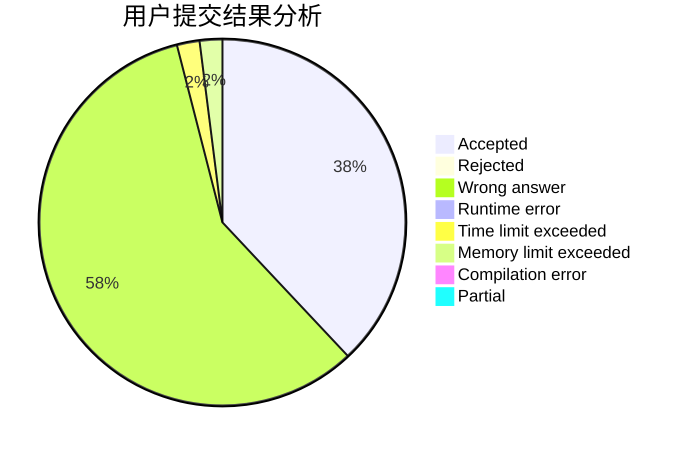
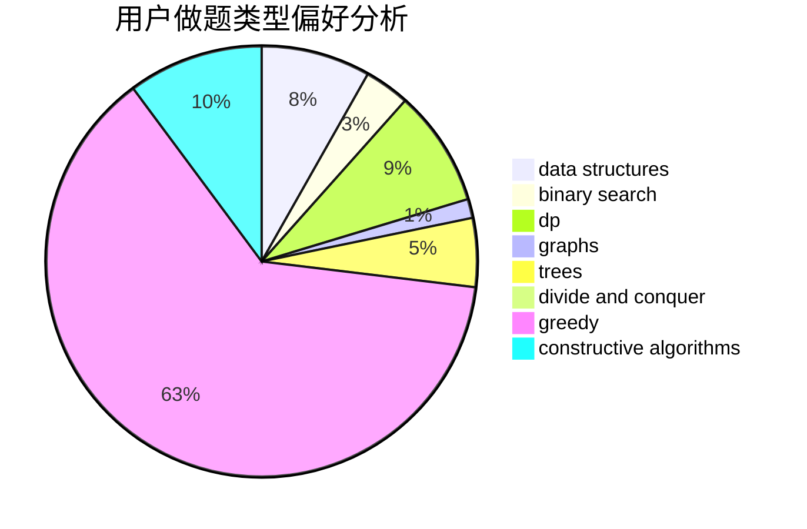
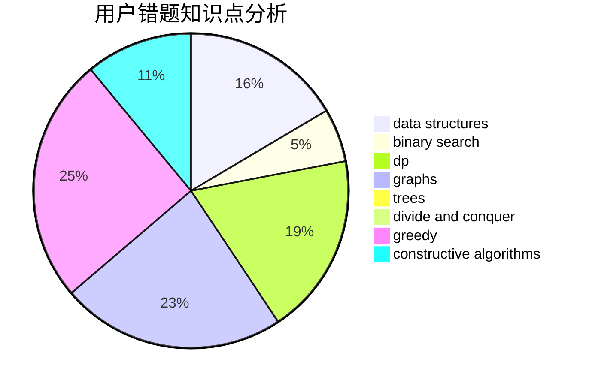

# Ltion
<!-- tabs:start -->
#### **用户提交结果分析**

#### **用户做题类型偏好分析**

#### **用户错题知识点分析**

<!-- tabs:end -->
# 推荐题目
[Prefixes and Suffixes](http://codeforces.com/problemset/problem/432/D)		dp,
                        string suffix structures,
                        strings,
                        two pointers		  
[Reality Show](http://codeforces.com/problemset/problem/1322/D)		bitmasks,
                        dp		  
[Break Up](https://codeforces.com/contest/701/problem/F)		dfs and similar,
                        graphs		  
[Rock-Paper-Scissors](http://codeforces.com/problemset/problem/173/A)		implementation,
                        math		  
[RGB Substring (easy version)](http://codeforces.com/problemset/problem/1196/D1)		implementation		  
[24 Game](http://codeforces.com/problemset/problem/468/A)		constructive algorithms,
                        greedy,
                        math		  
[Contact ATC](https://codeforces.com/contest/956/problem/D)		nan		  
[Wet Shark and Bishops](http://codeforces.com/problemset/problem/621/B)		combinatorics,
                        implementation		  
[The Child and Toy](https://codeforces.com/contest/438/problem/A)		graphs,
                        greedy,
                        sortings		  
[Barcelonian Distance](https://codeforces.com/contest/1078/problem/A)		geometry,
                        implementation		  
<!-- tabs:start -->
#### **data structures**
[Prefixes and Suffixes](http://codeforces.com/problemset/problem/1181/D)		binary search,
                        data structures,
                        implementation,
                        sortings,
                        trees,
                        two pointers		  
[Reality Show](http://codeforces.com/problemset/problem/1140/C)		brute force,
                        data structures,
                        sortings		  
[Break Up](http://codeforces.com/problemset/problem/780/G)		data structures,
                        dp		  
[Rock-Paper-Scissors](http://codeforces.com/problemset/problem/1179/C)		binary search,
                        data structures,
                        graph matchings,
                        greedy,
                        implementation,
                        math,
                        trees		  
[RGB Substring (easy version)](https://codeforces.com/contest/956/problem/C)		data structures,
                        dp,
                        greedy		  
[24 Game](http://codeforces.com/problemset/problem/1503/C)		binary search,
                        data structures,
                        dp,
                        greedy,
                        shortest paths,
                        sortings,
                        two pointers		  
[Contact ATC](http://codeforces.com/problemset/problem/1492/C)		binary search,
                        data structures,
                        dp,
                        greedy,
                        two pointers		  
[Wet Shark and Bishops](http://codeforces.com/problemset/problem/1492/C)		binary search,
                        data structures,
                        dp,
                        greedy,
                        two pointers		  
[The Child and Toy](http://codeforces.com/problemset/problem/1490/G)		binary search,
                        data structures,
                        math		  
[Barcelonian Distance](http://codeforces.com/problemset/problem/1479/D)		binary search,
                        bitmasks,
                        brute force,
                        data structures,
                        probabilities,
                        trees		  
#### **binary search**
[Prefixes and Suffixes](http://codeforces.com/problemset/problem/1178/H)		binary search,
                        flows,
                        graphs		  
[Reality Show](http://codeforces.com/problemset/problem/1181/D)		binary search,
                        data structures,
                        implementation,
                        sortings,
                        trees,
                        two pointers		  
[Break Up](http://codeforces.com/problemset/problem/1179/C)		binary search,
                        data structures,
                        graph matchings,
                        greedy,
                        implementation,
                        math,
                        trees		  
[Rock-Paper-Scissors](http://codeforces.com/problemset/problem/1479/A)		binary search,
                        interactive,
                        ternary search		  
[RGB Substring (easy version)](http://codeforces.com/problemset/problem/1503/C)		binary search,
                        data structures,
                        dp,
                        greedy,
                        shortest paths,
                        sortings,
                        two pointers		  
[24 Game](http://codeforces.com/problemset/problem/1492/C)		binary search,
                        data structures,
                        dp,
                        greedy,
                        two pointers		  
[Contact ATC](http://codeforces.com/problemset/problem/1492/C)		binary search,
                        data structures,
                        dp,
                        greedy,
                        two pointers		  
[Wet Shark and Bishops](http://codeforces.com/problemset/problem/1463/D)		binary search,
                        constructive algorithms,
                        greedy,
                        two pointers		  
[The Child and Toy](http://codeforces.com/problemset/problem/1490/G)		binary search,
                        data structures,
                        math		  
[Barcelonian Distance](http://codeforces.com/problemset/problem/1479/D)		binary search,
                        bitmasks,
                        brute force,
                        data structures,
                        probabilities,
                        trees		  
#### **dp**
[Prefixes and Suffixes](http://codeforces.com/problemset/problem/432/D)		dp,
                        string suffix structures,
                        strings,
                        two pointers		  
[Reality Show](http://codeforces.com/problemset/problem/1322/D)		bitmasks,
                        dp		  
[Break Up](http://codeforces.com/problemset/problem/1430/F)		dp,
                        greedy		  
[Rock-Paper-Scissors](http://codeforces.com/problemset/problem/398/B)		dp,
                        probabilities		  
[RGB Substring (easy version)](http://codeforces.com/problemset/problem/780/G)		data structures,
                        dp		  
[24 Game](http://codeforces.com/problemset/problem/917/B)		dfs and similar,
                        dp,
                        games,
                        graphs		  
[Contact ATC](https://codeforces.com/contest/956/problem/C)		data structures,
                        dp,
                        greedy		  
[Wet Shark and Bishops](http://codeforces.com/problemset/problem/1503/C)		binary search,
                        data structures,
                        dp,
                        greedy,
                        shortest paths,
                        sortings,
                        two pointers		  
[The Child and Toy](http://codeforces.com/problemset/problem/1492/C)		binary search,
                        data structures,
                        dp,
                        greedy,
                        two pointers		  
[Barcelonian Distance](http://codeforces.com/problemset/problem/1492/C)		binary search,
                        data structures,
                        dp,
                        greedy,
                        two pointers		  
#### **graph**
[Prefixes and Suffixes](https://codeforces.com/contest/701/problem/F)		dfs and similar,
                        graphs		  
[Reality Show](https://codeforces.com/contest/438/problem/A)		graphs,
                        greedy,
                        sortings		  
[Break Up](http://codeforces.com/problemset/problem/1178/H)		binary search,
                        flows,
                        graphs		  
[Rock-Paper-Scissors](http://codeforces.com/problemset/problem/164/C)		flows,
                        graphs		  
[RGB Substring (easy version)](http://codeforces.com/problemset/problem/917/B)		dfs and similar,
                        dp,
                        games,
                        graphs		  
[24 Game](http://codeforces.com/problemset/problem/1179/C)		binary search,
                        data structures,
                        graph matchings,
                        greedy,
                        implementation,
                        math,
                        trees		  
[Contact ATC](http://codeforces.com/problemset/problem/468/B)		2-sat,
                        dfs and similar,
                        dsu,
                        graph matchings,
                        greedy		  
[Wet Shark and Bishops](http://codeforces.com/problemset/problem/1487/C)		brute force,
                        constructive algorithms,
                        dfs and similar,
                        graphs,
                        greedy,
                        implementation,
                        math		  
[The Child and Toy](http://codeforces.com/problemset/problem/1437/C)		dp,
                        flows,
                        graph matchings,
                        greedy,
                        math,
                        sortings		  
[Barcelonian Distance](http://codeforces.com/problemset/problem/1470/D)		constructive algorithms,
                        dfs and similar,
                        graph matchings,
                        graphs,
                        greedy		  
#### **trees**
[Prefixes and Suffixes](http://codeforces.com/problemset/problem/1181/D)		binary search,
                        data structures,
                        implementation,
                        sortings,
                        trees,
                        two pointers		  
[Reality Show](http://codeforces.com/problemset/problem/1179/C)		binary search,
                        data structures,
                        graph matchings,
                        greedy,
                        implementation,
                        math,
                        trees		  
[Break Up](http://codeforces.com/problemset/problem/1479/D)		binary search,
                        bitmasks,
                        brute force,
                        data structures,
                        probabilities,
                        trees		  
[Rock-Paper-Scissors](http://codeforces.com/problemset/problem/1511/C)		brute force,
                        data structures,
                        implementation,
                        trees		  
[RGB Substring (easy version)](http://codeforces.com/problemset/problem/1499/F)		combinatorics,
                        dfs and similar,
                        dp,
                        trees		  
[24 Game](http://codeforces.com/problemset/problem/1491/E)		brute force,
                        dfs and similar,
                        divide and conquer,
                        number theory,
                        trees		  
[Contact ATC](http://codeforces.com/problemset/problem/1466/D)		data structures,
                        greedy,
                        sortings,
                        trees		  
[Wet Shark and Bishops](http://codeforces.com/problemset/problem/1495/D)		combinatorics,
                        dfs and similar,
                        graphs,
                        math,
                        shortest paths,
                        trees		  
[The Child and Toy](http://codeforces.com/problemset/problem/1303/G)		data structures,
                        divide and conquer,
                        geometry,
                        trees		  
[Barcelonian Distance](http://codeforces.com/problemset/problem/1454/E)		combinatorics,
                        dfs and similar,
                        graphs,
                        trees		  
#### **divide and conquer**
[Prefixes and Suffixes](http://codeforces.com/problemset/problem/1338/C)		bitmasks,
                        brute force,
                        constructive algorithms,
                        divide and conquer,
                        math		  
[Reality Show](http://codeforces.com/problemset/problem/1461/D)		binary search,
                        brute force,
                        data structures,
                        divide and conquer,
                        implementation,
                        sortings		  
[Break Up](http://codeforces.com/problemset/problem/1466/G)		combinatorics,
                        divide and conquer,
                        hashing,
                        math,
                        string suffix structures,
                        strings		  
[Rock-Paper-Scissors](http://codeforces.com/problemset/problem/1490/D)		dfs and similar,
                        divide and conquer,
                        implementation		  
[RGB Substring (easy version)](https://codeforces.com/contest/1483/problem/C)		data structures,
                        divide and conquer,
                        dp		  
[24 Game](http://codeforces.com/problemset/problem/1491/E)		brute force,
                        dfs and similar,
                        divide and conquer,
                        number theory,
                        trees		  
[Contact ATC](http://codeforces.com/problemset/problem/1303/G)		data structures,
                        divide and conquer,
                        geometry,
                        trees		  
[Wet Shark and Bishops](http://codeforces.com/problemset/problem/1494/D)		constructive algorithms,
                        data structures,
                        dfs and similar,
                        divide and conquer,
                        dsu,
                        greedy,
                        sortings,
                        trees		  
[The Child and Toy](http://codeforces.com/problemset/problem/1482/E)		data structures,
                        divide and conquer,
                        dp		  
[Barcelonian Distance](http://codeforces.com/problemset/problem/566/C)		dfs and similar,
                        divide and conquer,
                        trees		  
#### **greedy**
[Prefixes and Suffixes](http://codeforces.com/problemset/problem/468/A)		constructive algorithms,
                        greedy,
                        math		  
[Reality Show](https://codeforces.com/contest/438/problem/A)		graphs,
                        greedy,
                        sortings		  
[Break Up](http://codeforces.com/problemset/problem/1139/B)		greedy,
                        implementation		  
[Rock-Paper-Scissors](http://codeforces.com/problemset/problem/1430/F)		dp,
                        greedy		  
[RGB Substring (easy version)](http://codeforces.com/problemset/problem/16/B)		greedy,
                        implementation,
                        sortings		  
[24 Game](http://codeforces.com/problemset/problem/1179/C)		binary search,
                        data structures,
                        graph matchings,
                        greedy,
                        implementation,
                        math,
                        trees		  
[Contact ATC](http://codeforces.com/problemset/problem/1218/I)		2-sat,
                        dfs and similar,
                        greedy		  
[Wet Shark and Bishops](https://codeforces.com/contest/1269/problem/C)		constructive algorithms,
                        greedy,
                        implementation,
                        strings		  
[The Child and Toy](https://codeforces.com/contest/956/problem/C)		data structures,
                        dp,
                        greedy		  
[Barcelonian Distance](https://codeforces.com/contest/483/problem/C)		constructive algorithms,
                        greedy		  
#### **constructive algorithms**
[Prefixes and Suffixes](http://codeforces.com/problemset/problem/468/A)		constructive algorithms,
                        greedy,
                        math		  
[Reality Show](https://codeforces.com/contest/1269/problem/C)		constructive algorithms,
                        greedy,
                        implementation,
                        strings		  
[Break Up](http://codeforces.com/problemset/problem/1338/C)		bitmasks,
                        brute force,
                        constructive algorithms,
                        divide and conquer,
                        math		  
[Rock-Paper-Scissors](https://codeforces.com/contest/483/problem/C)		constructive algorithms,
                        greedy		  
[RGB Substring (easy version)](http://codeforces.com/problemset/problem/1337/A)		constructive algorithms,
                        math		  
[24 Game](http://codeforces.com/problemset/problem/1493/A)		constructive algorithms,
                        greedy		  
[Contact ATC](http://codeforces.com/problemset/problem/1463/D)		binary search,
                        constructive algorithms,
                        greedy,
                        two pointers		  
[Wet Shark and Bishops](https://codeforces.com/contest/1456/problem/B)		bitmasks,
                        brute force,
                        constructive algorithms		  
[The Child and Toy](http://codeforces.com/problemset/problem/1492/D)		bitmasks,
                        constructive algorithms,
                        greedy,
                        math		  
[Barcelonian Distance](https://codeforces.com/contest/1504/problem/D)		constructive algorithms,
                        games,
                        interactive		  
#### **sortings**
[Prefixes and Suffixes](https://codeforces.com/contest/438/problem/A)		graphs,
                        greedy,
                        sortings		  
[Reality Show](http://codeforces.com/problemset/problem/1181/D)		binary search,
                        data structures,
                        implementation,
                        sortings,
                        trees,
                        two pointers		  
[Break Up](http://codeforces.com/problemset/problem/1140/C)		brute force,
                        data structures,
                        sortings		  
[Rock-Paper-Scissors](http://codeforces.com/problemset/problem/16/B)		greedy,
                        implementation,
                        sortings		  
[RGB Substring (easy version)](http://codeforces.com/problemset/problem/1503/C)		binary search,
                        data structures,
                        dp,
                        greedy,
                        shortest paths,
                        sortings,
                        two pointers		  
[24 Game](https://codeforces.com/contest/1496/problem/C)		geometry,
                        greedy,
                        math,
                        sortings		  
[Contact ATC](http://codeforces.com/problemset/problem/1495/A)		geometry,
                        greedy,
                        math,
                        sortings		  
[Wet Shark and Bishops](http://codeforces.com/problemset/problem/1497/A)		brute force,
                        data structures,
                        greedy,
                        sortings		  
[The Child and Toy](http://codeforces.com/problemset/problem/1427/A)		math,
                        sortings		  
[Barcelonian Distance](http://codeforces.com/problemset/problem/1461/D)		binary search,
                        brute force,
                        data structures,
                        divide and conquer,
                        implementation,
                        sortings		  
<!-- tabs:end -->
