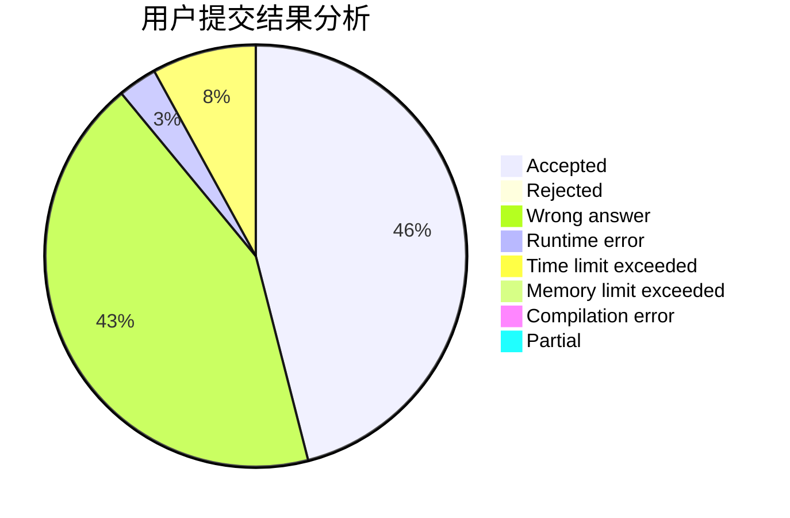
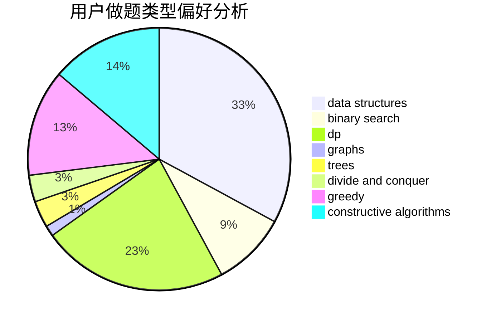
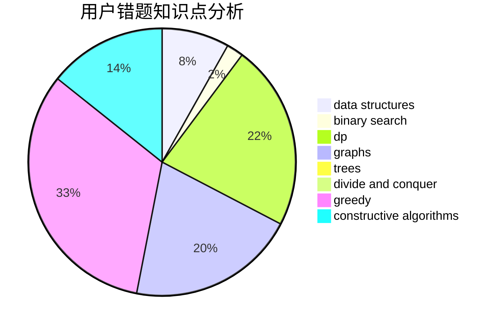

# Lu0J1

<!-- tabs:start -->

#### **用户提交结果分析**

#### **用户做题类型偏好分析**

#### **用户错题知识点分析**

<!-- tabs:end -->
# 推荐题目
[813D](https://codeforces.com/contest/813/problem/D)		dp,
                        flows		  
[675A](https://codeforces.com/contest/675/problem/A)		math		  
[1207C](https://codeforces.com/contest/1207/problem/C)		dp,
                        greedy		  
[852D](https://codeforces.com/contest/852/problem/D)		binary search,
                        flows,
                        graph matchings,
                        shortest paths		  
[107C](https://codeforces.com/contest/107/problem/C)		bitmasks,
                        dp		  
[1271A](https://codeforces.com/contest/1271/problem/A)		brute force,
                        greedy,
                        math		  
[1091G](https://codeforces.com/contest/1091/problem/G)		interactive,
                        math,
                        number theory		  
[438D](https://codeforces.com/contest/438/problem/D)		data structures,
                        math		  
[1042A](https://codeforces.com/contest/1042/problem/A)		binary search,
                        implementation		  
[1513A](https://codeforces.com/contest/1513/problem/A)		constructive algorithms,
                        implementation		  
