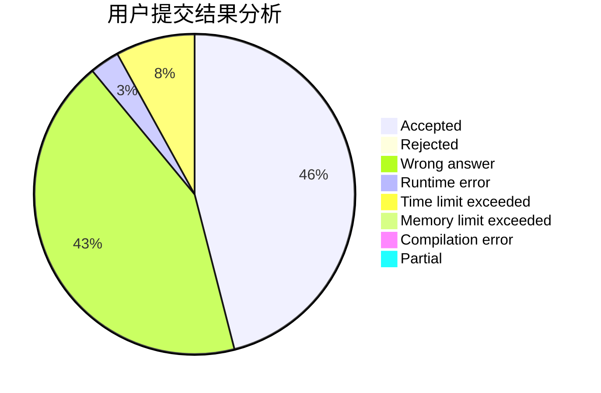
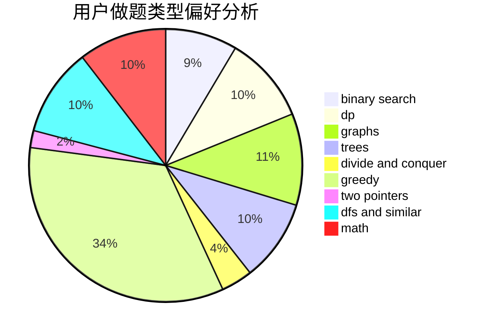

# Lu0J1

<!-- tabs:start -->

#### **用户提交结果分析**

#### **用户做题类型偏好分析**

<!-- tabs:end -->
# 推荐题目
[831F](https://codeforces.com/contest/831/problem/F)
[69A](https://codeforces.com/contest/69/problem/A)
[12131](https://codeforces.com/contest/1213/problem/1)
[870C](https://codeforces.com/contest/870/problem/C)
[1080B](https://codeforces.com/contest/1080/problem/B)
[1280C](https://codeforces.com/contest/1280/problem/C)
[10922](https://codeforces.com/contest/1092/problem/2)
[460B](https://codeforces.com/contest/460/problem/B)
[1042D](https://codeforces.com/contest/1042/problem/D)
[171H](https://codeforces.com/contest/171/problem/H)
