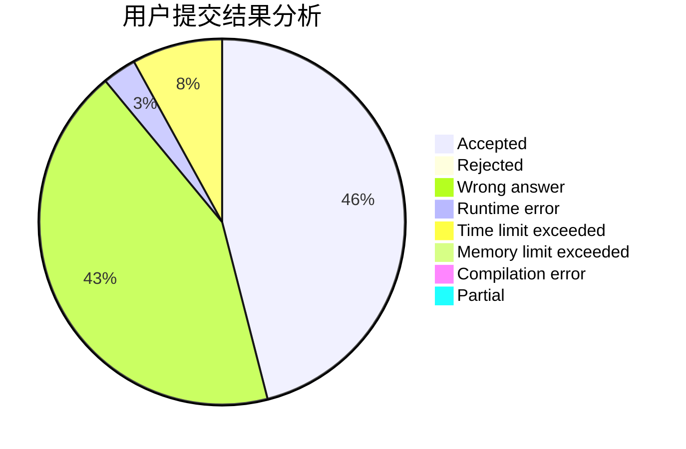
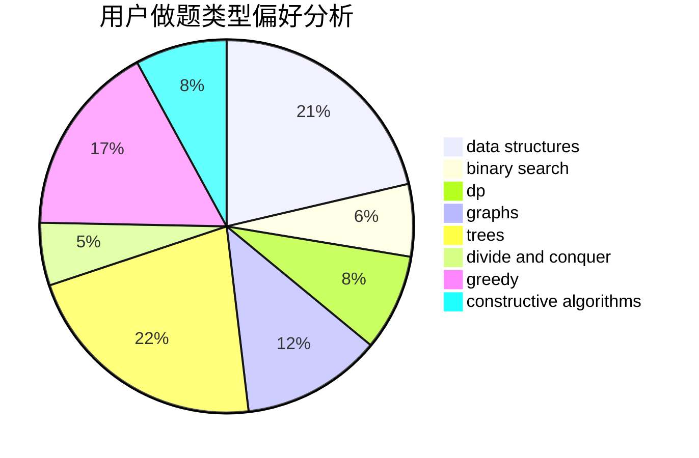
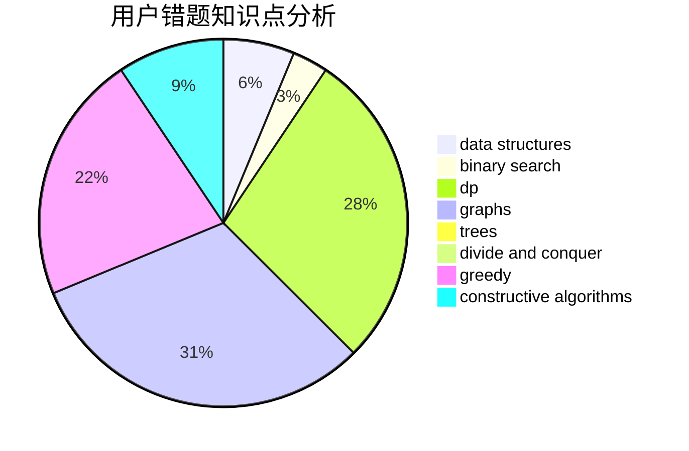

# Lu0J1

<!-- tabs:start -->

#### **用户提交结果分析**

#### **用户做题类型偏好分析**

#### **用户错题知识点分析**

<!-- tabs:end -->
# 推荐题目
[831F](https://codeforces.com/contest/831/problem/F)		dsu,graphs,sortings,trees		  
[69A](https://codeforces.com/contest/69/problem/A)		implementation,
                        math		  
[12131](https://codeforces.com/contest/1213/problem/1)		dsu,graphs,sortings,trees		  
[870C](https://codeforces.com/contest/870/problem/C)		dp,
                        greedy,
                        math,
                        number theory		  
[1080B](https://codeforces.com/contest/1080/problem/B)		math		  
[1280C](https://codeforces.com/contest/1280/problem/C)		dfs and similar,
                        graphs,
                        greedy,
                        trees		  
[10922](https://codeforces.com/contest/1092/problem/2)		dsu,graphs,sortings,trees		  
[460B](https://codeforces.com/contest/460/problem/B)		brute force,
                        implementation,
                        math,
                        number theory		  
[1042D](https://codeforces.com/contest/1042/problem/D)		data structures,
                        divide and conquer,
                        two pointers		  
[171H](https://codeforces.com/contest/171/problem/H)		*special problem,
                        implementation		  
