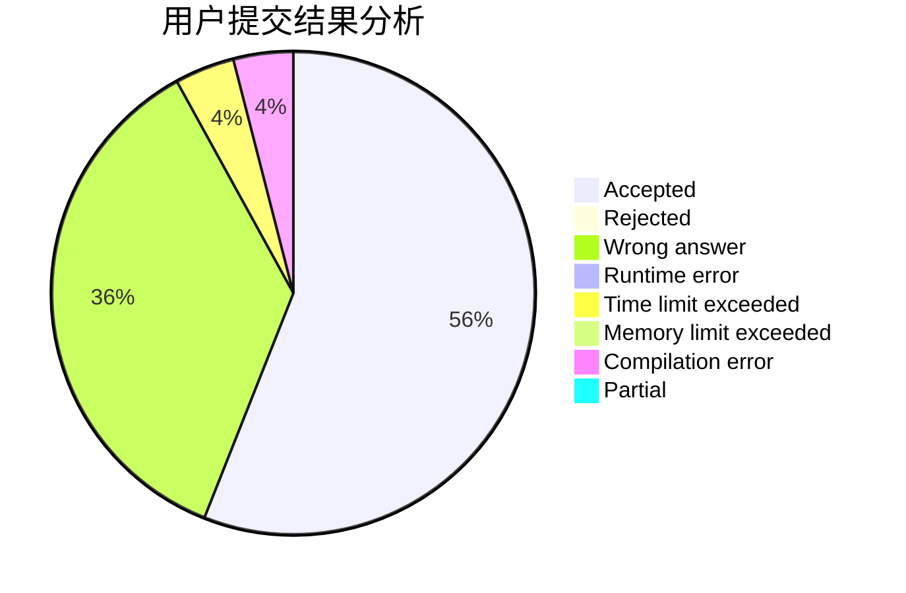
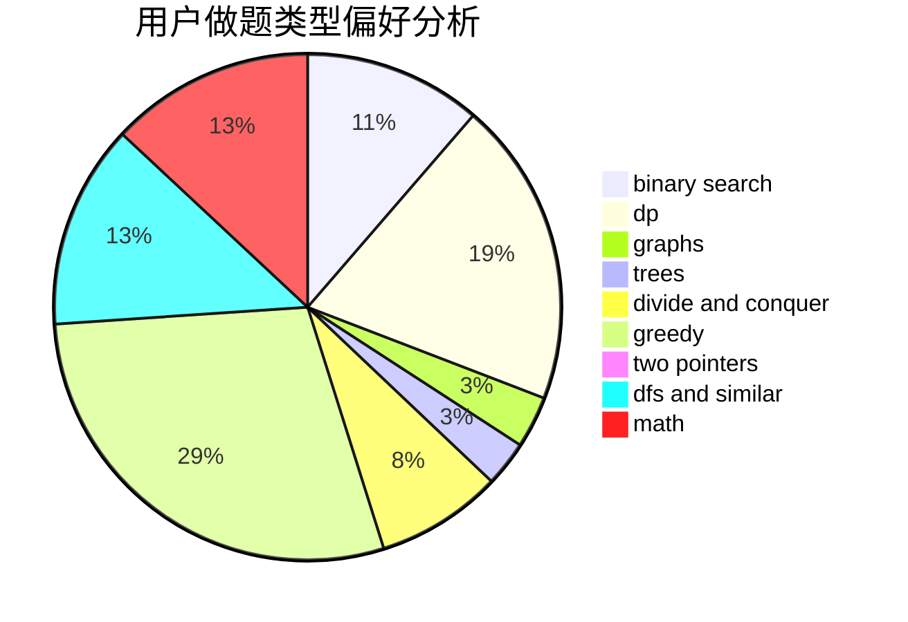

# Luban

<!-- tabs:start -->

#### **用户提交结果分析**

#### **用户做题类型偏好分析**

<!-- tabs:end -->
# 推荐题目
[1223E](https://codeforces.com/contest/1223/problem/E)
[317A](https://codeforces.com/contest/317/problem/A)
[1287B](https://codeforces.com/contest/1287/problem/B)
[1194E](https://codeforces.com/contest/1194/problem/E)
[118E](https://codeforces.com/contest/118/problem/E)
[533E](https://codeforces.com/contest/533/problem/E)
[899B](https://codeforces.com/contest/899/problem/B)
[889D](https://codeforces.com/contest/889/problem/D)
[1091E](https://codeforces.com/contest/1091/problem/E)
[629A](https://codeforces.com/contest/629/problem/A)
