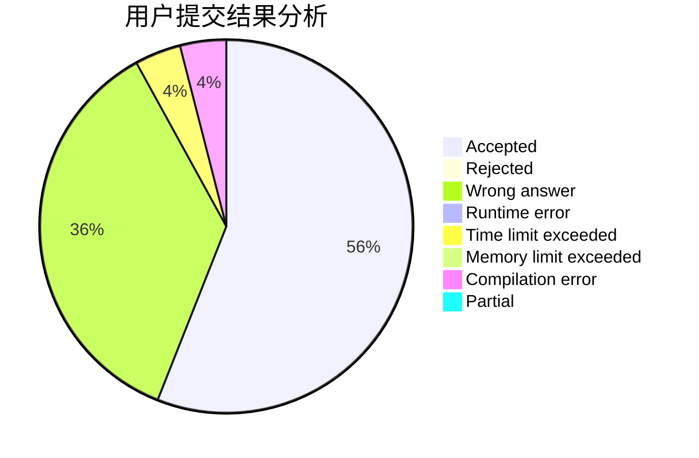
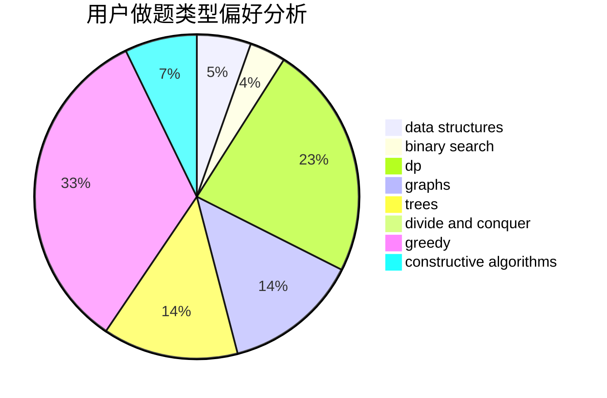
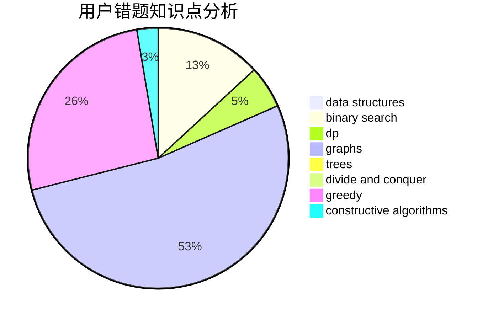

# Luban

<!-- tabs:start -->

#### **用户提交结果分析**

#### **用户做题类型偏好分析**

#### **用户错题知识点分析**

<!-- tabs:end -->
# 推荐题目
[1217A](https://codeforces.com/contest/1217/problem/A)		binary search,
                        math		  
[29B](https://codeforces.com/contest/29/problem/B)		implementation		  
[1281B](https://codeforces.com/contest/1281/problem/B)		greedy		  
[1189C](https://codeforces.com/contest/1189/problem/C)		data structures,
                        dp,
                        implementation,
                        math		  
[1186C](https://codeforces.com/contest/1186/problem/C)		implementation,
                        math		  
[510B](https://codeforces.com/contest/510/problem/B)		dfs and similar		  
[878C](https://codeforces.com/contest/878/problem/C)		data structures,
                        graphs		  
[869E](https://codeforces.com/contest/869/problem/E)		data structures,
                        hashing		  
[1091B](https://codeforces.com/contest/1091/problem/B)		brute force,
                        constructive algorithms,
                        greedy,
                        implementation		  
[609F](https://codeforces.com/contest/609/problem/F)		data structures,
                        greedy		  
