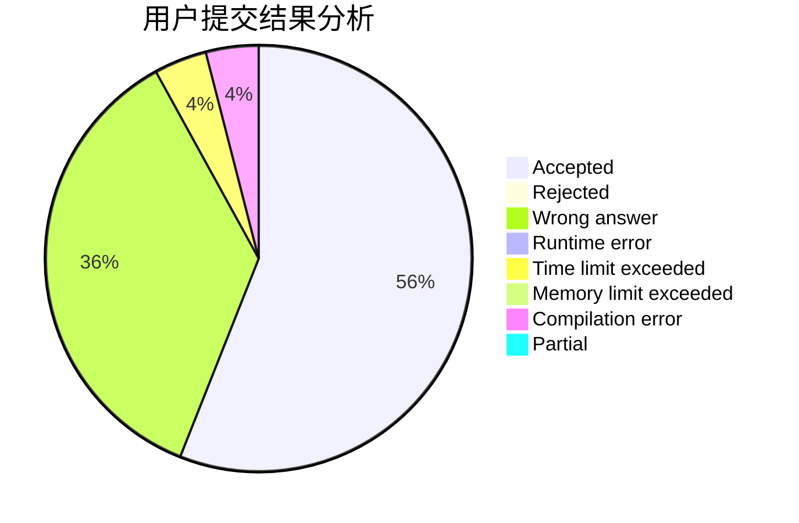
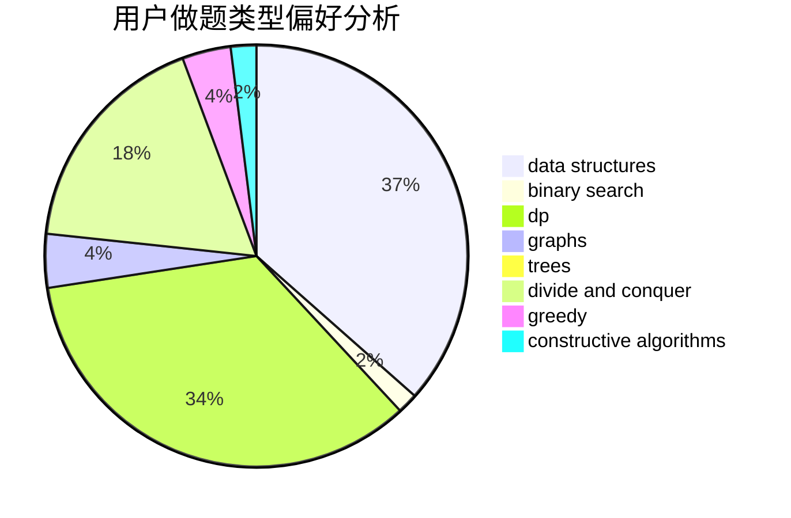
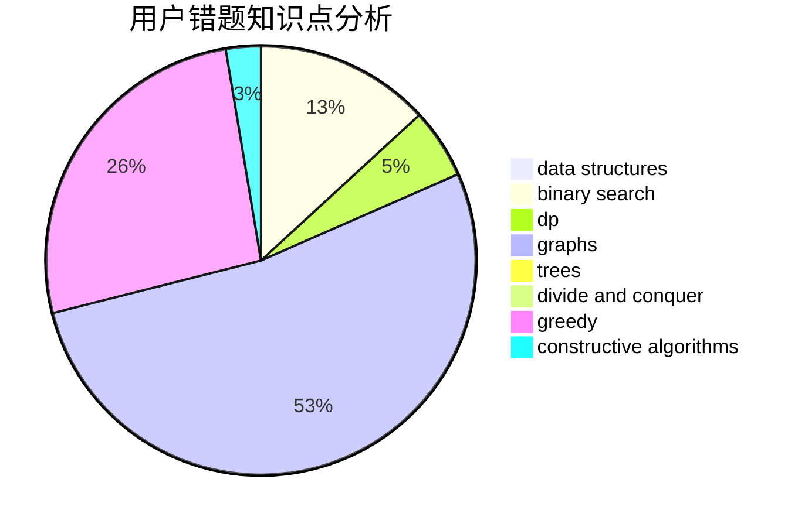

# Luban

<!-- tabs:start -->

#### **用户提交结果分析**

#### **用户做题类型偏好分析**

#### **用户错题知识点分析**

<!-- tabs:end -->
# 推荐题目
[1223E](https://codeforces.com/contest/1223/problem/E)		dp,
                        sortings,
                        trees		  
[317A](https://codeforces.com/contest/317/problem/A)		brute force		  
[1287B](https://codeforces.com/contest/1287/problem/B)		brute force,
                        data structures,
                        implementation		  
[1194E](https://codeforces.com/contest/1194/problem/E)		bitmasks,
                        brute force,
                        data structures,
                        geometry,
                        sortings		  
[118E](https://codeforces.com/contest/118/problem/E)		dfs and similar,
                        graphs		  
[533E](https://codeforces.com/contest/533/problem/E)		constructive algorithms,
                        dp,
                        greedy,
                        hashing,
                        strings,
                        two pointers		  
[899B](https://codeforces.com/contest/899/problem/B)		implementation		  
[889D](https://codeforces.com/contest/889/problem/D)		dsu,graphs,sortings,trees		  
[1091E](https://codeforces.com/contest/1091/problem/E)		binary search,
                        data structures,
                        graphs,
                        greedy,
                        implementation,
                        math,
                        sortings		  
[629A](https://codeforces.com/contest/629/problem/A)		brute force,
                        combinatorics,
                        constructive algorithms,
                        implementation		  
